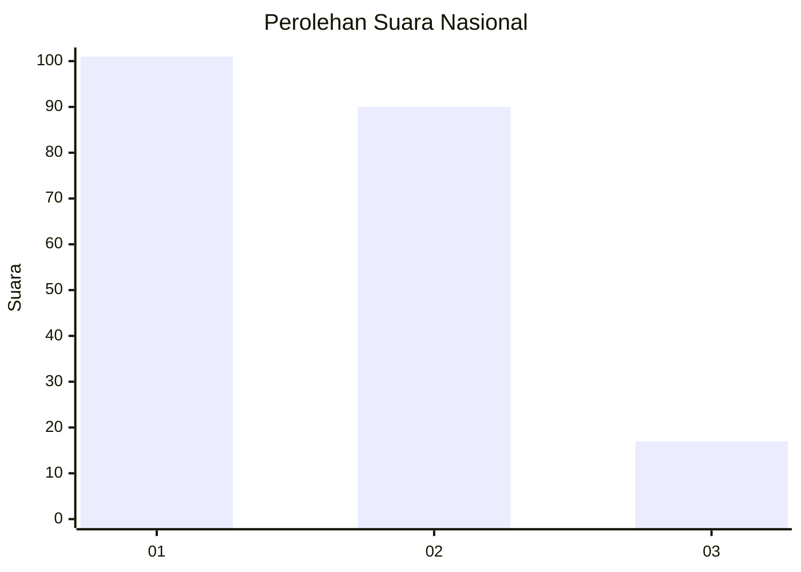
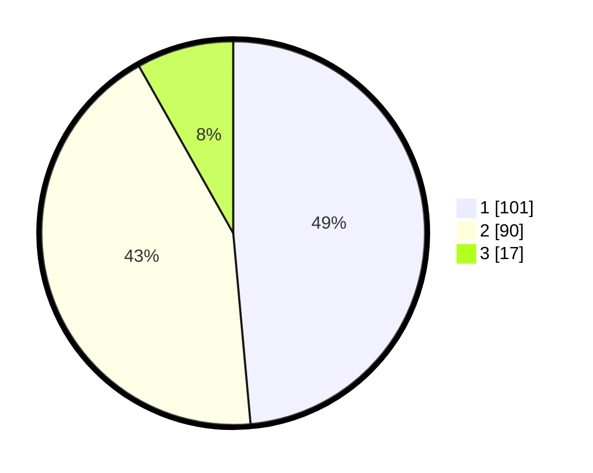

# Hasil

## Grafik

## Tabel

| No. | Nama Paslon    | Suara | Suara (raw) | Persentase |
|:--- |:-------------- | -----:| -----------:| ----------:|
| 1   | ANIES MUHAIMIN | 101   | [101][p-1]  | 48,56      |
| 2   | PRABOWO GIBRAN | 90    | [90][p-2]   | 43,27      |
| 3   | GANJAR MAHFUD  | 17    | [17][p-3]   | 8,17       |

[p-1]: https://github.com/gigit-pemilu/pemilu-2024/blob/main/pilpres/hitung-suara/sub/16-sumatera-selatan/sub/71-kota-palembang/sub/07-sukarami/sub/1007-kebunbunga/sub/043-tps/sub/paslon-1.txt
[p-2]: https://github.com/gigit-pemilu/pemilu-2024/blob/main/pilpres/hitung-suara/sub/16-sumatera-selatan/sub/71-kota-palembang/sub/07-sukarami/sub/1007-kebunbunga/sub/043-tps/sub/paslon-2.txt
[p-3]: https://github.com/gigit-pemilu/pemilu-2024/blob/main/pilpres/hitung-suara/sub/16-sumatera-selatan/sub/71-kota-palembang/sub/07-sukarami/sub/1007-kebunbunga/sub/043-tps/sub/paslon-3.txt

## Foto C Plano

https://sirekap-obj-formc.kpu.go.id/1b44/pemilu/ppwp/16/71/07/10/07/1671071007043-20240215-194516--b1d2a07e-bc35-42ef-bb30-3a9ff44ae74a.jpg

https://sirekap-obj-formc.kpu.go.id/1b44/pemilu/ppwp/16/71/07/10/07/1671071007043-20240215-194618--8522e3cf-dc03-4152-927b-cf183e753560.jpg

https://sirekap-obj-formc.kpu.go.id/1b44/pemilu/ppwp/16/71/07/10/07/1671071007043-20240215-200118--ad2c8ef9-1f8f-4ef4-b5cf-5cb6956c2356.jpg

## Metadata

| Key        | Value               |
| ---------- | ------------------- |
| Time Stamp | 2024-02-25 16:00:00 |

