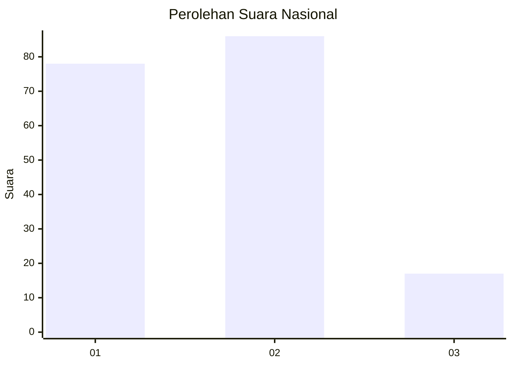
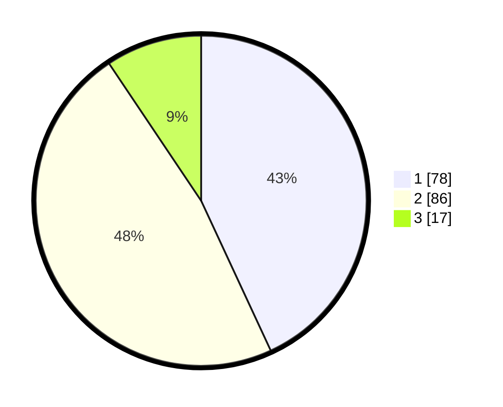

# Hasil

## Grafik

## Tabel

| No. | Nama Paslon    | Suara | Suara (raw) | Persentase |
|:--- |:-------------- | -----:| -----------:| ----------:|
| 1   | ANIES MUHAIMIN | 78    | [78][p-1]   | 43,09      |
| 2   | PRABOWO GIBRAN | 86    | [86][p-2]   | 47,51      |
| 3   | GANJAR MAHFUD  | 17    | [17][p-3]   | 9,39       |

[p-1]: https://github.com/gigit-pemilu/pemilu-2024/blob/main/pilpres/hitung-suara/sub/16-sumatera-selatan/sub/71-kota-palembang/sub/07-sukarami/sub/1009-sukabangun/sub/006-tps/sub/paslon-1.txt
[p-2]: https://github.com/gigit-pemilu/pemilu-2024/blob/main/pilpres/hitung-suara/sub/16-sumatera-selatan/sub/71-kota-palembang/sub/07-sukarami/sub/1009-sukabangun/sub/006-tps/sub/paslon-2.txt
[p-3]: https://github.com/gigit-pemilu/pemilu-2024/blob/main/pilpres/hitung-suara/sub/16-sumatera-selatan/sub/71-kota-palembang/sub/07-sukarami/sub/1009-sukabangun/sub/006-tps/sub/paslon-3.txt

## Foto C Plano

https://sirekap-obj-formc.kpu.go.id/2fcf/pemilu/ppwp/16/71/07/10/09/1671071009006-20240214-235449--03001052-4e8e-45d7-b205-afb2e7d7a1b5.jpg

https://sirekap-obj-formc.kpu.go.id/2fcf/pemilu/ppwp/16/71/07/10/09/1671071009006-20240214-235523--e134a408-0641-4c28-9ec1-66990706423a.jpg

https://sirekap-obj-formc.kpu.go.id/2fcf/pemilu/ppwp/16/71/07/10/09/1671071009006-20240214-235721--10cdb05b-3292-45fa-a144-8b2de30aaf25.jpg

## Metadata

| Key        | Value               |
| ---------- | ------------------- |
| Time Stamp | 2024-02-25 14:00:00 |

