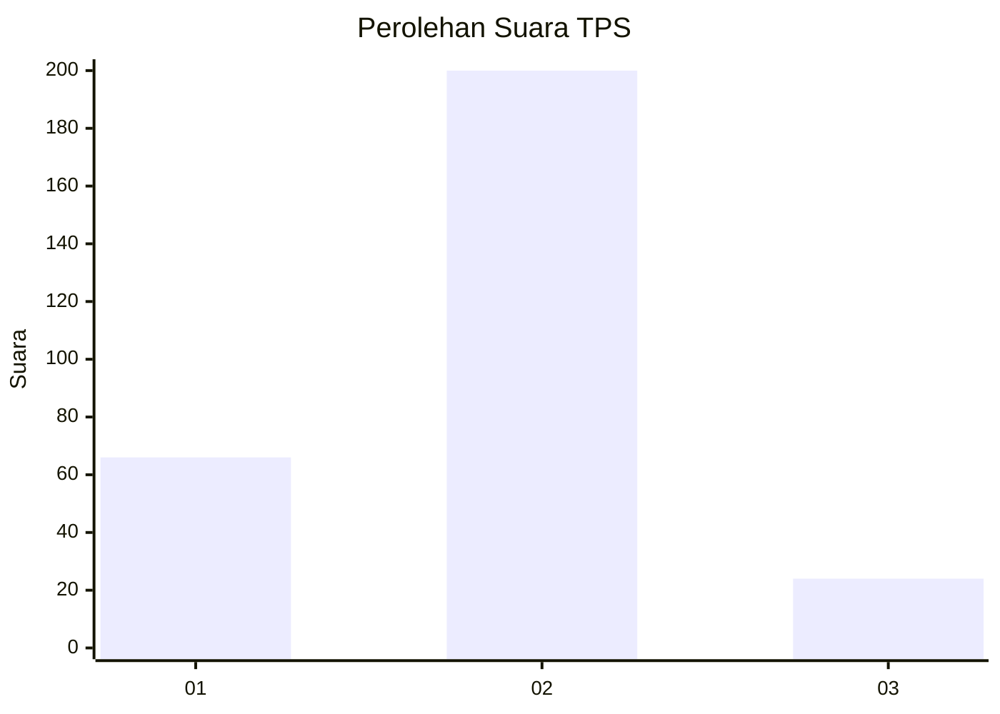
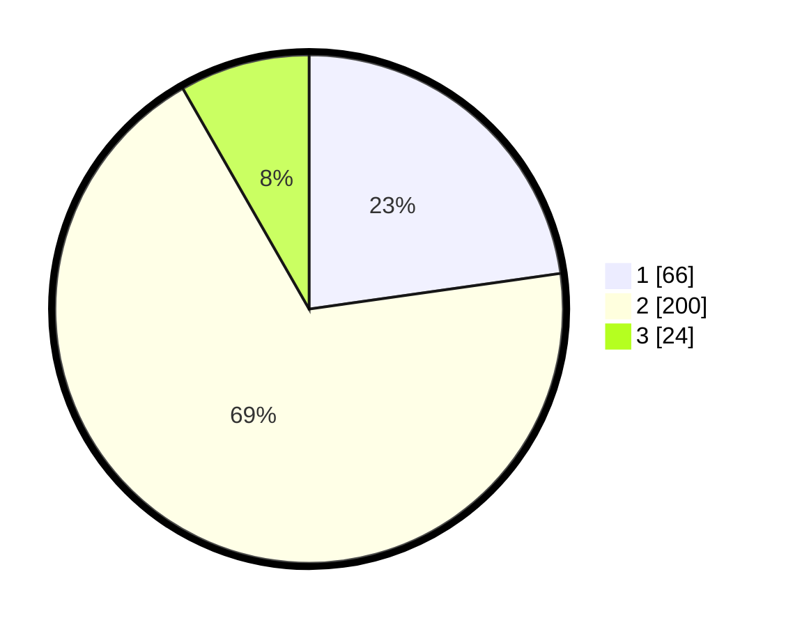

# Hasil

## Grafik

## Tabel

| No. | Nama Paslon    | Suara | Suara (raw) | Persentase |
|:--- |:-------------- | -----:| -----------:| ----------:|
| 1   | ANIES MUHAIMIN | 66    | [66][p-1]   | 22,76      |
| 2   | PRABOWO GIBRAN | 200   | [200][p-2]  | 68,97      |
| 3   | GANJAR MAHFUD  | 24    | [24][p-3]   | 8,28       |

[p-1]: https://github.com/gigit-pemilu/pemilu-2024-16-sumatera-selatan/blob/main/pilpres/hitung-suara/sub/16-sumatera-selatan/sub/71-kota-palembang/sub/07-sukarami/sub/1009-sukabangun/sub/017-tps/sub/paslon-1.txt
[p-2]: https://github.com/gigit-pemilu/pemilu-2024-16-sumatera-selatan/blob/main/pilpres/hitung-suara/sub/16-sumatera-selatan/sub/71-kota-palembang/sub/07-sukarami/sub/1009-sukabangun/sub/017-tps/sub/paslon-2.txt
[p-3]: https://github.com/gigit-pemilu/pemilu-2024-16-sumatera-selatan/blob/main/pilpres/hitung-suara/sub/16-sumatera-selatan/sub/71-kota-palembang/sub/07-sukarami/sub/1009-sukabangun/sub/017-tps/sub/paslon-3.txt

## Foto C Plano

https://sirekap-obj-formc.kpu.go.id/45c8/pemilu/ppwp/16/71/07/10/09/1671071009017-20240215-045211--e2d24791-b09f-447e-921b-8b5fa15fb681.jpg

https://sirekap-obj-formc.kpu.go.id/45c8/pemilu/ppwp/16/71/07/10/09/1671071009017-20240215-045305--953ab5bc-31db-4af2-98ee-8a1526285bbe.jpg

https://sirekap-obj-formc.kpu.go.id/45c8/pemilu/ppwp/16/71/07/10/09/1671071009017-20240215-045336--79dcaf91-0ab9-4f63-844e-9228abe6b08c.jpg

## Metadata

| Key        | Value               |
| ---------- | ------------------- |
| Time Stamp | 2024-02-25 18:00:00 |

