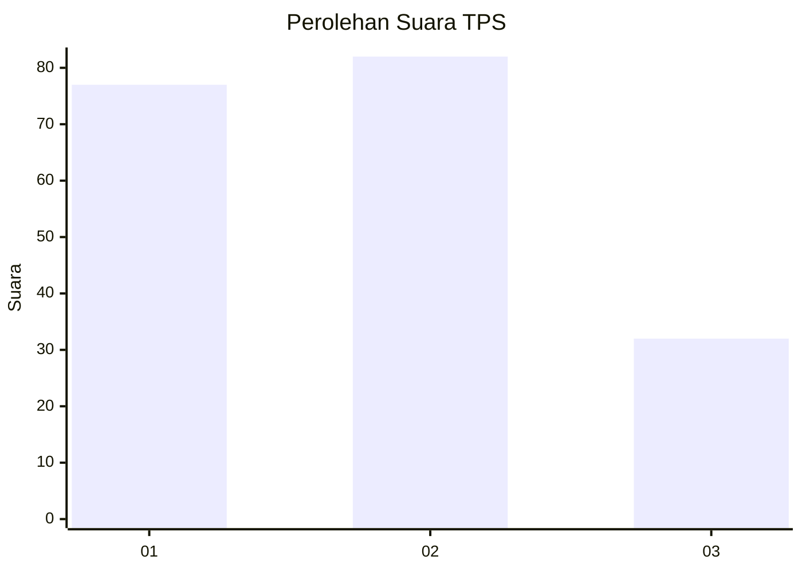
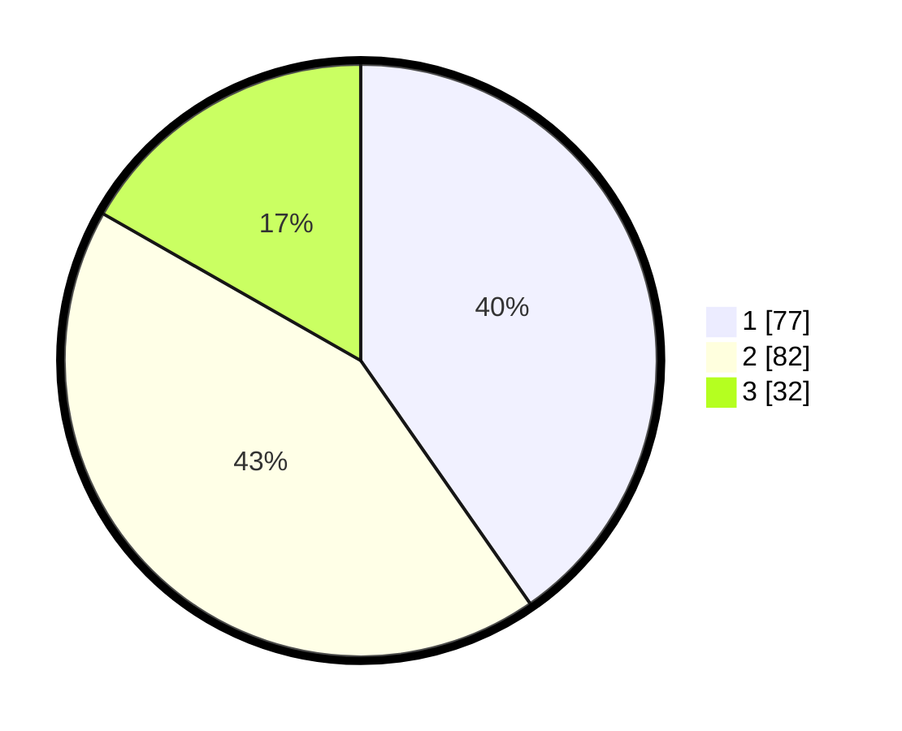

# Hasil

## Grafik

## Tabel

| No. | Nama Paslon    | Suara | Suara (raw) | Persentase |
|:--- |:-------------- | -----:| -----------:| ----------:|
| 1   | ANIES MUHAIMIN | 77    | [77][p-1]   | 40,31      |
| 2   | PRABOWO GIBRAN | 82    | [82][p-2]   | 42,93      |
| 3   | GANJAR MAHFUD  | 32    | [32][p-3]   | 16,75      |

[p-1]: https://github.com/gigit-pemilu/pemilu-2024-16-sumatera-selatan/blob/main/pilpres/hitung-suara/sub/16-sumatera-selatan/sub/71-kota-palembang/sub/07-sukarami/sub/1009-sukabangun/sub/021-tps/sub/paslon-1.txt
[p-2]: https://github.com/gigit-pemilu/pemilu-2024-16-sumatera-selatan/blob/main/pilpres/hitung-suara/sub/16-sumatera-selatan/sub/71-kota-palembang/sub/07-sukarami/sub/1009-sukabangun/sub/021-tps/sub/paslon-2.txt
[p-3]: https://github.com/gigit-pemilu/pemilu-2024-16-sumatera-selatan/blob/main/pilpres/hitung-suara/sub/16-sumatera-selatan/sub/71-kota-palembang/sub/07-sukarami/sub/1009-sukabangun/sub/021-tps/sub/paslon-3.txt

## Foto C Plano

https://sirekap-obj-formc.kpu.go.id/4eba/pemilu/ppwp/16/71/07/10/09/1671071009021-20240215-020202--32006412-6ee1-4407-996e-71e295cd4aa3.jpg

https://sirekap-obj-formc.kpu.go.id/4eba/pemilu/ppwp/16/71/07/10/09/1671071009021-20240215-020353--9080b9e8-4a94-4c93-9a2c-f786a91082c5.jpg

https://sirekap-obj-formc.kpu.go.id/4eba/pemilu/ppwp/16/71/07/10/09/1671071009021-20240215-020431--7fb042c8-ad78-494f-b9d3-9b14a9ec3769.jpg

## Metadata

| Key        | Value               |
| ---------- | ------------------- |
| Time Stamp | 2024-02-25 14:00:00 |

