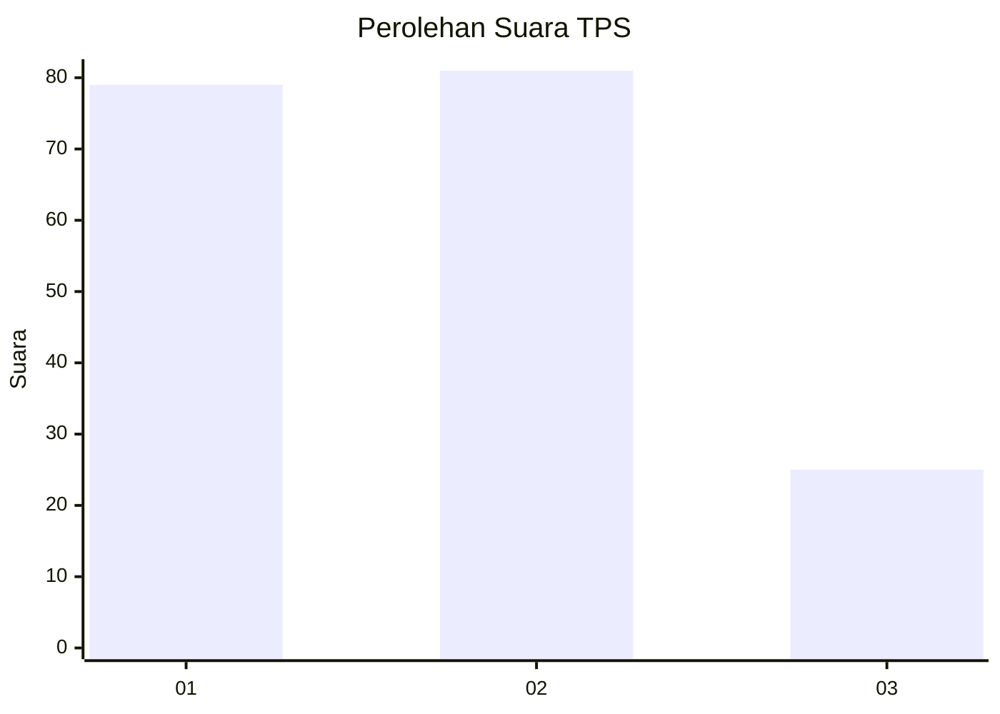
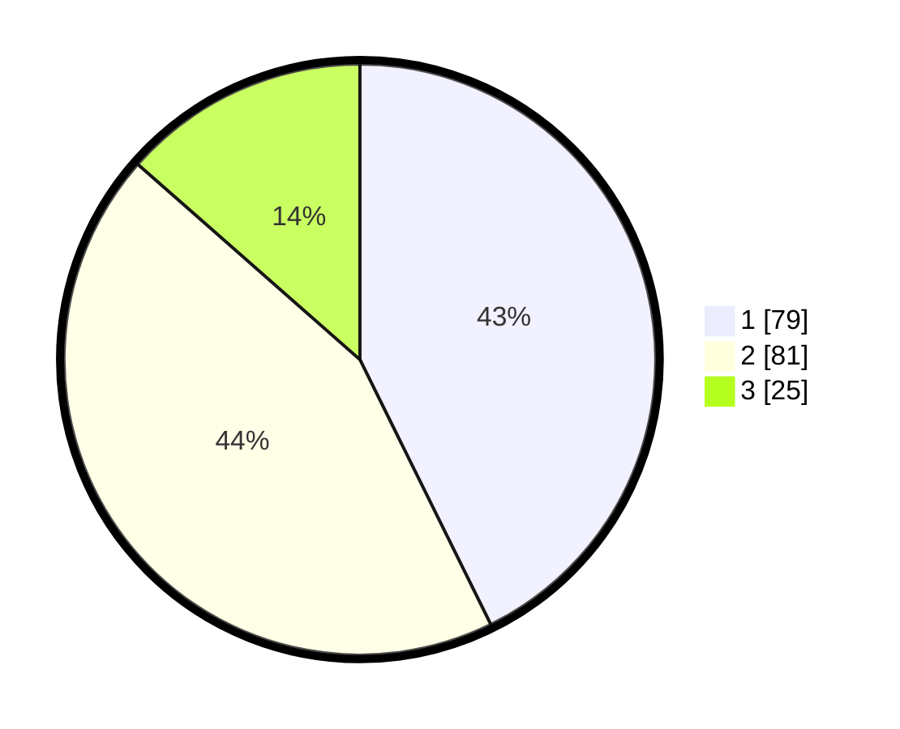

# Hasil

## Grafik

## Tabel

| No. | Nama Paslon    | Suara | Suara (raw) | Persentase |
|:--- |:-------------- | -----:| -----------:| ----------:|
| 1   | ANIES MUHAIMIN | 79    | [79][p-1]   | 42,70      |
| 2   | PRABOWO GIBRAN | 81    | [81][p-2]   | 43,78      |
| 3   | GANJAR MAHFUD  | 25    | [25][p-3]   | 13,51      |

[p-1]: https://github.com/gigit-pemilu/pemilu-2024-16-sumatera-selatan/blob/main/pilpres/hitung-suara/sub/16-sumatera-selatan/sub/71-kota-palembang/sub/07-sukarami/sub/1009-sukabangun/sub/050-tps/sub/paslon-1.txt
[p-2]: https://github.com/gigit-pemilu/pemilu-2024-16-sumatera-selatan/blob/main/pilpres/hitung-suara/sub/16-sumatera-selatan/sub/71-kota-palembang/sub/07-sukarami/sub/1009-sukabangun/sub/050-tps/sub/paslon-2.txt
[p-3]: https://github.com/gigit-pemilu/pemilu-2024-16-sumatera-selatan/blob/main/pilpres/hitung-suara/sub/16-sumatera-selatan/sub/71-kota-palembang/sub/07-sukarami/sub/1009-sukabangun/sub/050-tps/sub/paslon-3.txt

## Foto C Plano

https://sirekap-obj-formc.kpu.go.id/0b24/pemilu/ppwp/16/71/07/10/09/1671071009050-20240215-000530--5210919e-67bb-47bc-8494-8dbd67d86b15.jpg

https://sirekap-obj-formc.kpu.go.id/0b24/pemilu/ppwp/16/71/07/10/09/1671071009050-20240215-012142--54edae0a-f47b-498c-a495-295beea8628e.jpg

https://sirekap-obj-formc.kpu.go.id/0b24/pemilu/ppwp/16/71/07/10/09/1671071009050-20240215-000047--d8fd9f82-811c-485b-9349-37e85af71a0e.jpg

## Metadata

| Key        | Value               |
| ---------- | ------------------- |
| Time Stamp | 2024-02-25 12:00:00 |

