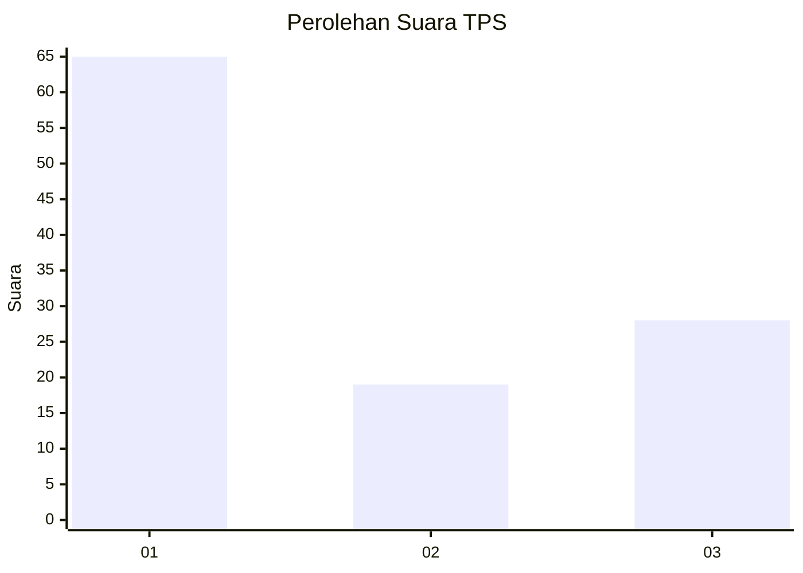
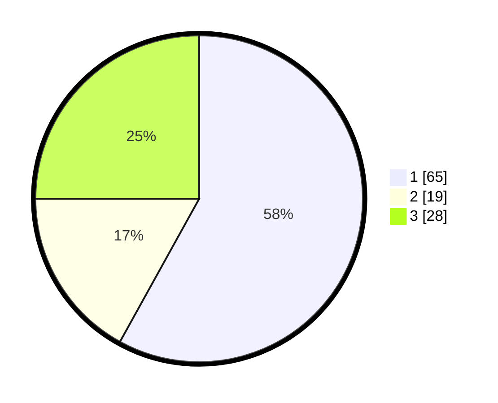

# Hasil

## Grafik

## Tabel

| No. | Nama Paslon    | Suara | Suara (raw) | Persentase |
|:--- |:-------------- | -----:| -----------:| ----------:|
| 1   | ANIES MUHAIMIN | 65    | [65][p-1]   | 58,04      |
| 2   | PRABOWO GIBRAN | 19    | [19][p-2]   | 16,96      |
| 3   | GANJAR MAHFUD  | 28    | [28][p-3]   | 25,00      |

[p-1]: https://github.com/gigit-pemilu/pemilu-2024-16-sumatera-selatan/blob/main/pilpres/hitung-suara/sub/16-sumatera-selatan/sub/71-kota-palembang/sub/07-sukarami/sub/1010-talangjambe/sub/019-tps/sub/paslon-1.txt
[p-2]: https://github.com/gigit-pemilu/pemilu-2024-16-sumatera-selatan/blob/main/pilpres/hitung-suara/sub/16-sumatera-selatan/sub/71-kota-palembang/sub/07-sukarami/sub/1010-talangjambe/sub/019-tps/sub/paslon-2.txt
[p-3]: https://github.com/gigit-pemilu/pemilu-2024-16-sumatera-selatan/blob/main/pilpres/hitung-suara/sub/16-sumatera-selatan/sub/71-kota-palembang/sub/07-sukarami/sub/1010-talangjambe/sub/019-tps/sub/paslon-3.txt

## Foto C Plano

https://sirekap-obj-formc.kpu.go.id/51cb/pemilu/ppwp/16/71/07/10/10/1671071010019-20240214-231815--2c7aec37-9c88-474a-990b-7361ec635de7.jpg

https://sirekap-obj-formc.kpu.go.id/51cb/pemilu/ppwp/16/71/07/10/10/1671071010019-20240214-231957--7a2a32c0-9a55-491e-bea2-e881a3b8a10c.jpg

https://sirekap-obj-formc.kpu.go.id/51cb/pemilu/ppwp/16/71/07/10/10/1671071010019-20240214-232353--e6dc699f-fce5-45f6-b786-cbacc621126d.jpg

## Metadata

| Key        | Value               |
| ---------- | ------------------- |
| Time Stamp | 2024-02-25 16:00:00 |

