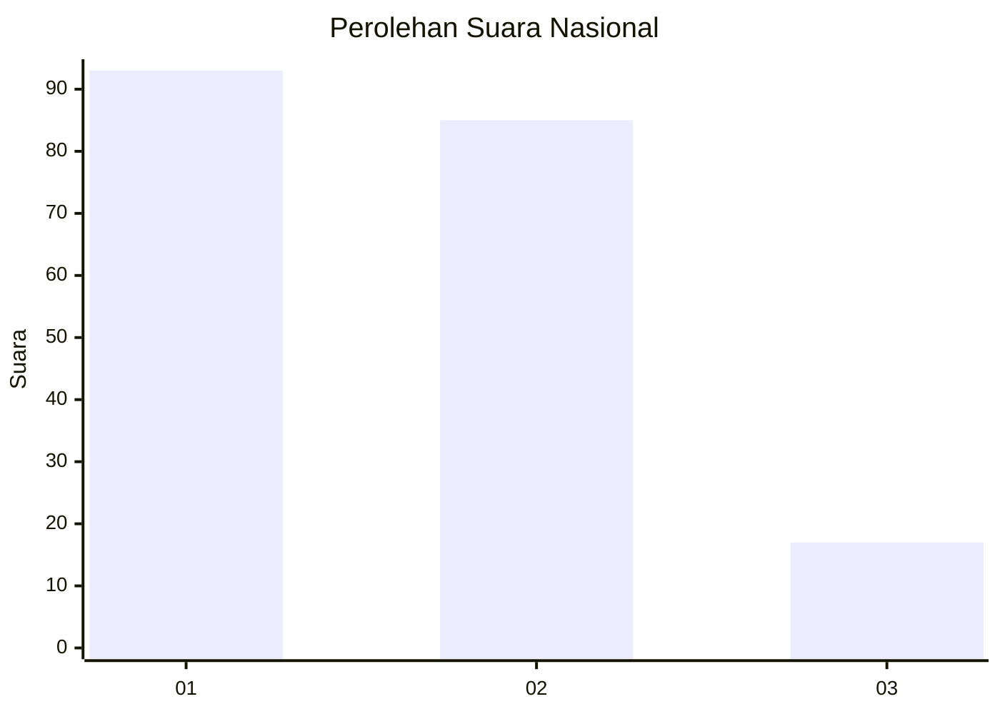
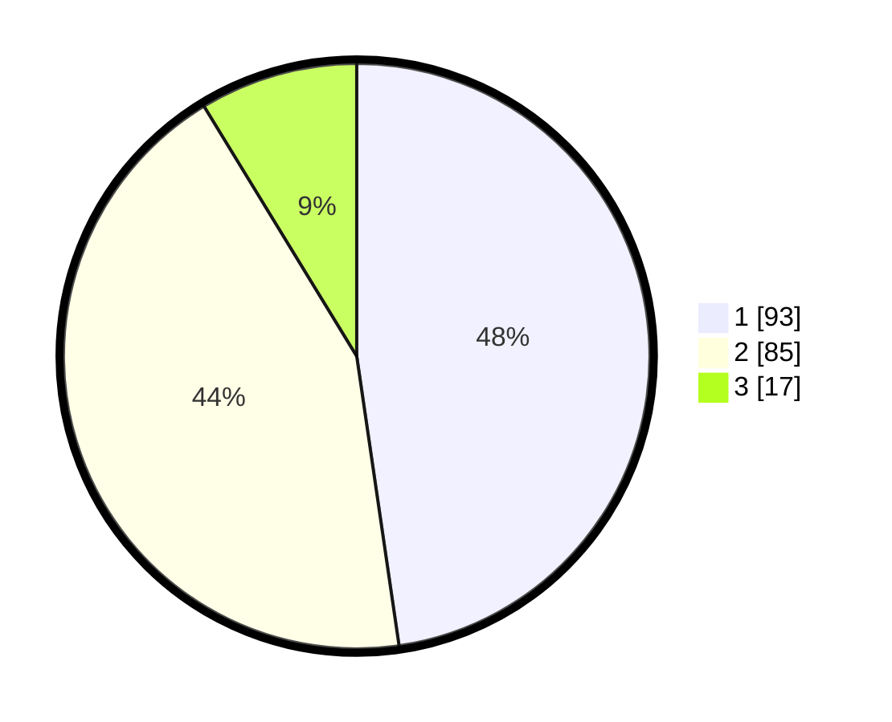

# Hasil

## Grafik

## Tabel

| No. | Nama Paslon    | Suara | Suara (raw) | Persentase |
|:--- |:-------------- | -----:| -----------:| ----------:|
| 1   | ANIES MUHAIMIN | 93    | [93][p-1]   | 47,69      |
| 2   | PRABOWO GIBRAN | 85    | [85][p-2]   | 43,59      |
| 3   | GANJAR MAHFUD  | 17    | [17][p-3]   | 8,72       |

[p-1]: https://github.com/gigit-pemilu/pemilu-2024/blob/main/pilpres/hitung-suara/sub/16-sumatera-selatan/sub/71-kota-palembang/sub/07-sukarami/sub/1011-sukodadi/sub/005-tps/sub/paslon-1.txt
[p-2]: https://github.com/gigit-pemilu/pemilu-2024/blob/main/pilpres/hitung-suara/sub/16-sumatera-selatan/sub/71-kota-palembang/sub/07-sukarami/sub/1011-sukodadi/sub/005-tps/sub/paslon-2.txt
[p-3]: https://github.com/gigit-pemilu/pemilu-2024/blob/main/pilpres/hitung-suara/sub/16-sumatera-selatan/sub/71-kota-palembang/sub/07-sukarami/sub/1011-sukodadi/sub/005-tps/sub/paslon-3.txt

## Foto C Plano

https://sirekap-obj-formc.kpu.go.id/19d8/pemilu/ppwp/16/71/07/10/11/1671071011005-20240215-004052--afd386ad-19c7-48cf-ac37-d409eef00ada.jpg

https://sirekap-obj-formc.kpu.go.id/19d8/pemilu/ppwp/16/71/07/10/11/1671071011005-20240215-004145--570443d7-fd23-4d36-9dca-69887e2bbaef.jpg

https://sirekap-obj-formc.kpu.go.id/19d8/pemilu/ppwp/16/71/07/10/11/1671071011005-20240215-004248--52a8c1ef-147a-454d-9572-83cf2490b3bc.jpg

## Metadata

| Key        | Value               |
| ---------- | ------------------- |
| Time Stamp | 2024-02-25 20:00:00 |

