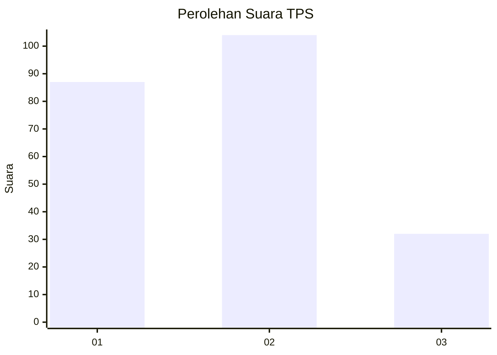
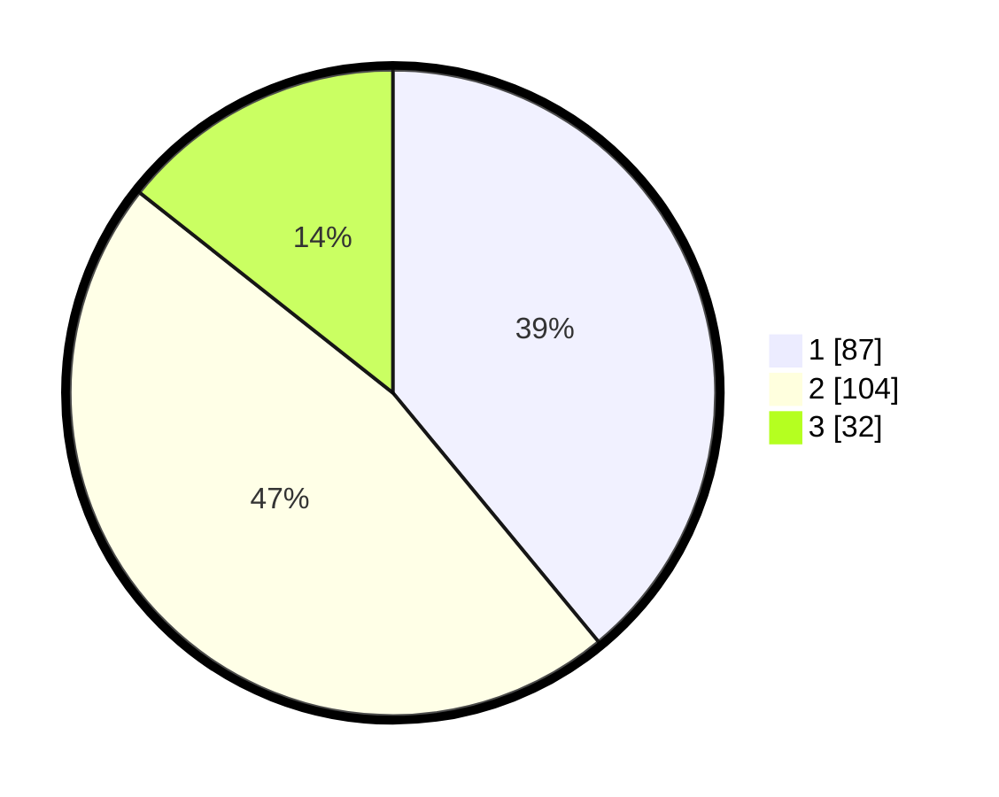

# Hasil

## Grafik

## Tabel

| No. | Nama Paslon    | Suara | Suara (raw) | Persentase |
|:--- |:-------------- | -----:| -----------:| ----------:|
| 1   | ANIES MUHAIMIN | 87    | [87][p-1]   | 39,01      |
| 2   | PRABOWO GIBRAN | 104   | [104][p-2]  | 46,64      |
| 3   | GANJAR MAHFUD  | 32    | [32][p-3]   | 14,35      |

[p-1]: https://github.com/gigit-pemilu/pemilu-2024-16-sumatera-selatan/blob/main/pilpres/hitung-suara/sub/16-sumatera-selatan/sub/71-kota-palembang/sub/07-sukarami/sub/1011-sukodadi/sub/038-tps/sub/paslon-1.txt
[p-2]: https://github.com/gigit-pemilu/pemilu-2024-16-sumatera-selatan/blob/main/pilpres/hitung-suara/sub/16-sumatera-selatan/sub/71-kota-palembang/sub/07-sukarami/sub/1011-sukodadi/sub/038-tps/sub/paslon-2.txt
[p-3]: https://github.com/gigit-pemilu/pemilu-2024-16-sumatera-selatan/blob/main/pilpres/hitung-suara/sub/16-sumatera-selatan/sub/71-kota-palembang/sub/07-sukarami/sub/1011-sukodadi/sub/038-tps/sub/paslon-3.txt

## Foto C Plano

https://sirekap-obj-formc.kpu.go.id/96d5/pemilu/ppwp/16/71/07/10/11/1671071011038-20240215-052050--f4a12583-fffe-42d7-a794-c6c5e4b4214d.jpg

https://sirekap-obj-formc.kpu.go.id/96d5/pemilu/ppwp/16/71/07/10/11/1671071011038-20240215-052526--4b6dd1c2-0822-4ac0-bf7c-77e0f38d07d3.jpg

https://sirekap-obj-formc.kpu.go.id/96d5/pemilu/ppwp/16/71/07/10/11/1671071011038-20240215-052702--56e0b370-5e31-4e10-8ef6-845ef1357b33.jpg

## Metadata

| Key        | Value               |
| ---------- | ------------------- |
| Time Stamp | 2024-02-26 12:00:00 |

