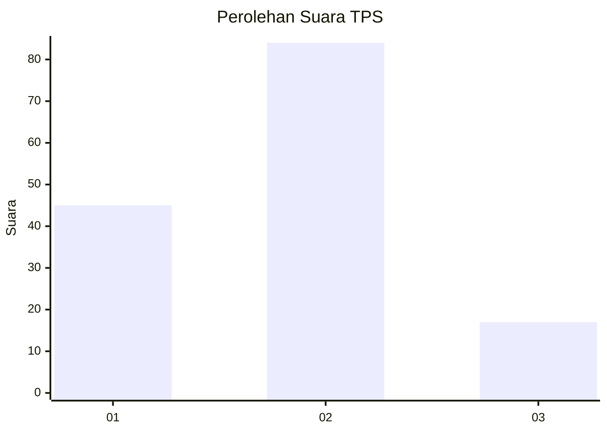
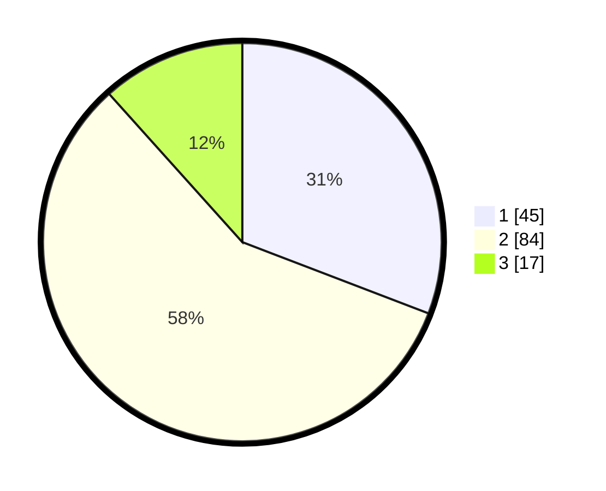

# Hasil

## Grafik

## Tabel

| No. | Nama Paslon    | Suara | Suara (raw) | Persentase |
|:--- |:-------------- | -----:| -----------:| ----------:|
| 1   | ANIES MUHAIMIN | 45    | [45][p-1]   | 30,82      |
| 2   | PRABOWO GIBRAN | 84    | [84][p-2]   | 57,53      |
| 3   | GANJAR MAHFUD  | 17    | [17][p-3]   | 11,64      |

[p-1]: https://github.com/gigit-pemilu/pemilu-2024-16-sumatera-selatan/blob/main/pilpres/hitung-suara/sub/16-sumatera-selatan/sub/71-kota-palembang/sub/08-sako/sub/1001-sukamaju/sub/001-tps/sub/paslon-1.txt
[p-2]: https://github.com/gigit-pemilu/pemilu-2024-16-sumatera-selatan/blob/main/pilpres/hitung-suara/sub/16-sumatera-selatan/sub/71-kota-palembang/sub/08-sako/sub/1001-sukamaju/sub/001-tps/sub/paslon-2.txt
[p-3]: https://github.com/gigit-pemilu/pemilu-2024-16-sumatera-selatan/blob/main/pilpres/hitung-suara/sub/16-sumatera-selatan/sub/71-kota-palembang/sub/08-sako/sub/1001-sukamaju/sub/001-tps/sub/paslon-3.txt

## Foto C Plano

https://sirekap-obj-formc.kpu.go.id/c2e5/pemilu/ppwp/16/71/08/10/01/1671081001001-20240219-143325--e3da1494-9010-4cb5-be72-1a37c7f43afc.jpg

https://sirekap-obj-formc.kpu.go.id/c2e5/pemilu/ppwp/16/71/08/10/01/1671081001001-20240219-143451--a5cef409-020a-497e-b910-dd9205637516.jpg

https://sirekap-obj-formc.kpu.go.id/c2e5/pemilu/ppwp/16/71/08/10/01/1671081001001-20240219-143559--020ac7f8-dcbe-432f-ba2d-db6080d332fe.jpg

## Metadata

| Key        | Value               |
| ---------- | ------------------- |
| Time Stamp | 2024-02-19 15:00:00 |

## DATA PEMILIH TETAP

Jumlah pemilih dalam DPT: **298**.
 * L: **595**.
 * P: **597**.

## DATA PENGGUNA HAK PILIH

Jumlah pengguna hak pilih dalam DPT: **527**.
 * L: **876**.
 * P: **827**.

Jumlah pengguna hak pilih dalam DPTb: **555**.
 * L: **582**.
 * P: **587**.

Jumlah pengguna hak pilih dalam DPK: **585**.
 * L: **85**.
 * P: **828**.

Jumlah pengguna hak pilih: **170**.
 * L: **878**.
 * P: **592**.

## JUMLAH SUARA SAH DAN TIDAK SAH

JUMLAH SELURUH SUARA SAH: **663**.

JUMLAH SUARA TIDAK SAH: **3**.

JUMLAH SELURUH SUARA SAH DAN SUARA TIDAK SAH: **670**.

