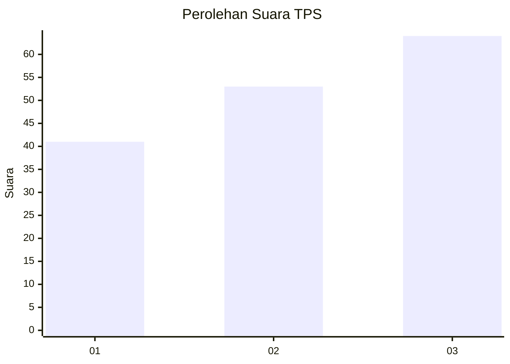
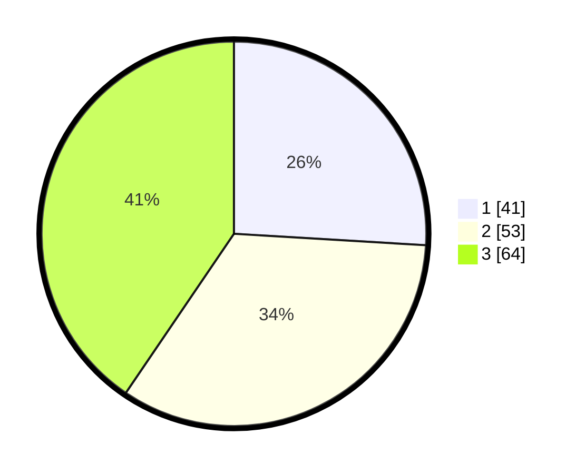

# Hasil

## Grafik

## Tabel

| No. | Nama Paslon    | Suara | Suara (raw) | Persentase |
|:--- |:-------------- | -----:| -----------:| ----------:|
| 1   | ANIES MUHAIMIN | 41    | [41][p-1]   | 25,95      |
| 2   | PRABOWO GIBRAN | 53    | [53][p-2]   | 33,54      |
| 3   | GANJAR MAHFUD  | 64    | [64][p-3]   | 40,51      |

[p-1]: https://github.com/gigit-pemilu/pemilu-2024-16-sumatera-selatan/blob/main/pilpres/hitung-suara/sub/16-sumatera-selatan/sub/71-kota-palembang/sub/08-sako/sub/1001-sukamaju/sub/003-tps/sub/paslon-1.txt
[p-2]: https://github.com/gigit-pemilu/pemilu-2024-16-sumatera-selatan/blob/main/pilpres/hitung-suara/sub/16-sumatera-selatan/sub/71-kota-palembang/sub/08-sako/sub/1001-sukamaju/sub/003-tps/sub/paslon-2.txt
[p-3]: https://github.com/gigit-pemilu/pemilu-2024-16-sumatera-selatan/blob/main/pilpres/hitung-suara/sub/16-sumatera-selatan/sub/71-kota-palembang/sub/08-sako/sub/1001-sukamaju/sub/003-tps/sub/paslon-3.txt

## Foto C Plano

https://sirekap-obj-formc.kpu.go.id/29f2/pemilu/ppwp/16/71/08/10/01/1671081001003-20240219-143811--983c8cbc-5936-4c14-bcb3-10298959d7dd.jpg

https://sirekap-obj-formc.kpu.go.id/29f2/pemilu/ppwp/16/71/08/10/01/1671081001003-20240219-143918--0a3981bb-ece7-42b0-a803-0397a8bab4e5.jpg

https://sirekap-obj-formc.kpu.go.id/29f2/pemilu/ppwp/16/71/08/10/01/1671081001003-20240219-144022--9a545dcb-c305-420b-8d0c-5ecd632cd861.jpg

## Metadata

| Key        | Value               |
| ---------- | ------------------- |
| Time Stamp | 2024-02-24 22:31:28 |

