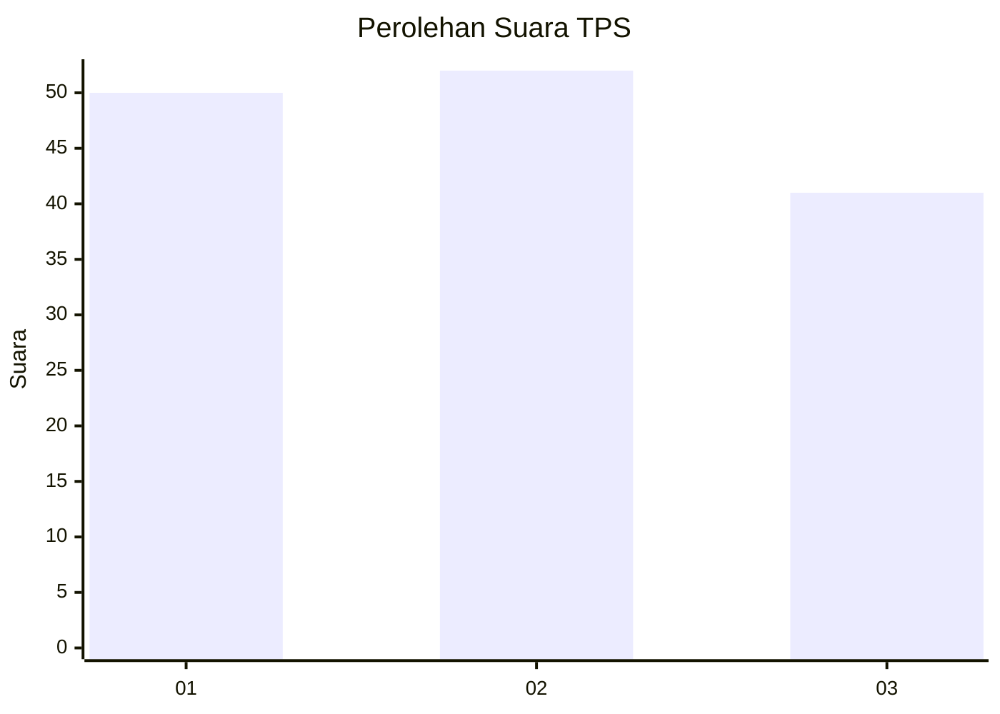
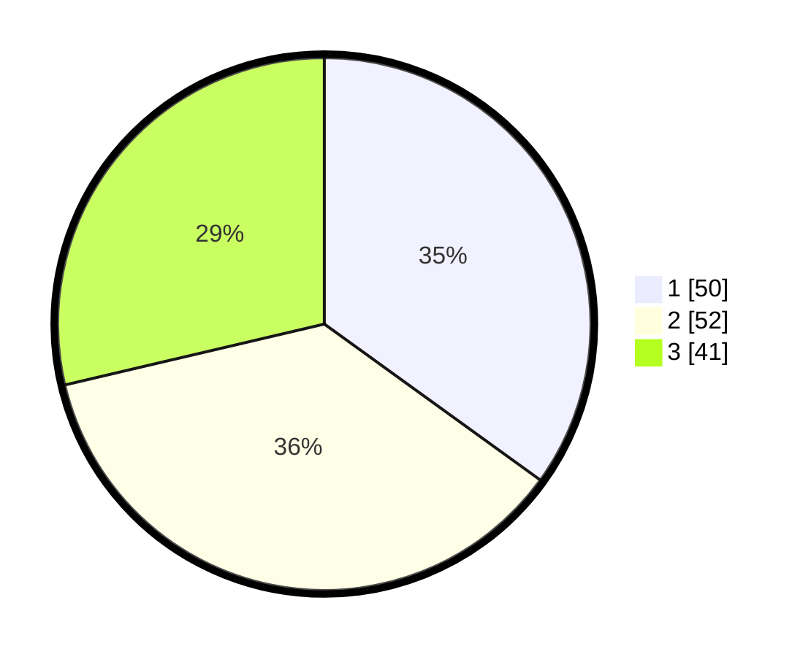

# Hasil

## Grafik

## Tabel

| No. | Nama Paslon    | Suara | Suara (raw) | Persentase |
|:--- |:-------------- | -----:| -----------:| ----------:|
| 1   | ANIES MUHAIMIN | 50    | [50][p-1]   | 34,97      |
| 2   | PRABOWO GIBRAN | 52    | [52][p-2]   | 36,36      |
| 3   | GANJAR MAHFUD  | 41    | [41][p-3]   | 28,67      |

[p-1]: https://github.com/gigit-pemilu/pemilu-2024-16-sumatera-selatan/blob/main/pilpres/hitung-suara/sub/16-sumatera-selatan/sub/71-kota-palembang/sub/08-sako/sub/1001-sukamaju/sub/004-tps/sub/paslon-1.txt
[p-2]: https://github.com/gigit-pemilu/pemilu-2024-16-sumatera-selatan/blob/main/pilpres/hitung-suara/sub/16-sumatera-selatan/sub/71-kota-palembang/sub/08-sako/sub/1001-sukamaju/sub/004-tps/sub/paslon-2.txt
[p-3]: https://github.com/gigit-pemilu/pemilu-2024-16-sumatera-selatan/blob/main/pilpres/hitung-suara/sub/16-sumatera-selatan/sub/71-kota-palembang/sub/08-sako/sub/1001-sukamaju/sub/004-tps/sub/paslon-3.txt

## Foto C Plano

https://sirekap-obj-formc.kpu.go.id/729e/pemilu/ppwp/16/71/08/10/01/1671081001004-20240219-144146--6dc68e53-2a1a-40d4-b86c-1790d20459d6.jpg

https://sirekap-obj-formc.kpu.go.id/729e/pemilu/ppwp/16/71/08/10/01/1671081001004-20240219-144229--c0648f2d-af79-4bf3-bf0b-b9e1211c21fd.jpg

https://sirekap-obj-formc.kpu.go.id/729e/pemilu/ppwp/16/71/08/10/01/1671081001004-20240219-144352--1961a7f2-6e80-469d-b63d-c1caa8ea6df6.jpg

## Metadata

| Key        | Value               |
| ---------- | ------------------- |
| Time Stamp | 2024-02-19 15:00:00 |

## DATA PEMILIH TETAP

Jumlah pemilih dalam DPT: **196**.
 * L: **94**.
 * P: **102**.

## DATA PENGGUNA HAK PILIH

Jumlah pengguna hak pilih dalam DPT: **30**.
 * L: **67**.
 * P: **6**.

Jumlah pengguna hak pilih dalam DPTb: **40**.
 * L: **60**.
 * P: **20**.

Jumlah pengguna hak pilih dalam DPK: **0**.
 * L: **0**.
 * P: **0**.

Jumlah pengguna hak pilih: **143**.
 * L: **69**.
 * P: **74**.

## JUMLAH SUARA SAH DAN TIDAK SAH

JUMLAH SELURUH SUARA SAH: **143**.

JUMLAH SUARA TIDAK SAH: **0**.

JUMLAH SELURUH SUARA SAH DAN SUARA TIDAK SAH: **143**.

