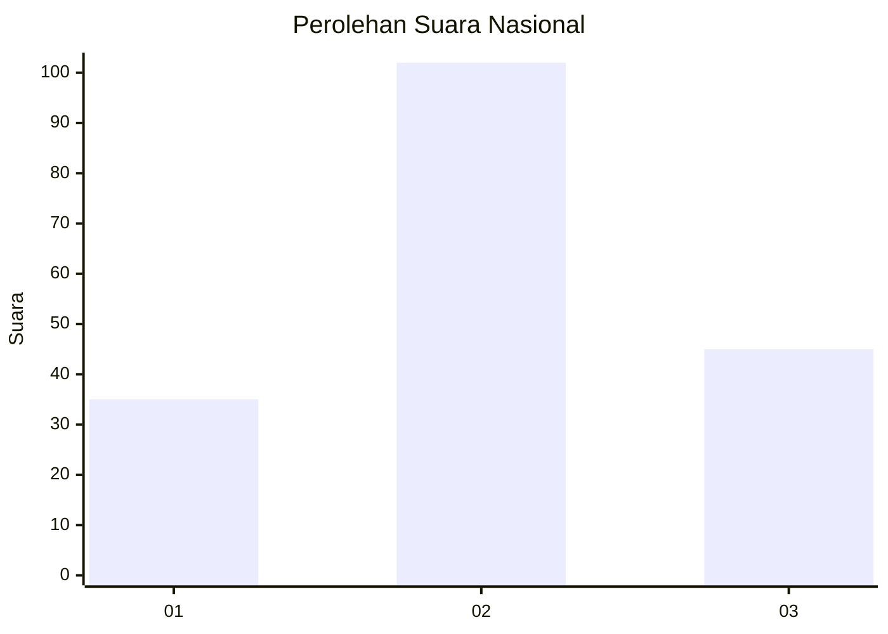
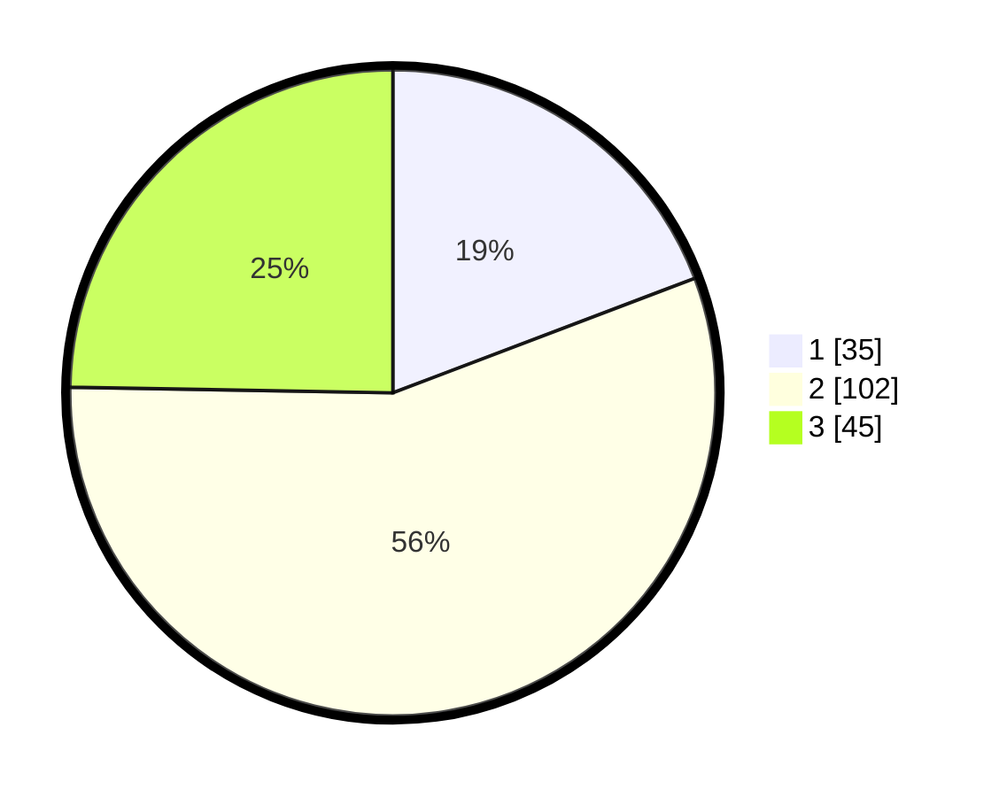

# Hasil

## Grafik

## Tabel

| No. | Nama Paslon    | Suara | Suara (raw) | Persentase |
|:--- |:-------------- | -----:| -----------:| ----------:|
| 1   | ANIES MUHAIMIN | 35    | [35][p-1]   | 19,23      |
| 2   | PRABOWO GIBRAN | 102   | [102][p-2]  | 56,04      |
| 3   | GANJAR MAHFUD  | 45    | [45][p-3]   | 24,73      |

[p-1]: https://github.com/gigit-pemilu/pemilu-2024/blob/main/pilpres/hitung-suara/sub/16-sumatera-selatan/sub/71-kota-palembang/sub/08-sako/sub/1001-sukamaju/sub/007-tps/sub/paslon-1.txt
[p-2]: https://github.com/gigit-pemilu/pemilu-2024/blob/main/pilpres/hitung-suara/sub/16-sumatera-selatan/sub/71-kota-palembang/sub/08-sako/sub/1001-sukamaju/sub/007-tps/sub/paslon-2.txt
[p-3]: https://github.com/gigit-pemilu/pemilu-2024/blob/main/pilpres/hitung-suara/sub/16-sumatera-selatan/sub/71-kota-palembang/sub/08-sako/sub/1001-sukamaju/sub/007-tps/sub/paslon-3.txt

## Foto C Plano

https://sirekap-obj-formc.kpu.go.id/111d/pemilu/ppwp/16/71/08/10/01/1671081001007-20240219-150055--17888b3a-fa11-4411-bf1b-2582982db85c.jpg

https://sirekap-obj-formc.kpu.go.id/111d/pemilu/ppwp/16/71/08/10/01/1671081001007-20240219-150150--d12f1207-baf9-4165-8bac-3a48a8b964d0.jpg

https://sirekap-obj-formc.kpu.go.id/111d/pemilu/ppwp/16/71/08/10/01/1671081001007-20240219-150237--6bf9acbd-eaca-4b8c-8402-cfeeee654e8c.jpg

## Metadata

| Key        | Value               |
| ---------- | ------------------- |
| Time Stamp | 2024-02-19 16:00:00 |

## DATA PEMILIH TETAP

Jumlah pemilih dalam DPT: **335**.
 * L: **592**.
 * P: **528**.

## DATA PENGGUNA HAK PILIH

Jumlah pengguna hak pilih dalam DPT: **536**.
 * L: **377**.
 * P: **299**.

Jumlah pengguna hak pilih dalam DPTb: **284**.
 * L: **83**.
 * P: **23**.

Jumlah pengguna hak pilih dalam DPK: **284**.
 * L: **382**.
 * P: **882**.

Jumlah pengguna hak pilih: **689**.
 * L: **30**.
 * P: **504**.

## JUMLAH SUARA SAH DAN TIDAK SAH

JUMLAH SELURUH SUARA SAH: **583**.

JUMLAH SUARA TIDAK SAH: **2**.

JUMLAH SELURUH SUARA SAH DAN SUARA TIDAK SAH: **584**.

