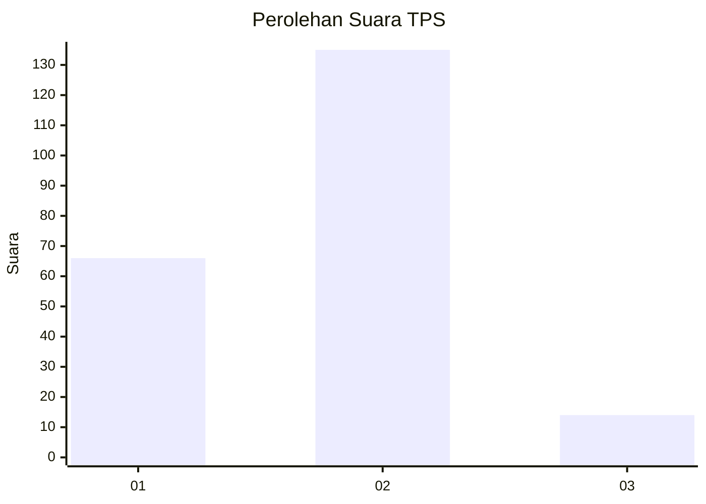
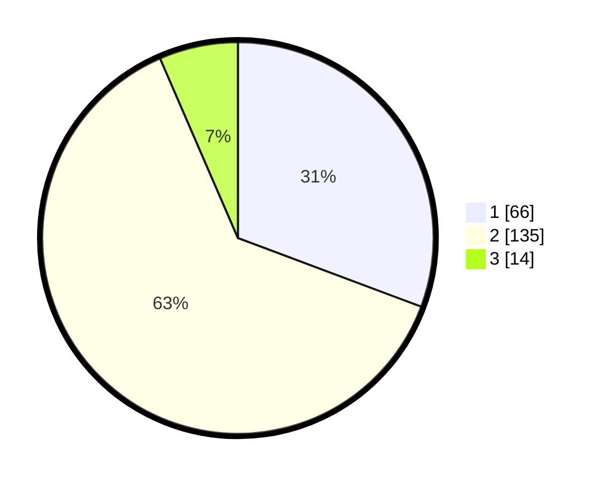

# Hasil

## Grafik

## Tabel

| No. | Nama Paslon    | Suara | Suara (raw) | Persentase |
|:--- |:-------------- | -----:| -----------:| ----------:|
| 1   | ANIES MUHAIMIN | 66    | [66][p-1]   | 30,70      |
| 2   | PRABOWO GIBRAN | 135   | [135][p-2]  | 62,79      |
| 3   | GANJAR MAHFUD  | 14    | [14][p-3]   | 6,51       |

[p-1]: https://github.com/gigit-pemilu/pemilu-2024-16-sumatera-selatan/blob/main/pilpres/hitung-suara/sub/16-sumatera-selatan/sub/71-kota-palembang/sub/08-sako/sub/1001-sukamaju/sub/011-tps/sub/paslon-1.txt
[p-2]: https://github.com/gigit-pemilu/pemilu-2024-16-sumatera-selatan/blob/main/pilpres/hitung-suara/sub/16-sumatera-selatan/sub/71-kota-palembang/sub/08-sako/sub/1001-sukamaju/sub/011-tps/sub/paslon-2.txt
[p-3]: https://github.com/gigit-pemilu/pemilu-2024-16-sumatera-selatan/blob/main/pilpres/hitung-suara/sub/16-sumatera-selatan/sub/71-kota-palembang/sub/08-sako/sub/1001-sukamaju/sub/011-tps/sub/paslon-3.txt

## Foto C Plano

https://sirekap-obj-formc.kpu.go.id/7672/pemilu/ppwp/16/71/08/10/01/1671081001011-20240219-151302--e7d3c9fd-ad48-4860-a435-5922cc7e0a15.jpg

https://sirekap-obj-formc.kpu.go.id/7672/pemilu/ppwp/16/71/08/10/01/1671081001011-20240219-151404--b319bd1c-d6cd-47a8-a62e-20093671e04a.jpg

https://sirekap-obj-formc.kpu.go.id/7672/pemilu/ppwp/16/71/08/10/01/1671081001011-20240219-151505--c3febfdc-789f-498a-8c52-6749135f933c.jpg

## Metadata

| Key        | Value               |
| ---------- | ------------------- |
| Time Stamp | 2024-02-19 16:00:00 |

## DATA PEMILIH TETAP

Jumlah pemilih dalam DPT: **287**.
 * L: **645**.
 * P: **636**.

## DATA PENGGUNA HAK PILIH

Jumlah pengguna hak pilih dalam DPT: **276**.
 * L: **405**.
 * P: **411**.

Jumlah pengguna hak pilih dalam DPTb: **802**.
 * L: **4**.
 * P: **5**.

Jumlah pengguna hak pilih dalam DPK: **60**.
 * L: **3**.
 * P: **7**.

Jumlah pengguna hak pilih: **228**.
 * L: **609**.
 * P: **129**.

## JUMLAH SUARA SAH DAN TIDAK SAH

JUMLAH SELURUH SUARA SAH: **225**.

JUMLAH SUARA TIDAK SAH: **3**.

JUMLAH SELURUH SUARA SAH DAN SUARA TIDAK SAH: **228**.

