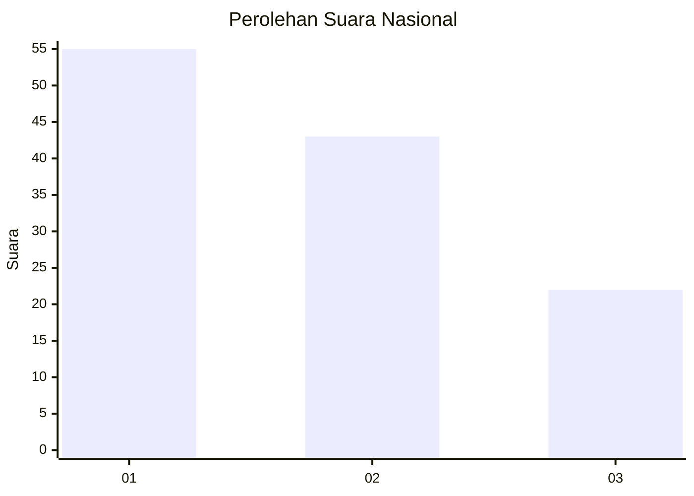
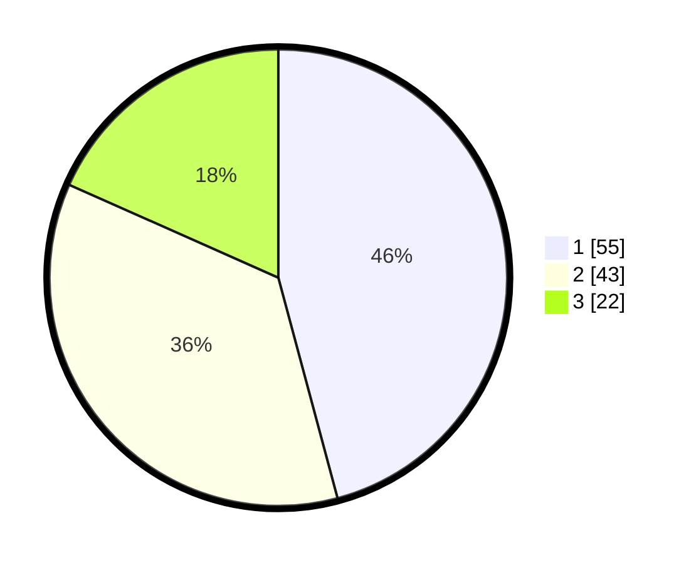

# Hasil

## Grafik

## Tabel

| No. | Nama Paslon    | Suara | Suara (raw) | Persentase |
|:--- |:-------------- | -----:| -----------:| ----------:|
| 1   | ANIES MUHAIMIN | 55    | [55][p-1]   | 45,83      |
| 2   | PRABOWO GIBRAN | 43    | [43][p-2]   | 35,83      |
| 3   | GANJAR MAHFUD  | 22    | [22][p-3]   | 18,33      |

[p-1]: https://github.com/gigit-pemilu/pemilu-2024/blob/main/pilpres/hitung-suara/sub/16-sumatera-selatan/sub/71-kota-palembang/sub/08-sako/sub/1001-sukamaju/sub/016-tps/sub/paslon-1.txt
[p-2]: https://github.com/gigit-pemilu/pemilu-2024/blob/main/pilpres/hitung-suara/sub/16-sumatera-selatan/sub/71-kota-palembang/sub/08-sako/sub/1001-sukamaju/sub/016-tps/sub/paslon-2.txt
[p-3]: https://github.com/gigit-pemilu/pemilu-2024/blob/main/pilpres/hitung-suara/sub/16-sumatera-selatan/sub/71-kota-palembang/sub/08-sako/sub/1001-sukamaju/sub/016-tps/sub/paslon-3.txt

## Foto C Plano

https://sirekap-obj-formc.kpu.go.id/32a4/pemilu/ppwp/16/71/08/10/01/1671081001016-20240219-153633--014bb7a5-1f4b-4a6f-98c0-d9bb29832f1f.jpg

https://sirekap-obj-formc.kpu.go.id/32a4/pemilu/ppwp/16/71/08/10/01/1671081001016-20240219-153744--b8e769bd-52de-43f1-acde-1d6aeb64b0be.jpg

https://sirekap-obj-formc.kpu.go.id/32a4/pemilu/ppwp/16/71/08/10/01/1671081001016-20240219-153832--2b47b95a-d045-4760-86de-92ea986ea859.jpg

## Metadata

| Key        | Value               |
| ---------- | ------------------- |
| Time Stamp | 2024-02-19 16:00:00 |

## DATA PEMILIH TETAP

Jumlah pemilih dalam DPT: **282**.
 * L: **540**.
 * P: **542**.

## DATA PENGGUNA HAK PILIH

Jumlah pengguna hak pilih dalam DPT: **222**.
 * L: **6**.
 * P: **456**.

Jumlah pengguna hak pilih dalam DPTb: **0**.
 * L: **0**.
 * P: **0**.

Jumlah pengguna hak pilih dalam DPK: **22**.
 * L: **4**.
 * P: **6**.

Jumlah pengguna hak pilih: **224**.
 * L: **607**.
 * P: **667**.

## JUMLAH SUARA SAH DAN TIDAK SAH

JUMLAH SELURUH SUARA SAH: **220**.

JUMLAH SUARA TIDAK SAH: **84**.

JUMLAH SELURUH SUARA SAH DAN SUARA TIDAK SAH: **224**.

