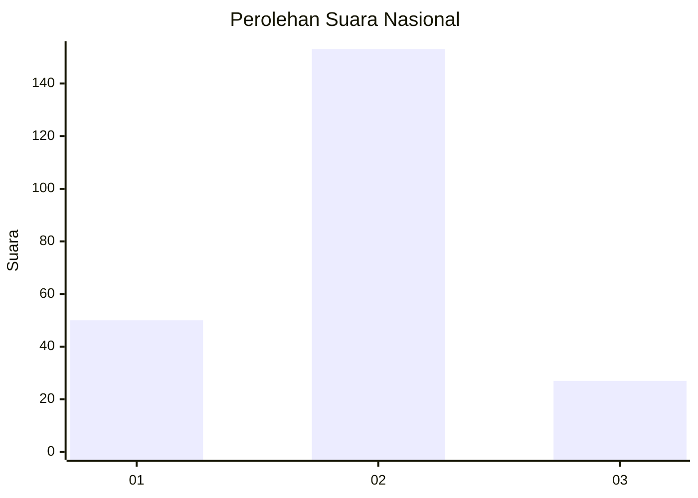
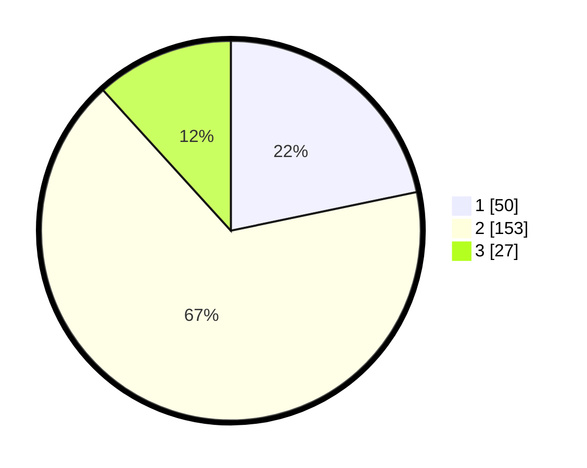

# Hasil

## Grafik

## Tabel

| No. | Nama Paslon    | Suara | Suara (raw) | Persentase |
|:--- |:-------------- | -----:| -----------:| ----------:|
| 1   | ANIES MUHAIMIN | 50    | [50][p-1]   | 21,74      |
| 2   | PRABOWO GIBRAN | 153   | [153][p-2]  | 66,52      |
| 3   | GANJAR MAHFUD  | 27    | [27][p-3]   | 11,74      |

[p-1]: https://github.com/gigit-pemilu/pemilu-2024/blob/main/pilpres/hitung-suara/sub/16-sumatera-selatan/sub/71-kota-palembang/sub/08-sako/sub/1001-sukamaju/sub/034-tps/sub/paslon-1.txt
[p-2]: https://github.com/gigit-pemilu/pemilu-2024/blob/main/pilpres/hitung-suara/sub/16-sumatera-selatan/sub/71-kota-palembang/sub/08-sako/sub/1001-sukamaju/sub/034-tps/sub/paslon-2.txt
[p-3]: https://github.com/gigit-pemilu/pemilu-2024/blob/main/pilpres/hitung-suara/sub/16-sumatera-selatan/sub/71-kota-palembang/sub/08-sako/sub/1001-sukamaju/sub/034-tps/sub/paslon-3.txt

## Foto C Plano

https://sirekap-obj-formc.kpu.go.id/9142/pemilu/ppwp/16/71/08/10/01/1671081001034-20240219-155225--489519ff-c596-49da-b1a2-4cf1f5c8ae8f.jpg

https://sirekap-obj-formc.kpu.go.id/9142/pemilu/ppwp/16/71/08/10/01/1671081001034-20240219-155306--09e603f8-e275-4528-919c-dad439599f21.jpg

https://sirekap-obj-formc.kpu.go.id/9142/pemilu/ppwp/16/71/08/10/01/1671081001034-20240219-155334--df29a81e-69e5-4476-a6cf-f9dab292ff75.jpg

## Metadata

| Key        | Value               |
| ---------- | ------------------- |
| Time Stamp | 2024-02-19 16:00:00 |

## DATA PEMILIH TETAP

Jumlah pemilih dalam DPT: **290**.
 * L: **143**.
 * P: **147**.

## DATA PENGGUNA HAK PILIH

Jumlah pengguna hak pilih dalam DPT: **199**.
 * L: **119**.
 * P: **130**.

Jumlah pengguna hak pilih dalam DPTb: **84**.
 * L: **0**.
 * P: **800**.

Jumlah pengguna hak pilih dalam DPK: **3**.
 * L: **2**.
 * P: **81**.

Jumlah pengguna hak pilih: **297**.
 * L: **116**.
 * P: **131**.

## JUMLAH SUARA SAH DAN TIDAK SAH

JUMLAH SELURUH SUARA SAH: **860**.

JUMLAH SUARA TIDAK SAH: **153**.

JUMLAH SELURUH SUARA SAH DAN SUARA TIDAK SAH: **25**.

