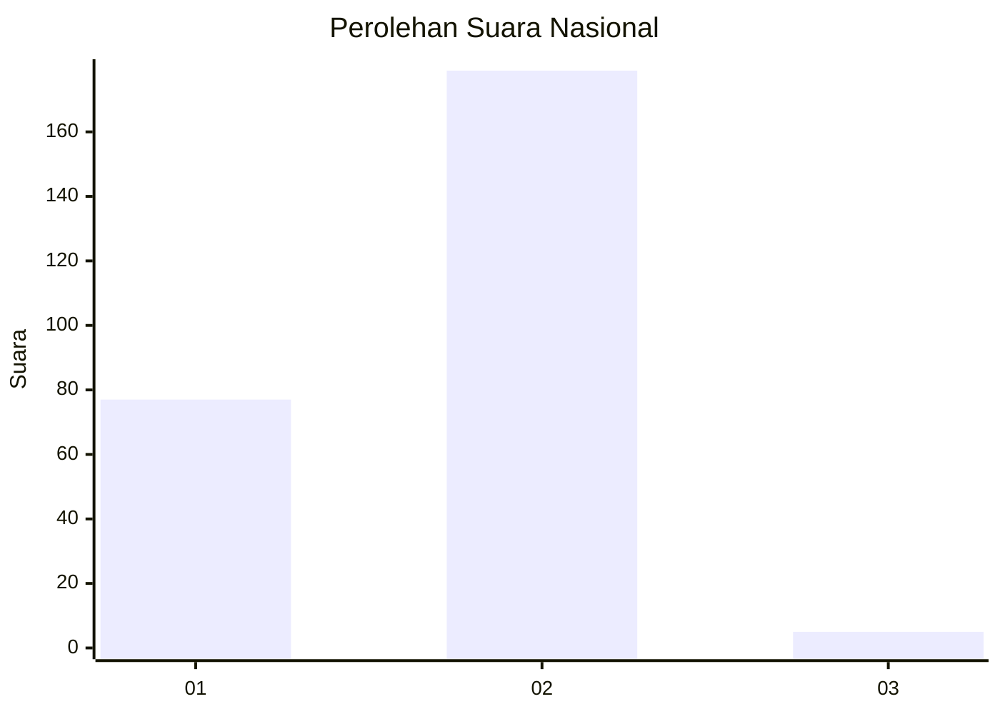
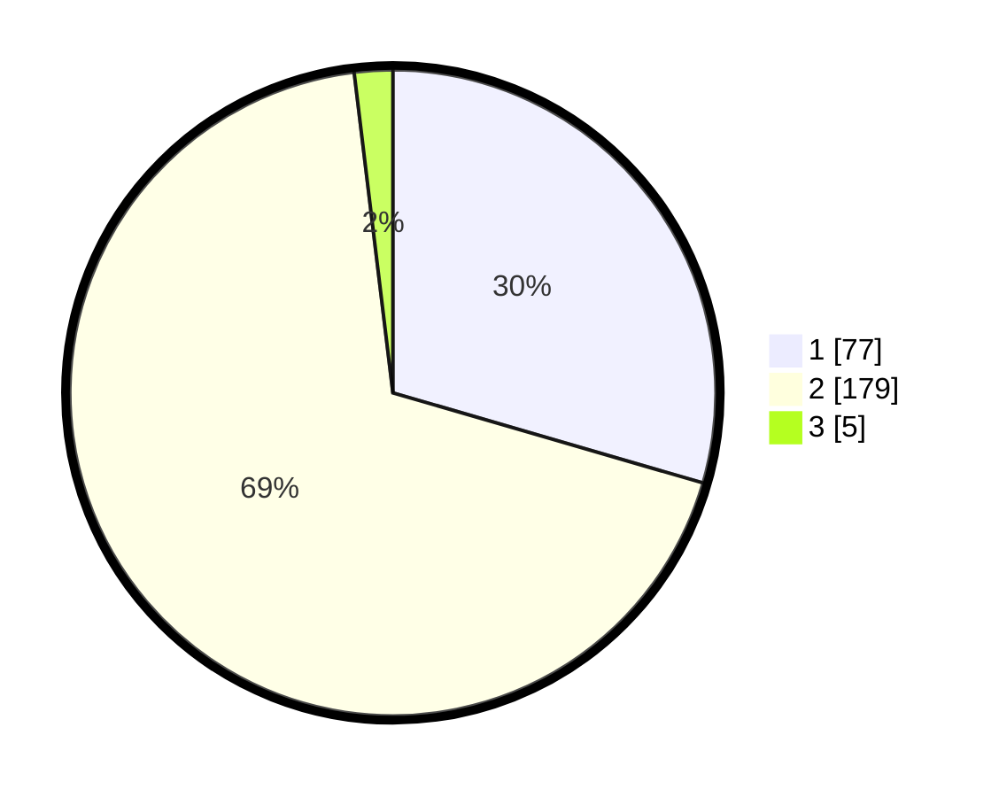

# Hasil

## Grafik

## Tabel

| No. | Nama Paslon    | Suara | Suara (raw) | Persentase |
|:--- |:-------------- | -----:| -----------:| ----------:|
| 1   | ANIES MUHAIMIN | 77    | [77][p-1]   | 29,50      |
| 2   | PRABOWO GIBRAN | 179   | [179][p-2]  | 68,58      |
| 3   | GANJAR MAHFUD  | 5     | [5][p-3]    | 1,92       |

[p-1]: https://github.com/gigit-pemilu/pemilu-2024/blob/main/pilpres/hitung-suara/sub/16-sumatera-selatan/sub/71-kota-palembang/sub/08-sako/sub/1001-sukamaju/sub/053-tps/sub/paslon-1.txt
[p-2]: https://github.com/gigit-pemilu/pemilu-2024/blob/main/pilpres/hitung-suara/sub/16-sumatera-selatan/sub/71-kota-palembang/sub/08-sako/sub/1001-sukamaju/sub/053-tps/sub/paslon-2.txt
[p-3]: https://github.com/gigit-pemilu/pemilu-2024/blob/main/pilpres/hitung-suara/sub/16-sumatera-selatan/sub/71-kota-palembang/sub/08-sako/sub/1001-sukamaju/sub/053-tps/sub/paslon-3.txt

## Foto C Plano

https://sirekap-obj-formc.kpu.go.id/27a5/pemilu/ppwp/16/71/08/10/01/1671081001053-20240219-203913--3e67f9ed-c95c-4ae0-ac0f-f0de96751fef.jpg

https://sirekap-obj-formc.kpu.go.id/27a5/pemilu/ppwp/16/71/08/10/01/1671081001053-20240219-204009--dcbc6ae2-c06b-4d39-9cdb-d720496409b8.jpg

https://sirekap-obj-formc.kpu.go.id/27a5/pemilu/ppwp/16/71/08/10/01/1671081001053-20240219-204124--1392b36f-ddb2-4fab-8155-d1b7af204900.jpg

## Metadata

| Key        | Value               |
| ---------- | ------------------- |
| Time Stamp | 2024-02-19 21:00:00 |

## DATA PEMILIH TETAP

Jumlah pemilih dalam DPT: **622**.
 * L: **55**.
 * P: **552**.

## DATA PENGGUNA HAK PILIH

Jumlah pengguna hak pilih dalam DPT: **624**.
 * L: **104**.
 * P: **116**.

Jumlah pengguna hak pilih dalam DPTb: **655**.
 * L: **0**.
 * P: **0**.

Jumlah pengguna hak pilih dalam DPK: **4**.
 * L: **4**.
 * P: **0**.

Jumlah pengguna hak pilih: **224**.
 * L: **113**.
 * P: **111**.

## JUMLAH SUARA SAH DAN TIDAK SAH

JUMLAH SELURUH SUARA SAH: **221**.

JUMLAH SUARA TIDAK SAH: **3**.

JUMLAH SELURUH SUARA SAH DAN SUARA TIDAK SAH: **229**.

