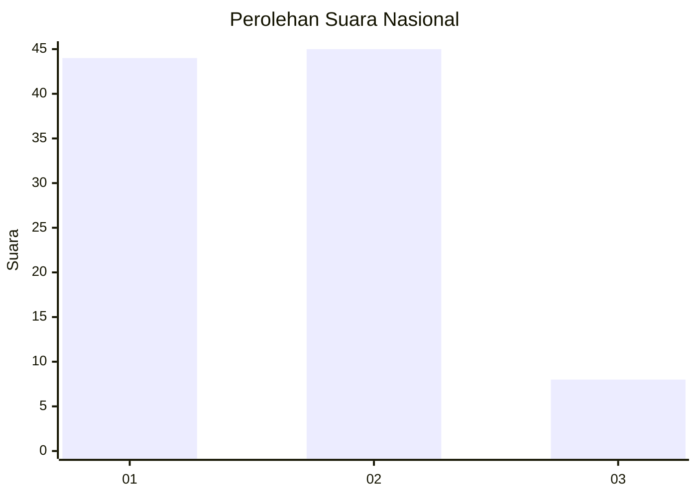
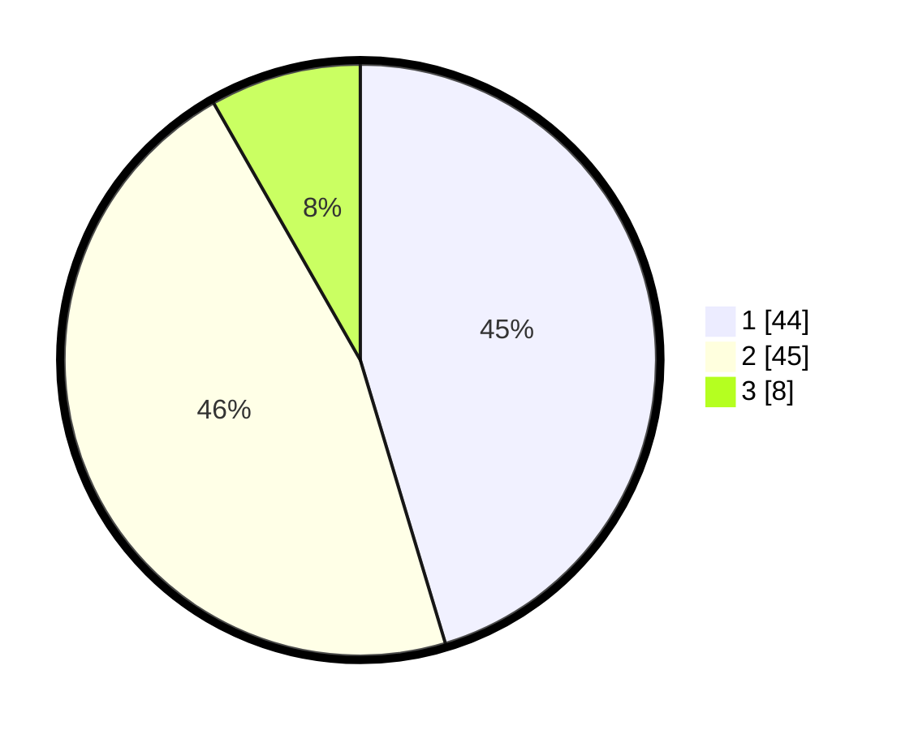

# Hasil

## Grafik

## Tabel

| No. | Nama Paslon    | Suara | Suara (raw) | Persentase |
|:--- |:-------------- | -----:| -----------:| ----------:|
| 1   | ANIES MUHAIMIN | 44    | [44][p-1]   | 45,36      |
| 2   | PRABOWO GIBRAN | 45    | [45][p-2]   | 46,39      |
| 3   | GANJAR MAHFUD  | 8     | [8][p-3]    | 8,25       |

[p-1]: https://github.com/gigit-pemilu/pemilu-2024/blob/main/pilpres/hitung-suara/sub/16-sumatera-selatan/sub/71-kota-palembang/sub/08-sako/sub/1001-sukamaju/sub/058-tps/sub/paslon-1.txt
[p-2]: https://github.com/gigit-pemilu/pemilu-2024/blob/main/pilpres/hitung-suara/sub/16-sumatera-selatan/sub/71-kota-palembang/sub/08-sako/sub/1001-sukamaju/sub/058-tps/sub/paslon-2.txt
[p-3]: https://github.com/gigit-pemilu/pemilu-2024/blob/main/pilpres/hitung-suara/sub/16-sumatera-selatan/sub/71-kota-palembang/sub/08-sako/sub/1001-sukamaju/sub/058-tps/sub/paslon-3.txt

## Foto C Plano

https://sirekap-obj-formc.kpu.go.id/7614/pemilu/ppwp/16/71/08/10/01/1671081001058-20240219-171415--72fa4e2b-84bf-477a-a172-07f0f246f74d.jpg

https://sirekap-obj-formc.kpu.go.id/7614/pemilu/ppwp/16/71/08/10/01/1671081001058-20240219-171458--3be617ae-58e3-417e-9679-4046dc10c73e.jpg

https://sirekap-obj-formc.kpu.go.id/7614/pemilu/ppwp/16/71/08/10/01/1671081001058-20240219-171533--f2c27b4a-5689-4176-bce7-c4a0c8281af3.jpg

## Metadata

| Key        | Value               |
| ---------- | ------------------- |
| Time Stamp | 2024-02-19 18:00:00 |

## DATA PEMILIH TETAP

Jumlah pemilih dalam DPT: **243**.
 * L: **628**.
 * P: **665**.

## DATA PENGGUNA HAK PILIH

Jumlah pengguna hak pilih dalam DPT: **599**.
 * L: **96**.
 * P: **503**.

Jumlah pengguna hak pilih dalam DPTb: **358**.
 * L: **0**.
 * P: **0**.

Jumlah pengguna hak pilih dalam DPK: **0**.
 * L: **0**.
 * P: **0**.

Jumlah pengguna hak pilih: **199**.
 * L: **96**.
 * P: **603**.

## JUMLAH SUARA SAH DAN TIDAK SAH

JUMLAH SELURUH SUARA SAH: **697**.

JUMLAH SUARA TIDAK SAH: **2**.

JUMLAH SELURUH SUARA SAH DAN SUARA TIDAK SAH: **599**.

