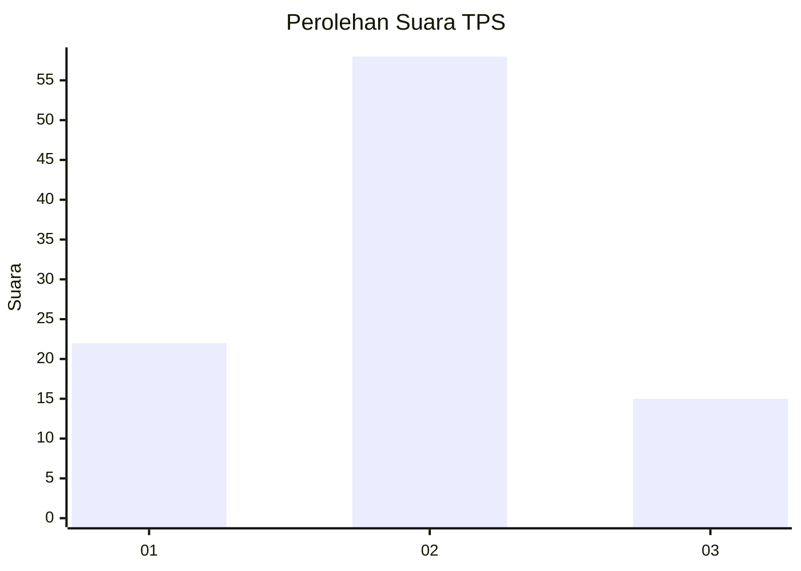
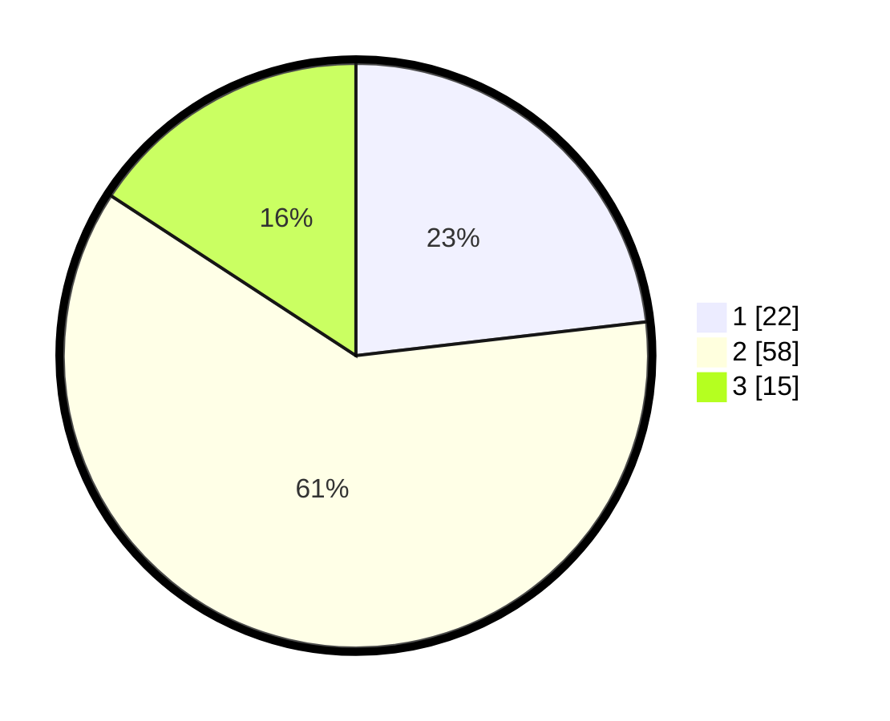

# Hasil

## Grafik

## Tabel

| No. | Nama Paslon    | Suara | Suara (raw) | Persentase |
|:--- |:-------------- | -----:| -----------:| ----------:|
| 1   | ANIES MUHAIMIN | 22    | [22][p-1]   | 23,16      |
| 2   | PRABOWO GIBRAN | 58    | [58][p-2]   | 61,05      |
| 3   | GANJAR MAHFUD  | 15    | [15][p-3]   | 15,79      |

[p-1]: https://github.com/gigit-pemilu/pemilu-2024-16-sumatera-selatan/blob/main/pilpres/hitung-suara/sub/16-sumatera-selatan/sub/71-kota-palembang/sub/08-sako/sub/1001-sukamaju/sub/059-tps/sub/paslon-1.txt
[p-2]: https://github.com/gigit-pemilu/pemilu-2024-16-sumatera-selatan/blob/main/pilpres/hitung-suara/sub/16-sumatera-selatan/sub/71-kota-palembang/sub/08-sako/sub/1001-sukamaju/sub/059-tps/sub/paslon-2.txt
[p-3]: https://github.com/gigit-pemilu/pemilu-2024-16-sumatera-selatan/blob/main/pilpres/hitung-suara/sub/16-sumatera-selatan/sub/71-kota-palembang/sub/08-sako/sub/1001-sukamaju/sub/059-tps/sub/paslon-3.txt

## Foto C Plano

https://sirekap-obj-formc.kpu.go.id/5279/pemilu/ppwp/16/71/08/10/01/1671081001059-20240219-170934--9ecbce24-3a5c-4751-af51-abdbc331e12c.jpg

https://sirekap-obj-formc.kpu.go.id/5279/pemilu/ppwp/16/71/08/10/01/1671081001059-20240219-171004--35edcad2-6654-49a9-8959-9590a7d03e37.jpg

https://sirekap-obj-formc.kpu.go.id/5279/pemilu/ppwp/16/71/08/10/01/1671081001059-20240219-171053--b07bae27-34f7-4c2d-9974-351c411bb2d0.jpg

## Metadata

| Key        | Value               |
| ---------- | ------------------- |
| Time Stamp | 2024-02-19 18:00:00 |

## DATA PEMILIH TETAP

Jumlah pemilih dalam DPT: **242**.
 * L: **349**.
 * P: **528**.

## DATA PENGGUNA HAK PILIH

Jumlah pengguna hak pilih dalam DPT: **896**.
 * L: **796**.
 * P: **800**.

Jumlah pengguna hak pilih dalam DPTb: **0**.
 * L: **0**.
 * P: **0**.

Jumlah pengguna hak pilih dalam DPK: **2**.
 * L: **7**.
 * P: **3**.

Jumlah pengguna hak pilih: **298**.
 * L: **42**.
 * P: **205**.

## JUMLAH SUARA SAH DAN TIDAK SAH

JUMLAH SELURUH SUARA SAH: **695**.

JUMLAH SUARA TIDAK SAH: **3**.

JUMLAH SELURUH SUARA SAH DAN SUARA TIDAK SAH: **598**.

