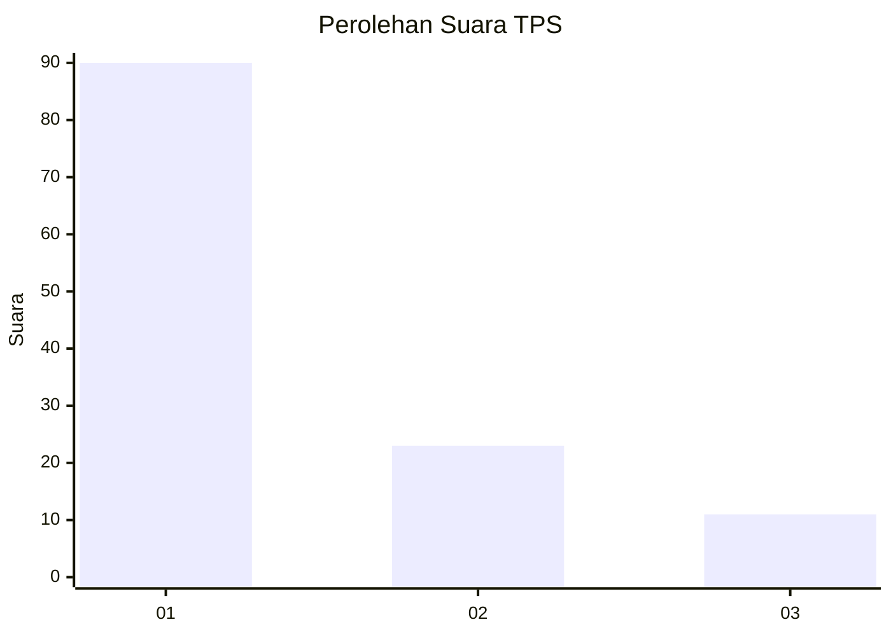
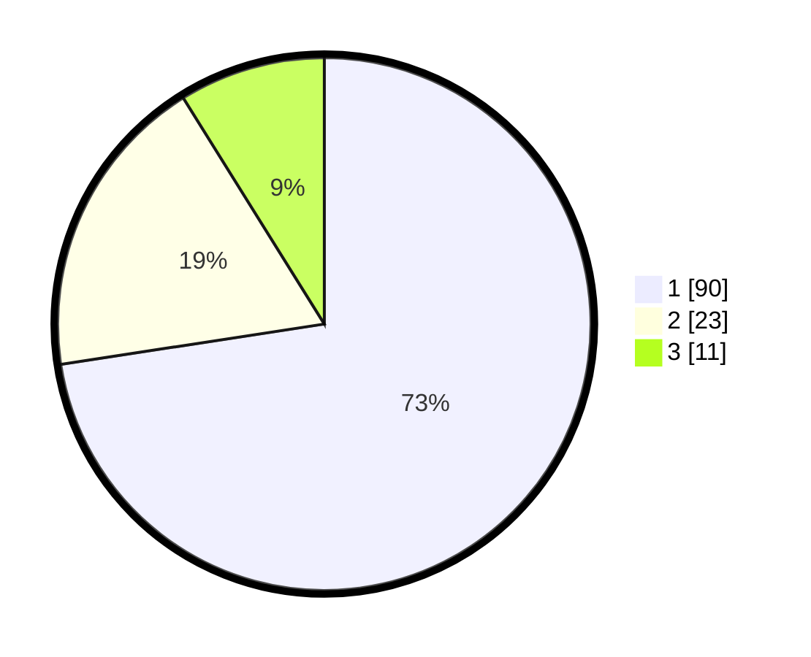

# Hasil

## Grafik

## Tabel

| No. | Nama Paslon    | Suara | Suara (raw) | Persentase |
|:--- |:-------------- | -----:| -----------:| ----------:|
| 1   | ANIES MUHAIMIN | 90    | [90][p-1]   | 72,58      |
| 2   | PRABOWO GIBRAN | 23    | [23][p-2]   | 18,55      |
| 3   | GANJAR MAHFUD  | 11    | [11][p-3]   | 8,87       |

[p-1]: https://github.com/gigit-pemilu/pemilu-2024-16-sumatera-selatan/blob/main/pilpres/hitung-suara/sub/16-sumatera-selatan/sub/71-kota-palembang/sub/08-sako/sub/1001-sukamaju/sub/061-tps/sub/paslon-1.txt
[p-2]: https://github.com/gigit-pemilu/pemilu-2024-16-sumatera-selatan/blob/main/pilpres/hitung-suara/sub/16-sumatera-selatan/sub/71-kota-palembang/sub/08-sako/sub/1001-sukamaju/sub/061-tps/sub/paslon-2.txt
[p-3]: https://github.com/gigit-pemilu/pemilu-2024-16-sumatera-selatan/blob/main/pilpres/hitung-suara/sub/16-sumatera-selatan/sub/71-kota-palembang/sub/08-sako/sub/1001-sukamaju/sub/061-tps/sub/paslon-3.txt

## Foto C Plano

https://sirekap-obj-formc.kpu.go.id/7d18/pemilu/ppwp/16/71/08/10/01/1671081001061-20240219-201354--f5539925-32e5-4246-b4af-e86bf04ea322.jpg

https://sirekap-obj-formc.kpu.go.id/7d18/pemilu/ppwp/16/71/08/10/01/1671081001061-20240219-201447--94b52438-05c5-4372-9253-db2f1cc94461.jpg

https://sirekap-obj-formc.kpu.go.id/7d18/pemilu/ppwp/16/71/08/10/01/1671081001061-20240219-201538--0776a878-5663-469d-b54a-fbd7101beb33.jpg

## Metadata

| Key        | Value               |
| ---------- | ------------------- |
| Time Stamp | 2024-02-19 21:00:00 |

## DATA PEMILIH TETAP

Jumlah pemilih dalam DPT: **286**.
 * L: **543**.
 * P: **543**.

## DATA PENGGUNA HAK PILIH

Jumlah pengguna hak pilih dalam DPT: **228**.
 * L: **889**.
 * P: **768**.

Jumlah pengguna hak pilih dalam DPTb: **886**.
 * L: **506**.
 * P: **88**.

Jumlah pengguna hak pilih dalam DPK: **888**.
 * L: **888**.
 * P: **0**.

Jumlah pengguna hak pilih: **239**.
 * L: **504**.
 * P: **418**.

## JUMLAH SUARA SAH DAN TIDAK SAH

JUMLAH SELURUH SUARA SAH: **224**.

JUMLAH SUARA TIDAK SAH: **5**.

JUMLAH SELURUH SUARA SAH DAN SUARA TIDAK SAH: **229**.

