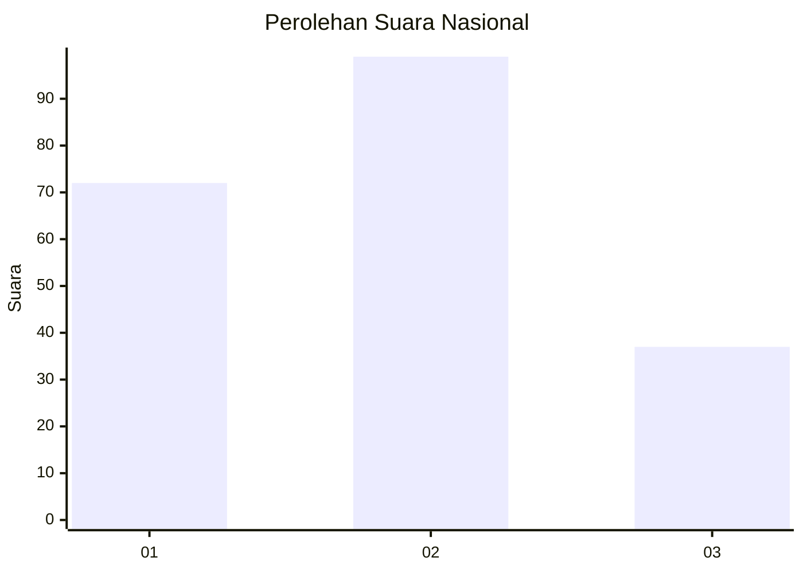
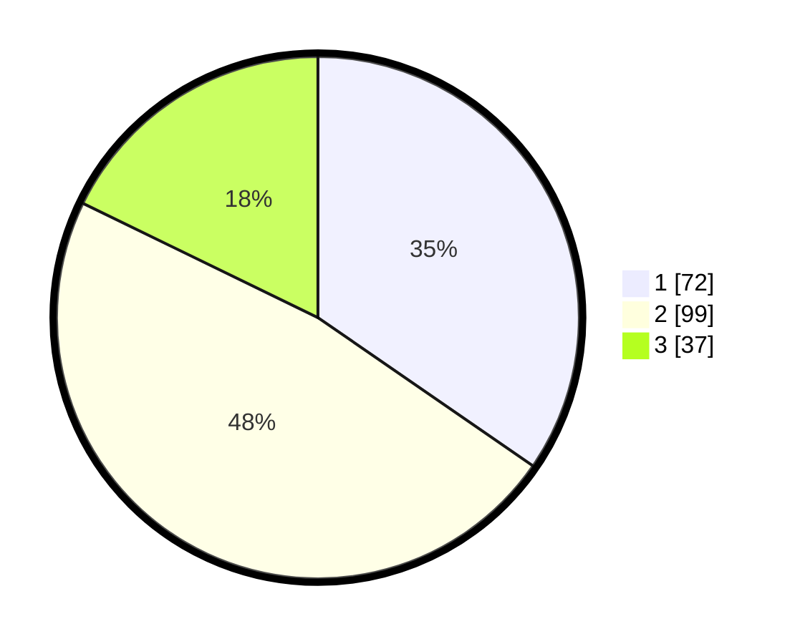

# Hasil

## Grafik

## Tabel

| No. | Nama Paslon    | Suara | Suara (raw) | Persentase |
|:--- |:-------------- | -----:| -----------:| ----------:|
| 1   | ANIES MUHAIMIN | 72    | [72][p-1]   | 34,62      |
| 2   | PRABOWO GIBRAN | 99    | [99][p-2]   | 47,60      |
| 3   | GANJAR MAHFUD  | 37    | [37][p-3]   | 17,79      |

[p-1]: https://github.com/gigit-pemilu/pemilu-2024/blob/main/pilpres/hitung-suara/sub/16-sumatera-selatan/sub/71-kota-palembang/sub/08-sako/sub/1001-sukamaju/sub/062-tps/sub/paslon-1.txt
[p-2]: https://github.com/gigit-pemilu/pemilu-2024/blob/main/pilpres/hitung-suara/sub/16-sumatera-selatan/sub/71-kota-palembang/sub/08-sako/sub/1001-sukamaju/sub/062-tps/sub/paslon-2.txt
[p-3]: https://github.com/gigit-pemilu/pemilu-2024/blob/main/pilpres/hitung-suara/sub/16-sumatera-selatan/sub/71-kota-palembang/sub/08-sako/sub/1001-sukamaju/sub/062-tps/sub/paslon-3.txt

## Foto C Plano

https://sirekap-obj-formc.kpu.go.id/4321/pemilu/ppwp/16/71/08/10/01/1671081001062-20240219-202724--03e531bf-0dab-4e1b-b237-c34cbf7f8002.jpg

https://sirekap-obj-formc.kpu.go.id/4321/pemilu/ppwp/16/71/08/10/01/1671081001062-20240219-202822--9a8fef58-4176-4a61-b129-5363bd2939c1.jpg

https://sirekap-obj-formc.kpu.go.id/4321/pemilu/ppwp/16/71/08/10/01/1671081001062-20240219-202251--128afe19-f981-4c61-98b3-2a5d36799054.jpg

## Metadata

| Key        | Value               |
| ---------- | ------------------- |
| Time Stamp | 2024-02-24 22:31:28 |

