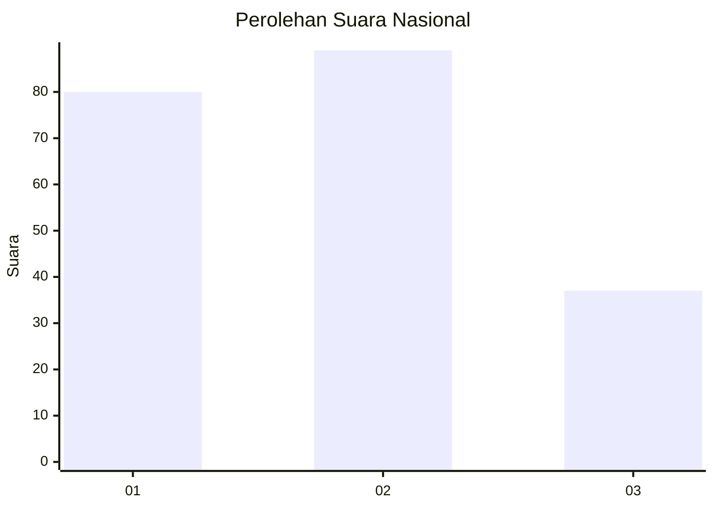
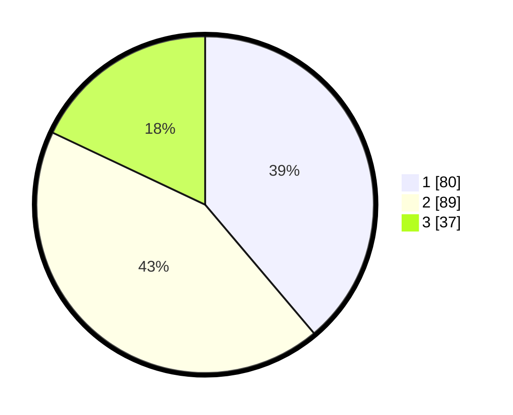

# Hasil

## Grafik

## Tabel

| No. | Nama Paslon    | Suara | Suara (raw) | Persentase |
|:--- |:-------------- | -----:| -----------:| ----------:|
| 1   | ANIES MUHAIMIN | 80    | [80][p-1]   | 38,83      |
| 2   | PRABOWO GIBRAN | 89    | [89][p-2]   | 43,20      |
| 3   | GANJAR MAHFUD  | 37    | [37][p-3]   | 17,96      |

[p-1]: https://github.com/gigit-pemilu/pemilu-2024/blob/main/pilpres/hitung-suara/sub/16-sumatera-selatan/sub/71-kota-palembang/sub/08-sako/sub/1001-sukamaju/sub/066-tps/sub/paslon-1.txt
[p-2]: https://github.com/gigit-pemilu/pemilu-2024/blob/main/pilpres/hitung-suara/sub/16-sumatera-selatan/sub/71-kota-palembang/sub/08-sako/sub/1001-sukamaju/sub/066-tps/sub/paslon-2.txt
[p-3]: https://github.com/gigit-pemilu/pemilu-2024/blob/main/pilpres/hitung-suara/sub/16-sumatera-selatan/sub/71-kota-palembang/sub/08-sako/sub/1001-sukamaju/sub/066-tps/sub/paslon-3.txt

## Foto C Plano

https://sirekap-obj-formc.kpu.go.id/fc53/pemilu/ppwp/16/71/08/10/01/1671081001066-20240214-194115--0afc6eb9-ae65-472e-82db-04c308380272.jpg

https://sirekap-obj-formc.kpu.go.id/fc53/pemilu/ppwp/16/71/08/10/01/1671081001066-20240214-194148--794afdee-38bc-4776-9970-6bde3f3e8e96.jpg

https://sirekap-obj-formc.kpu.go.id/fc53/pemilu/ppwp/16/71/08/10/01/1671081001066-20240214-194215--ce17c88a-383d-499e-808c-0f0063e5291c.jpg

## Metadata

| Key        | Value               |
| ---------- | ------------------- |
| Time Stamp | 2024-02-24 22:31:28 |

