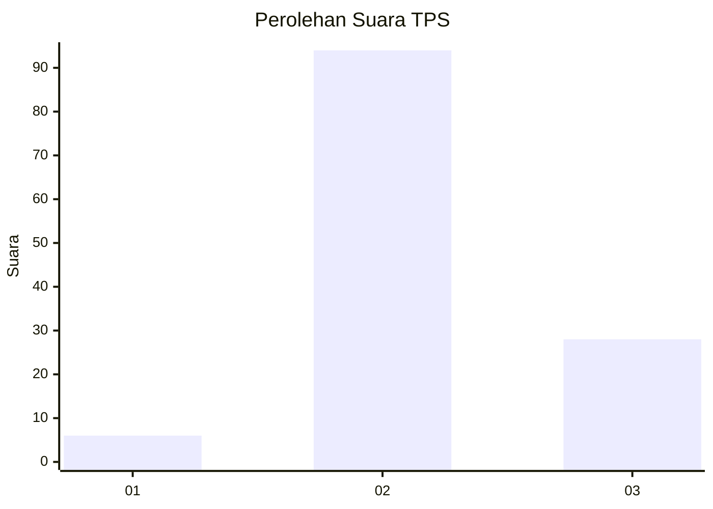

# Hasil

## Grafik

## Tabel

| No. | Nama Paslon    | Suara | Suara (raw) | Persentase |
|:--- |:-------------- | -----:| -----------:| ----------:|
| 1   | ANIES MUHAIMIN | 6     | [6][p-1]    | 4,69       |
| 2   | PRABOWO GIBRAN | 94    | [94][p-2]   | 73,44      |
| 3   | GANJAR MAHFUD  | 28    | [28][p-3]   | 21,88      |

[p-1]: https://github.com/gigit-pemilu/pemilu-2024-16-sumatera-selatan/blob/main/pilpres/hitung-suara/sub/16-sumatera-selatan/sub/71-kota-palembang/sub/08-sako/sub/1001-sukamaju/sub/082-tps/sub/paslon-1.txt
[p-2]: https://github.com/gigit-pemilu/pemilu-2024-16-sumatera-selatan/blob/main/pilpres/hitung-suara/sub/16-sumatera-selatan/sub/71-kota-palembang/sub/08-sako/sub/1001-sukamaju/sub/082-tps/sub/paslon-2.txt
[p-3]: https://github.com/gigit-pemilu/pemilu-2024-16-sumatera-selatan/blob/main/pilpres/hitung-suara/sub/16-sumatera-selatan/sub/71-kota-palembang/sub/08-sako/sub/1001-sukamaju/sub/082-tps/sub/paslon-3.txt

## Foto C Plano

https://sirekap-obj-formc.kpu.go.id/ce76/pemilu/ppwp/16/71/08/10/01/1671081001082-20240219-205906--ef1f7e0e-078b-4548-a4ee-49edebd58679.jpg

https://sirekap-obj-formc.kpu.go.id/ce76/pemilu/ppwp/16/71/08/10/01/1671081001082-20240219-205947--1163def8-6646-4a5e-94ea-5212c7371737.jpg

https://sirekap-obj-formc.kpu.go.id/ce76/pemilu/ppwp/16/71/08/10/01/1671081001082-20240219-210017--03365d7b-b781-4235-8b50-a7a6c612ab5f.jpg

## Metadata

| Key        | Value               |
| ---------- | ------------------- |
| Time Stamp | 2024-02-19 22:00:00 |

## DATA PEMILIH TETAP

Jumlah pemilih dalam DPT: **258**.
 * L: **722**.
 * P: **236**.

## DATA PENGGUNA HAK PILIH

Jumlah pengguna hak pilih dalam DPT: **279**.
 * L: **96**.
 * P: **523**.

Jumlah pengguna hak pilih dalam DPTb: **4**.
 * L: **3**.
 * P: **6**.

Jumlah pengguna hak pilih dalam DPK: **5**.
 * L: **4**.
 * P: **4**.

Jumlah pengguna hak pilih: **228**.
 * L: **703**.
 * P: **725**.

## JUMLAH SUARA SAH DAN TIDAK SAH

JUMLAH SELURUH SUARA SAH: **228**.

JUMLAH SUARA TIDAK SAH: **900**.

JUMLAH SELURUH SUARA SAH DAN SUARA TIDAK SAH: **208**.

