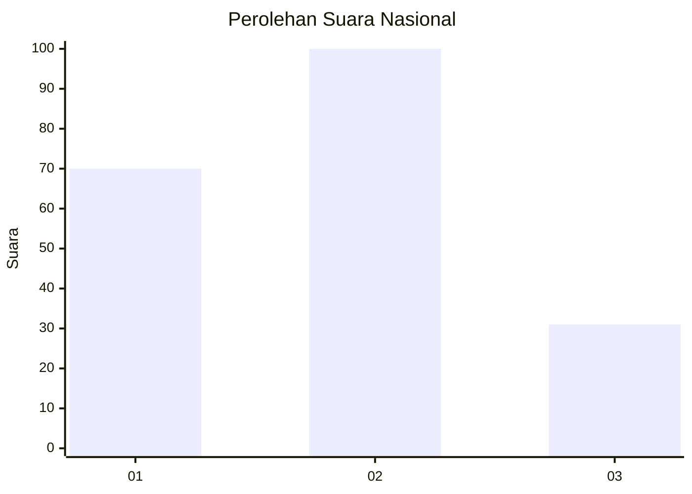
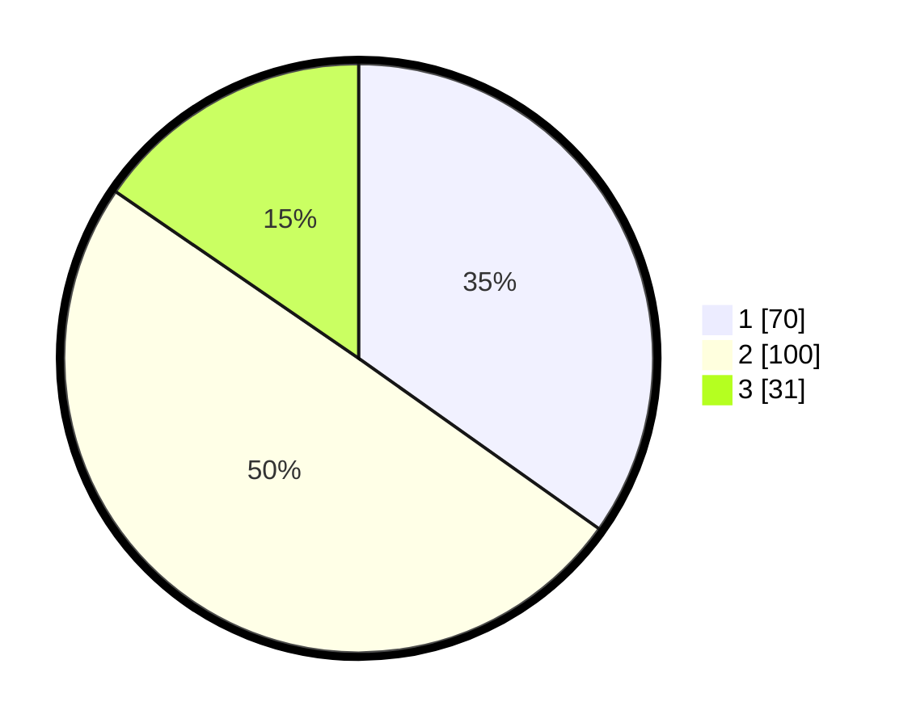

# Hasil

## Grafik

## Tabel

| No. | Nama Paslon    | Suara | Suara (raw) | Persentase |
|:--- |:-------------- | -----:| -----------:| ----------:|
| 1   | ANIES MUHAIMIN | 70    | [70][p-1]   | 34,83      |
| 2   | PRABOWO GIBRAN | 100   | [100][p-2]  | 49,75      |
| 3   | GANJAR MAHFUD  | 31    | [31][p-3]   | 15,42      |

[p-1]: https://github.com/gigit-pemilu/pemilu-2024/blob/main/pilpres/hitung-suara/sub/16-sumatera-selatan/sub/71-kota-palembang/sub/08-sako/sub/1001-sukamaju/sub/085-tps/sub/paslon-1.txt
[p-2]: https://github.com/gigit-pemilu/pemilu-2024/blob/main/pilpres/hitung-suara/sub/16-sumatera-selatan/sub/71-kota-palembang/sub/08-sako/sub/1001-sukamaju/sub/085-tps/sub/paslon-2.txt
[p-3]: https://github.com/gigit-pemilu/pemilu-2024/blob/main/pilpres/hitung-suara/sub/16-sumatera-selatan/sub/71-kota-palembang/sub/08-sako/sub/1001-sukamaju/sub/085-tps/sub/paslon-3.txt

## Foto C Plano

https://sirekap-obj-formc.kpu.go.id/0b9a/pemilu/ppwp/16/71/08/10/01/1671081001085-20240219-211949--67194c8b-4fbf-43d4-97ce-fe70072f3f7f.jpg

https://sirekap-obj-formc.kpu.go.id/0b9a/pemilu/ppwp/16/71/08/10/01/1671081001085-20240219-212024--77866be5-5179-4cf0-a2f9-a3e1cd8aea1d.jpg

https://sirekap-obj-formc.kpu.go.id/0b9a/pemilu/ppwp/16/71/08/10/01/1671081001085-20240219-212059--3126e716-3fb2-4c21-af5b-a0e0a72ba288.jpg

## Metadata

| Key        | Value               |
| ---------- | ------------------- |
| Time Stamp | 2024-02-19 22:00:00 |

## DATA PEMILIH TETAP

Jumlah pemilih dalam DPT: **265**.
 * L: **227**.
 * P: **334**.

## DATA PENGGUNA HAK PILIH

Jumlah pengguna hak pilih dalam DPT: **192**.
 * L: **289**.
 * P: **393**.

Jumlah pengguna hak pilih dalam DPTb: **885**.
 * L: **23**.
 * P: **882**.

Jumlah pengguna hak pilih dalam DPK: **85**.
 * L: **282**.
 * P: **3**.

Jumlah pengguna hak pilih: **202**.
 * L: **94**.
 * P: **192**.

## JUMLAH SUARA SAH DAN TIDAK SAH

JUMLAH SELURUH SUARA SAH: **201**.

JUMLAH SUARA TIDAK SAH: **886**.

JUMLAH SELURUH SUARA SAH DAN SUARA TIDAK SAH: **292**.

