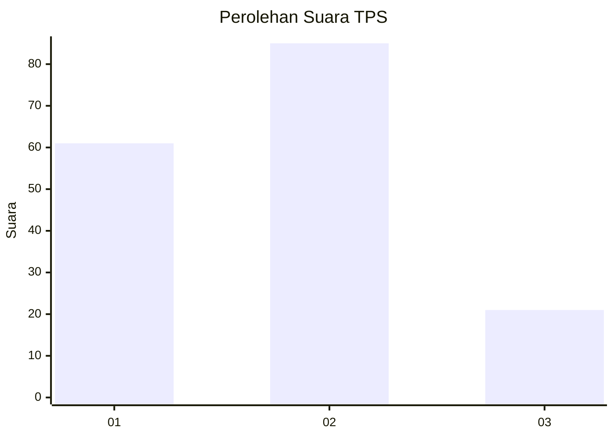
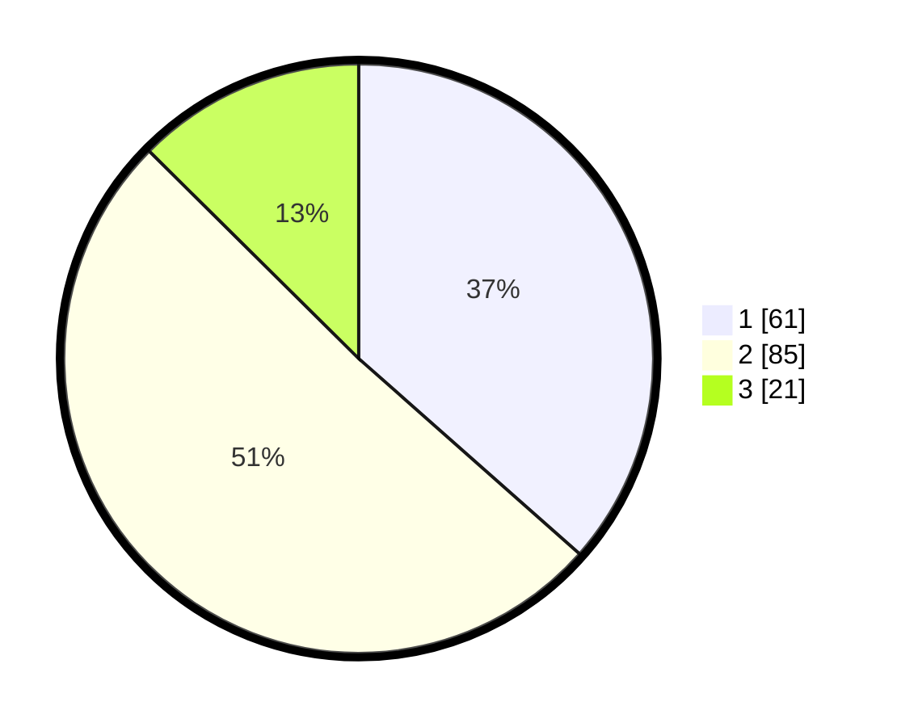

# Hasil

## Grafik

## Tabel

| No. | Nama Paslon    | Suara | Suara (raw) | Persentase |
|:--- |:-------------- | -----:| -----------:| ----------:|
| 1   | ANIES MUHAIMIN | 61    | [61][p-1]   | 36,53      |
| 2   | PRABOWO GIBRAN | 85    | [85][p-2]   | 50,90      |
| 3   | GANJAR MAHFUD  | 21    | [21][p-3]   | 12,57      |

[p-1]: https://github.com/gigit-pemilu/pemilu-2024-16-sumatera-selatan/blob/main/pilpres/hitung-suara/sub/16-sumatera-selatan/sub/71-kota-palembang/sub/08-sako/sub/1002-sako/sub/006-tps/sub/paslon-1.txt
[p-2]: https://github.com/gigit-pemilu/pemilu-2024-16-sumatera-selatan/blob/main/pilpres/hitung-suara/sub/16-sumatera-selatan/sub/71-kota-palembang/sub/08-sako/sub/1002-sako/sub/006-tps/sub/paslon-2.txt
[p-3]: https://github.com/gigit-pemilu/pemilu-2024-16-sumatera-selatan/blob/main/pilpres/hitung-suara/sub/16-sumatera-selatan/sub/71-kota-palembang/sub/08-sako/sub/1002-sako/sub/006-tps/sub/paslon-3.txt

## Foto C Plano

https://sirekap-obj-formc.kpu.go.id/48b3/pemilu/ppwp/16/71/08/10/02/1671081002006-20240219-233054--e5fe2c0c-3661-4451-b69c-b7a663f3785a.jpg

https://sirekap-obj-formc.kpu.go.id/48b3/pemilu/ppwp/16/71/08/10/02/1671081002006-20240219-233136--5bbc7865-7cc0-41ef-9d5a-9b92937a9e7e.jpg

https://sirekap-obj-formc.kpu.go.id/48b3/pemilu/ppwp/16/71/08/10/02/1671081002006-20240219-233228--dc19cd46-4539-49aa-8605-ac7ff7de1557.jpg

## Metadata

| Key        | Value               |
| ---------- | ------------------- |
| Time Stamp | 2024-02-20 00:00:00 |

## DATA PEMILIH TETAP

Jumlah pemilih dalam DPT: **210**.
 * L: **602**.
 * P: **402**.

## DATA PENGGUNA HAK PILIH

Jumlah pengguna hak pilih dalam DPT: **657**.
 * L: **878**.
 * P: **73**.

Jumlah pengguna hak pilih dalam DPTb: **6**.
 * L: **8**.
 * P: **806**.

Jumlah pengguna hak pilih dalam DPK: **25**.
 * L: **808**.
 * P: **807**.

Jumlah pengguna hak pilih: **569**.
 * L: **82**.
 * P: **87**.

## JUMLAH SUARA SAH DAN TIDAK SAH

JUMLAH SELURUH SUARA SAH: **167**.

JUMLAH SUARA TIDAK SAH: **2**.

JUMLAH SELURUH SUARA SAH DAN SUARA TIDAK SAH: **169**.

