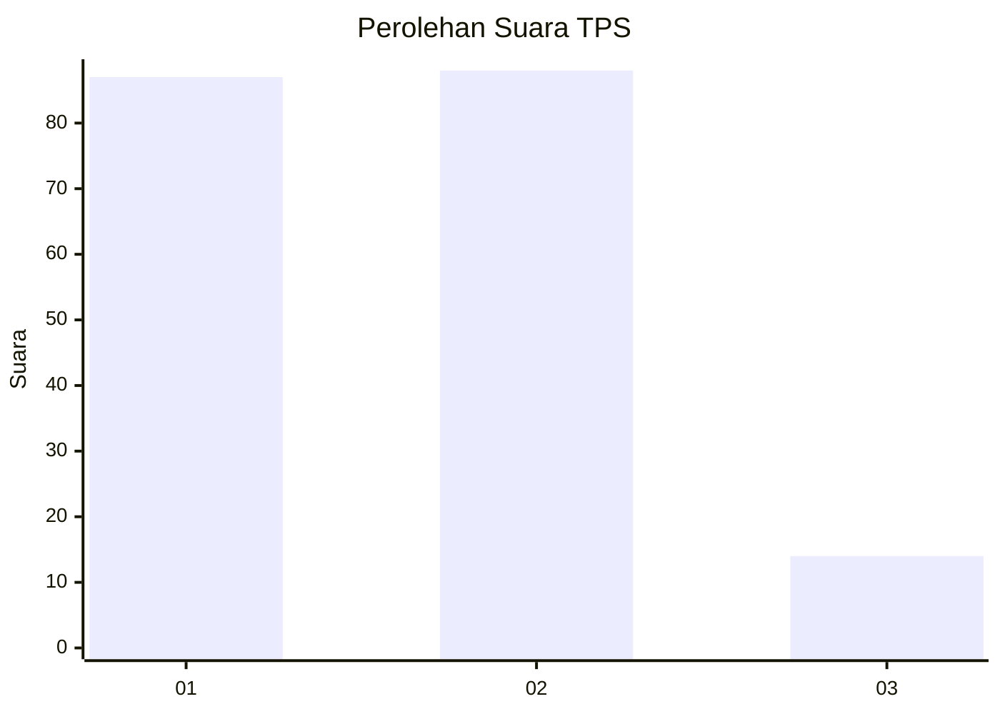
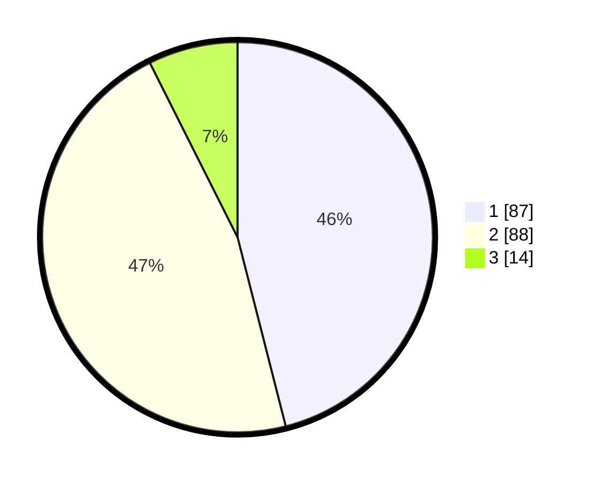

# Hasil

## Grafik

## Tabel

| No. | Nama Paslon    | Suara | Suara (raw) | Persentase |
|:--- |:-------------- | -----:| -----------:| ----------:|
| 1   | ANIES MUHAIMIN | 87    | [87][p-1]   | 46,03      |
| 2   | PRABOWO GIBRAN | 88    | [88][p-2]   | 46,56      |
| 3   | GANJAR MAHFUD  | 14    | [14][p-3]   | 7,41       |

[p-1]: https://github.com/gigit-pemilu/pemilu-2024-16-sumatera-selatan/blob/main/pilpres/hitung-suara/sub/16-sumatera-selatan/sub/71-kota-palembang/sub/08-sako/sub/1002-sako/sub/012-tps/sub/paslon-1.txt
[p-2]: https://github.com/gigit-pemilu/pemilu-2024-16-sumatera-selatan/blob/main/pilpres/hitung-suara/sub/16-sumatera-selatan/sub/71-kota-palembang/sub/08-sako/sub/1002-sako/sub/012-tps/sub/paslon-2.txt
[p-3]: https://github.com/gigit-pemilu/pemilu-2024-16-sumatera-selatan/blob/main/pilpres/hitung-suara/sub/16-sumatera-selatan/sub/71-kota-palembang/sub/08-sako/sub/1002-sako/sub/012-tps/sub/paslon-3.txt

## Foto C Plano

https://sirekap-obj-formc.kpu.go.id/3bd8/pemilu/ppwp/16/71/08/10/02/1671081002012-20240214-210650--cac03822-e63c-481f-b8b5-bcd3631fde1e.jpg

https://sirekap-obj-formc.kpu.go.id/3bd8/pemilu/ppwp/16/71/08/10/02/1671081002012-20240214-210757--ac64550f-7660-4422-a433-0bb7d0df1645.jpg

https://sirekap-obj-formc.kpu.go.id/3bd8/pemilu/ppwp/16/71/08/10/02/1671081002012-20240214-210846--a91d8689-4522-4d81-bfc0-caf041139bd4.jpg

## Metadata

| Key        | Value               |
| ---------- | ------------------- |
| Time Stamp | 2024-02-25 00:00:00 |

