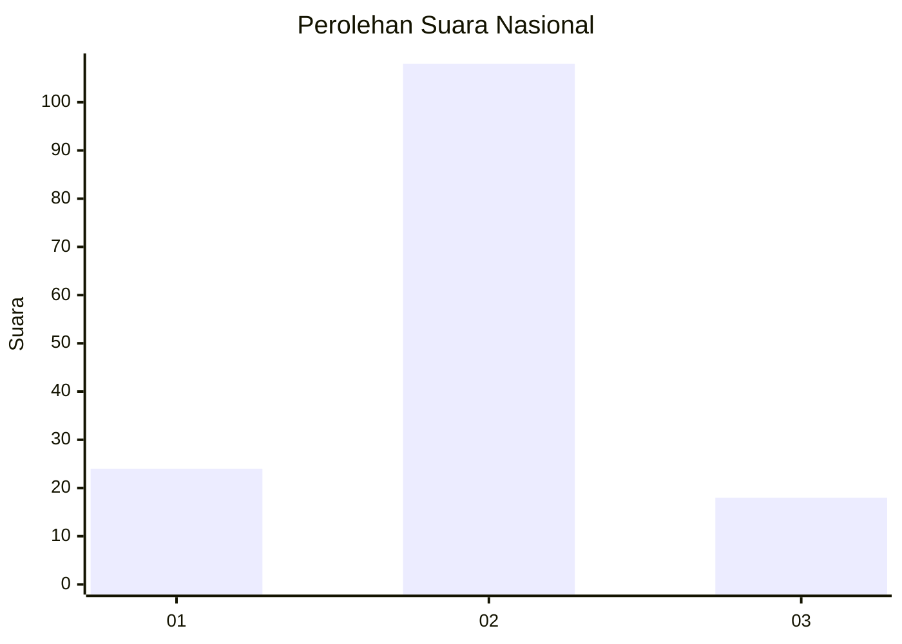
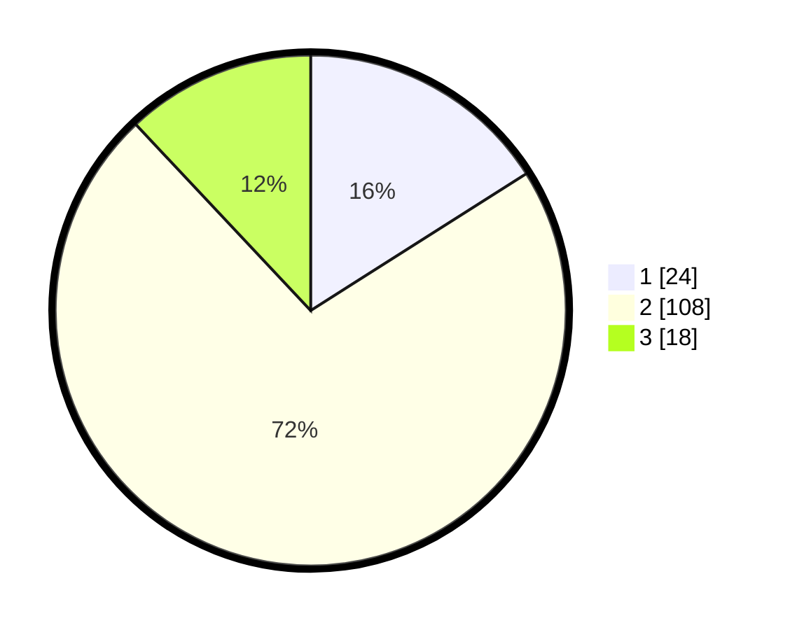

# Hasil

## Grafik

## Tabel

| No. | Nama Paslon    | Suara | Suara (raw) | Persentase |
|:--- |:-------------- | -----:| -----------:| ----------:|
| 1   | ANIES MUHAIMIN | 24    | [24][p-1]   | 16,00      |
| 2   | PRABOWO GIBRAN | 108   | [108][p-2]  | 72,00      |
| 3   | GANJAR MAHFUD  | 18    | [18][p-3]   | 12,00      |

[p-1]: https://github.com/gigit-pemilu/pemilu-2024/blob/main/pilpres/hitung-suara/sub/16-sumatera-selatan/sub/71-kota-palembang/sub/08-sako/sub/1002-sako/sub/016-tps/sub/paslon-1.txt
[p-2]: https://github.com/gigit-pemilu/pemilu-2024/blob/main/pilpres/hitung-suara/sub/16-sumatera-selatan/sub/71-kota-palembang/sub/08-sako/sub/1002-sako/sub/016-tps/sub/paslon-2.txt
[p-3]: https://github.com/gigit-pemilu/pemilu-2024/blob/main/pilpres/hitung-suara/sub/16-sumatera-selatan/sub/71-kota-palembang/sub/08-sako/sub/1002-sako/sub/016-tps/sub/paslon-3.txt

## Foto C Plano

https://sirekap-obj-formc.kpu.go.id/957d/pemilu/ppwp/16/71/08/10/02/1671081002016-20240219-214815--788eef6f-1cfa-4986-881b-2e766c6c2087.jpg

https://sirekap-obj-formc.kpu.go.id/957d/pemilu/ppwp/16/71/08/10/02/1671081002016-20240219-214844--b5c4d220-87f7-4bdd-80c8-64479ce3d8d8.jpg

https://sirekap-obj-formc.kpu.go.id/957d/pemilu/ppwp/16/71/08/10/02/1671081002016-20240219-214912--928399ff-bc5f-4b28-ac83-9f34f3b9503d.jpg

## Metadata

| Key        | Value               |
| ---------- | ------------------- |
| Time Stamp | 2024-02-19 22:00:00 |

## DATA PEMILIH TETAP

Jumlah pemilih dalam DPT: **248**.
 * L: **823**.
 * P: **525**.

## DATA PENGGUNA HAK PILIH

Jumlah pengguna hak pilih dalam DPT: **797**.
 * L: **95**.
 * P: **602**.

Jumlah pengguna hak pilih dalam DPTb: **80**.
 * L: **8**.
 * P: **0**.

Jumlah pengguna hak pilih dalam DPK: **82**.
 * L: **4**.
 * P: **0**.

Jumlah pengguna hak pilih: **798**.
 * L: **35**.
 * P: **102**.

## JUMLAH SUARA SAH DAN TIDAK SAH

JUMLAH SELURUH SUARA SAH: **353**.

JUMLAH SUARA TIDAK SAH: **403**.

JUMLAH SELURUH SUARA SAH DAN SUARA TIDAK SAH: **597**.

