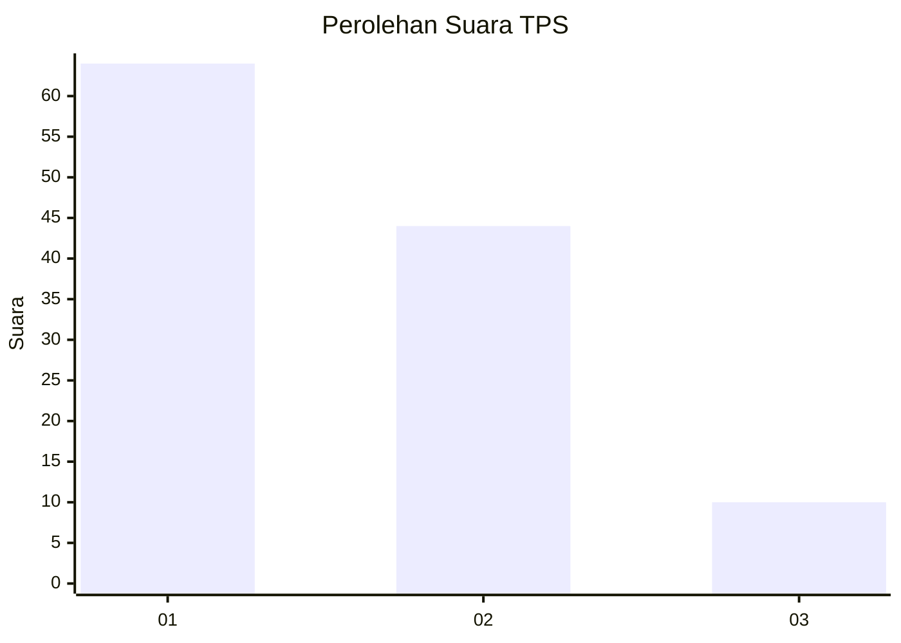
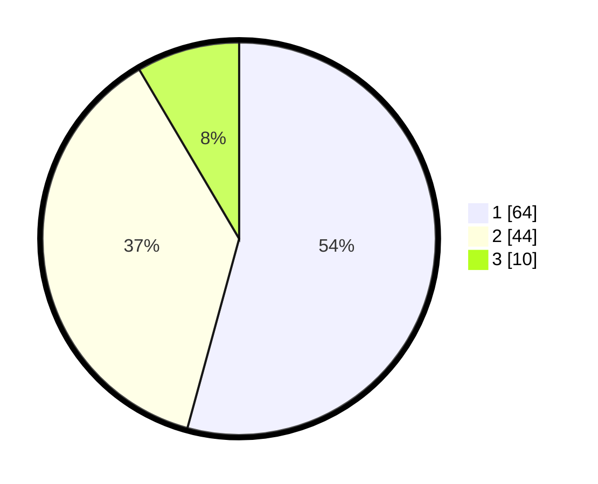

# Hasil

## Grafik

## Tabel

| No. | Nama Paslon    | Suara | Suara (raw) | Persentase |
|:--- |:-------------- | -----:| -----------:| ----------:|
| 1   | ANIES MUHAIMIN | 64    | [64][p-1]   | 54,24      |
| 2   | PRABOWO GIBRAN | 44    | [44][p-2]   | 37,29      |
| 3   | GANJAR MAHFUD  | 10    | [10][p-3]   | 8,47       |

[p-1]: https://github.com/gigit-pemilu/pemilu-2024-16-sumatera-selatan/blob/main/pilpres/hitung-suara/sub/16-sumatera-selatan/sub/71-kota-palembang/sub/08-sako/sub/1002-sako/sub/017-tps/sub/paslon-1.txt
[p-2]: https://github.com/gigit-pemilu/pemilu-2024-16-sumatera-selatan/blob/main/pilpres/hitung-suara/sub/16-sumatera-selatan/sub/71-kota-palembang/sub/08-sako/sub/1002-sako/sub/017-tps/sub/paslon-2.txt
[p-3]: https://github.com/gigit-pemilu/pemilu-2024-16-sumatera-selatan/blob/main/pilpres/hitung-suara/sub/16-sumatera-selatan/sub/71-kota-palembang/sub/08-sako/sub/1002-sako/sub/017-tps/sub/paslon-3.txt

## Foto C Plano

https://sirekap-obj-formc.kpu.go.id/5e3e/pemilu/ppwp/16/71/08/10/02/1671081002017-20240219-215040--571a9c3b-9de9-4f0c-bce7-752534e76bca.jpg

https://sirekap-obj-formc.kpu.go.id/5e3e/pemilu/ppwp/16/71/08/10/02/1671081002017-20240219-215114--e8620d94-45f1-4c9b-b896-9e080e66fe42.jpg

https://sirekap-obj-formc.kpu.go.id/5e3e/pemilu/ppwp/16/71/08/10/02/1671081002017-20240219-215148--0238cec9-dba2-41f0-aeb1-c374f0526f97.jpg

## Metadata

| Key        | Value               |
| ---------- | ------------------- |
| Time Stamp | 2024-02-19 22:00:00 |

## DATA PEMILIH TETAP

Jumlah pemilih dalam DPT: **254**.
 * L: **429**.
 * P: **722**.

## DATA PENGGUNA HAK PILIH

Jumlah pengguna hak pilih dalam DPT: **203**.
 * L: **96**.
 * P: **605**.

Jumlah pengguna hak pilih dalam DPTb: **82**.
 * L: **6**.
 * P: **5**.

Jumlah pengguna hak pilih dalam DPK: **7**.
 * L: **0**.
 * P: **1**.

Jumlah pengguna hak pilih: **204**.
 * L: **97**.
 * P: **507**.

## JUMLAH SUARA SAH DAN TIDAK SAH

JUMLAH SELURUH SUARA SAH: **292**.

JUMLAH SUARA TIDAK SAH: **2**.

JUMLAH SELURUH SUARA SAH DAN SUARA TIDAK SAH: **204**.

