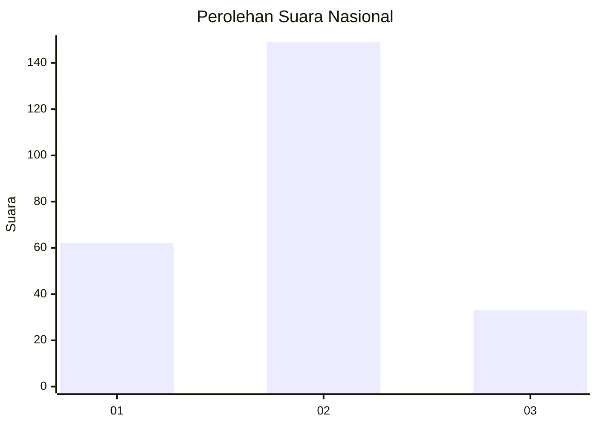
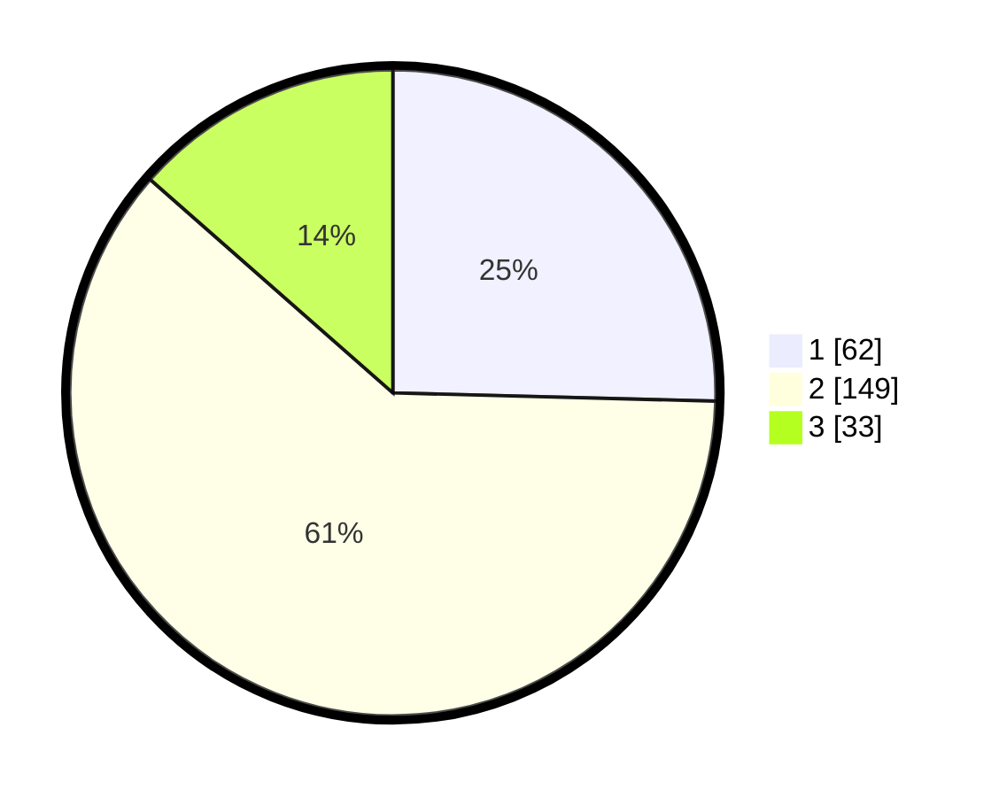

# Hasil

## Grafik

## Tabel

| No. | Nama Paslon    | Suara | Suara (raw) | Persentase |
|:--- |:-------------- | -----:| -----------:| ----------:|
| 1   | ANIES MUHAIMIN | 62    | [62][p-1]   | 25,41      |
| 2   | PRABOWO GIBRAN | 149   | [149][p-2]  | 61,07      |
| 3   | GANJAR MAHFUD  | 33    | [33][p-3]   | 13,52      |

[p-1]: https://github.com/gigit-pemilu/pemilu-2024/blob/main/pilpres/hitung-suara/sub/16-sumatera-selatan/sub/71-kota-palembang/sub/08-sako/sub/1002-sako/sub/025-tps/sub/paslon-1.txt
[p-2]: https://github.com/gigit-pemilu/pemilu-2024/blob/main/pilpres/hitung-suara/sub/16-sumatera-selatan/sub/71-kota-palembang/sub/08-sako/sub/1002-sako/sub/025-tps/sub/paslon-2.txt
[p-3]: https://github.com/gigit-pemilu/pemilu-2024/blob/main/pilpres/hitung-suara/sub/16-sumatera-selatan/sub/71-kota-palembang/sub/08-sako/sub/1002-sako/sub/025-tps/sub/paslon-3.txt

## Foto C Plano

https://sirekap-obj-formc.kpu.go.id/4524/pemilu/ppwp/16/71/08/10/02/1671081002025-20240219-220506--42540df5-ad37-4153-977e-b93671ef7787.jpg

https://sirekap-obj-formc.kpu.go.id/4524/pemilu/ppwp/16/71/08/10/02/1671081002025-20240219-220539--d08475d1-81e6-40d7-83a7-d1fea5dfc9f3.jpg

https://sirekap-obj-formc.kpu.go.id/4524/pemilu/ppwp/16/71/08/10/02/1671081002025-20240219-220608--00ac8b46-a631-478a-bbce-de480d6390af.jpg

## Metadata

| Key        | Value               |
| ---------- | ------------------- |
| Time Stamp | 2024-02-19 23:00:00 |

## DATA PEMILIH TETAP

Jumlah pemilih dalam DPT: **197**.
 * L: **893**.
 * P: **194**.

## DATA PENGGUNA HAK PILIH

Jumlah pengguna hak pilih dalam DPT: **194**.
 * L: **893**.
 * P: **527**.

Jumlah pengguna hak pilih dalam DPTb: **5**.
 * L: **0**.
 * P: **804**.

Jumlah pengguna hak pilih dalam DPK: **82**.
 * L: **8**.
 * P: **2**.

Jumlah pengguna hak pilih: **197**.
 * L: **893**.
 * P: **604**.

## JUMLAH SUARA SAH DAN TIDAK SAH

JUMLAH SELURUH SUARA SAH: **193**.

JUMLAH SUARA TIDAK SAH: **4**.

JUMLAH SELURUH SUARA SAH DAN SUARA TIDAK SAH: **697**.

