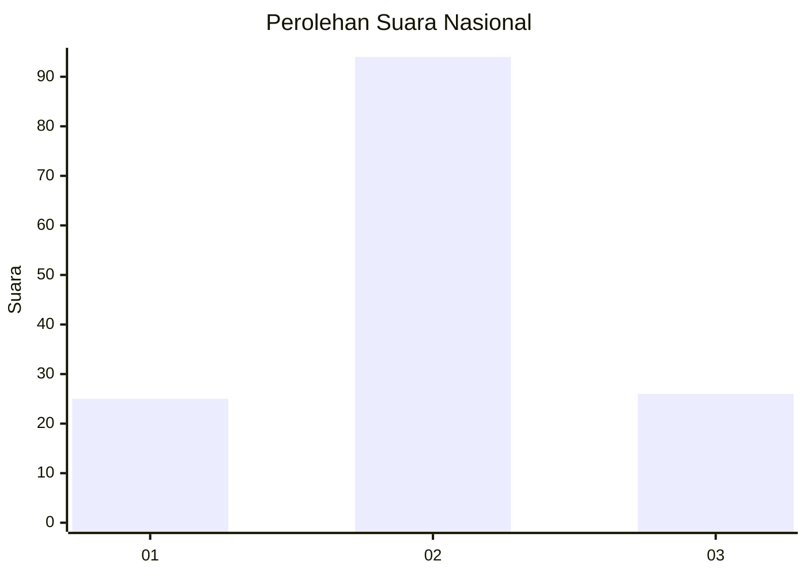
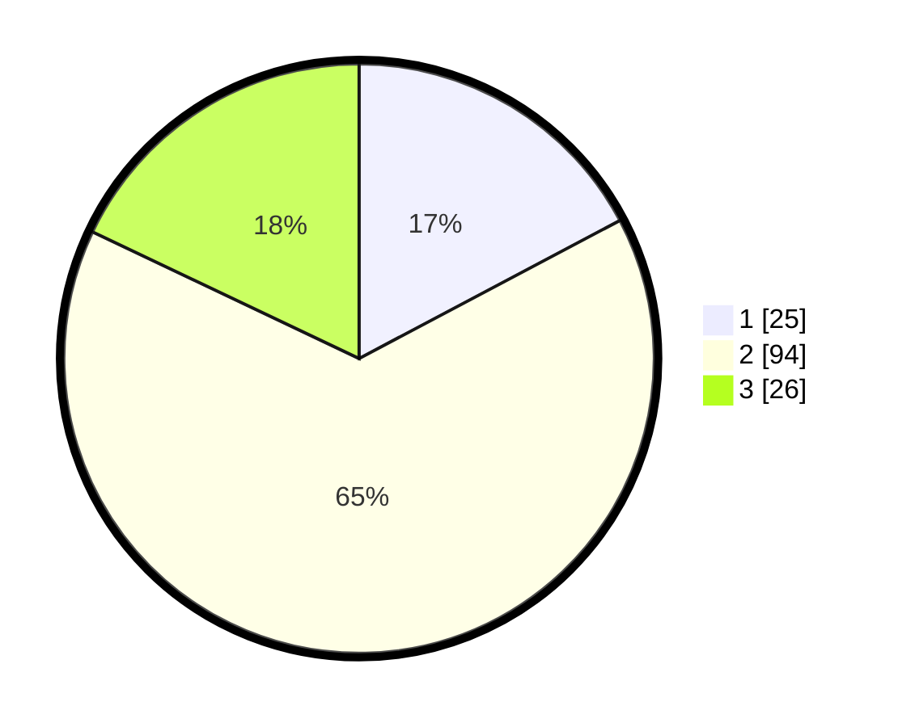

# Hasil

## Grafik

## Tabel

| No. | Nama Paslon    | Suara | Suara (raw) | Persentase |
|:--- |:-------------- | -----:| -----------:| ----------:|
| 1   | ANIES MUHAIMIN | 25    | [25][p-1]   | 17,24      |
| 2   | PRABOWO GIBRAN | 94    | [94][p-2]   | 64,83      |
| 3   | GANJAR MAHFUD  | 26    | [26][p-3]   | 17,93      |

[p-1]: https://github.com/gigit-pemilu/pemilu-2024/blob/main/pilpres/hitung-suara/sub/16-sumatera-selatan/sub/71-kota-palembang/sub/08-sako/sub/1002-sako/sub/032-tps/sub/paslon-1.txt
[p-2]: https://github.com/gigit-pemilu/pemilu-2024/blob/main/pilpres/hitung-suara/sub/16-sumatera-selatan/sub/71-kota-palembang/sub/08-sako/sub/1002-sako/sub/032-tps/sub/paslon-2.txt
[p-3]: https://github.com/gigit-pemilu/pemilu-2024/blob/main/pilpres/hitung-suara/sub/16-sumatera-selatan/sub/71-kota-palembang/sub/08-sako/sub/1002-sako/sub/032-tps/sub/paslon-3.txt

## Foto C Plano

https://sirekap-obj-formc.kpu.go.id/7e40/pemilu/ppwp/16/71/08/10/02/1671081002032-20240220-100833--4abf3408-4b79-4da2-9f59-9e78e9d5652c.jpg

https://sirekap-obj-formc.kpu.go.id/7e40/pemilu/ppwp/16/71/08/10/02/1671081002032-20240220-100913--d8da04a7-e307-4ec2-894c-c79494d70e04.jpg

https://sirekap-obj-formc.kpu.go.id/7e40/pemilu/ppwp/16/71/08/10/02/1671081002032-20240220-100942--d320d1ff-5ecf-4e07-8cc4-440d2ff3f75b.jpg

## Metadata

| Key        | Value               |
| ---------- | ------------------- |
| Time Stamp | 2024-02-20 11:00:00 |

## DATA PEMILIH TETAP

Jumlah pemilih dalam DPT: **243**.
 * L: **836**.
 * P: **722**.

## DATA PENGGUNA HAK PILIH

Jumlah pengguna hak pilih dalam DPT: **592**.
 * L: **898**.
 * P: **895**.

Jumlah pengguna hak pilih dalam DPTb: **4**.
 * L: **0**.
 * P: **82**.

Jumlah pengguna hak pilih dalam DPK: **3**.
 * L: **802**.
 * P: **4**.

Jumlah pengguna hak pilih: **296**.
 * L: **99**.
 * P: **92**.

## JUMLAH SUARA SAH DAN TIDAK SAH

JUMLAH SELURUH SUARA SAH: **895**.

JUMLAH SUARA TIDAK SAH: **886**.

JUMLAH SELURUH SUARA SAH DAN SUARA TIDAK SAH: **696**.

