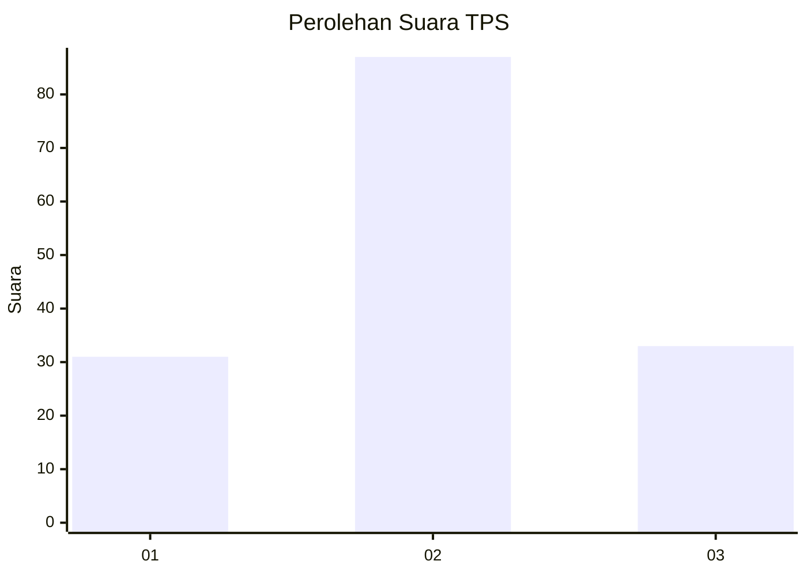
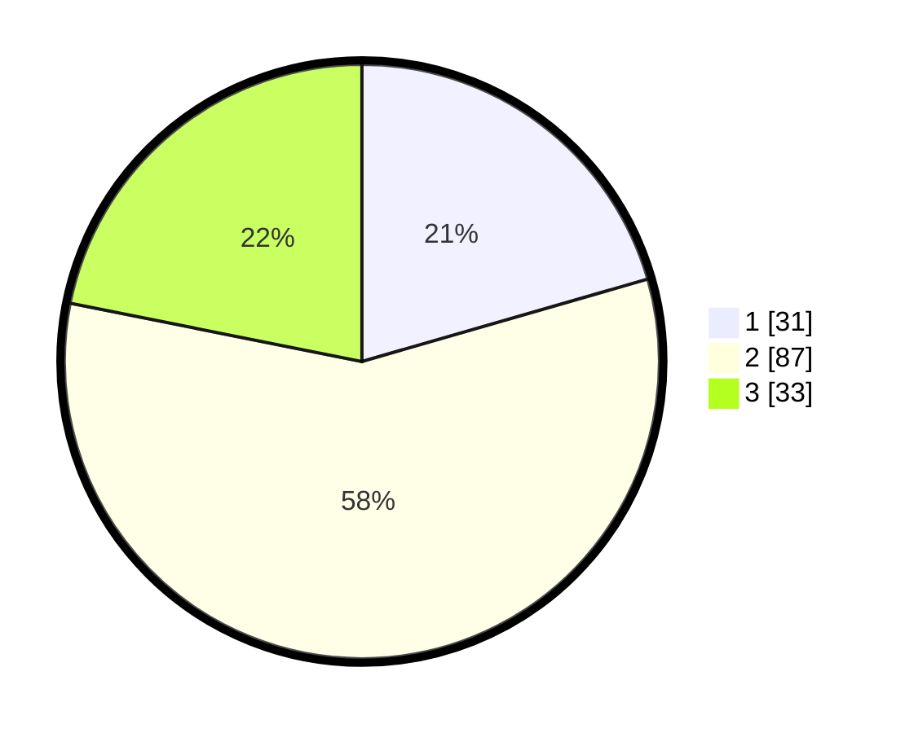

# Hasil

## Grafik

## Tabel

| No. | Nama Paslon    | Suara | Suara (raw) | Persentase |
|:--- |:-------------- | -----:| -----------:| ----------:|
| 1   | ANIES MUHAIMIN | 31    | [31][p-1]   | 20,53      |
| 2   | PRABOWO GIBRAN | 87    | [87][p-2]   | 57,62      |
| 3   | GANJAR MAHFUD  | 33    | [33][p-3]   | 21,85      |

[p-1]: https://github.com/gigit-pemilu/pemilu-2024-16-sumatera-selatan/blob/main/pilpres/hitung-suara/sub/16-sumatera-selatan/sub/71-kota-palembang/sub/08-sako/sub/1002-sako/sub/033-tps/sub/paslon-1.txt
[p-2]: https://github.com/gigit-pemilu/pemilu-2024-16-sumatera-selatan/blob/main/pilpres/hitung-suara/sub/16-sumatera-selatan/sub/71-kota-palembang/sub/08-sako/sub/1002-sako/sub/033-tps/sub/paslon-2.txt
[p-3]: https://github.com/gigit-pemilu/pemilu-2024-16-sumatera-selatan/blob/main/pilpres/hitung-suara/sub/16-sumatera-selatan/sub/71-kota-palembang/sub/08-sako/sub/1002-sako/sub/033-tps/sub/paslon-3.txt

## Foto C Plano

https://sirekap-obj-formc.kpu.go.id/7d92/pemilu/ppwp/16/71/08/10/02/1671081002033-20240220-102354--7fad30e3-0da3-4934-a663-bd1e75fbae77.jpg

https://sirekap-obj-formc.kpu.go.id/7d92/pemilu/ppwp/16/71/08/10/02/1671081002033-20240220-102437--6ed0bd33-7fd5-4a41-9d9b-296e11a48361.jpg

https://sirekap-obj-formc.kpu.go.id/7d92/pemilu/ppwp/16/71/08/10/02/1671081002033-20240220-102511--a938ab38-31b1-4d18-b8d2-4830d7ec254d.jpg

## Metadata

| Key        | Value               |
| ---------- | ------------------- |
| Time Stamp | 2024-02-20 11:00:00 |

## DATA PEMILIH TETAP

Jumlah pemilih dalam DPT: **293**.
 * L: **99**.
 * P: **7**.

## DATA PENGGUNA HAK PILIH

Jumlah pengguna hak pilih dalam DPT: **345**.
 * L: **70**.
 * P: **78**.

Jumlah pengguna hak pilih dalam DPTb: **2**.
 * L: **808**.
 * P: **3**.

Jumlah pengguna hak pilih dalam DPK: **4**.
 * L: **82**.
 * P: **3**.

Jumlah pengguna hak pilih: **353**.
 * L: **72**.
 * P: **82**.

## JUMLAH SUARA SAH DAN TIDAK SAH

JUMLAH SELURUH SUARA SAH: **854**.

JUMLAH SUARA TIDAK SAH: **82**.

JUMLAH SELURUH SUARA SAH DAN SUARA TIDAK SAH: **653**.

