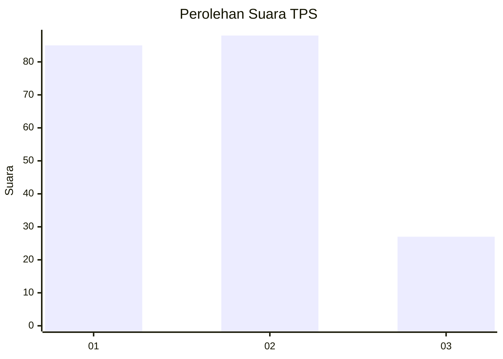
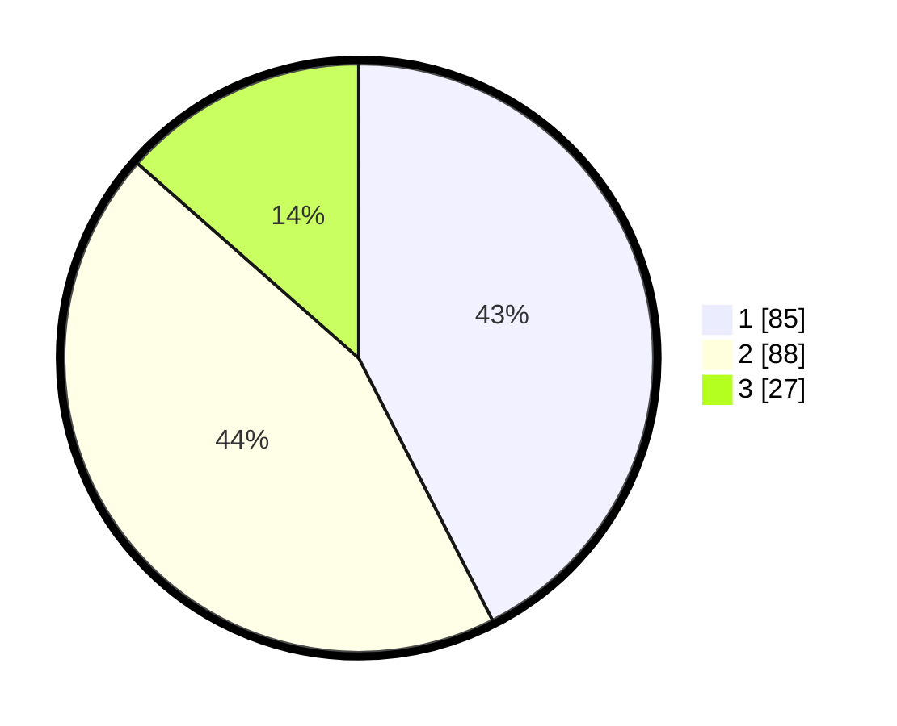

# Hasil

## Grafik

## Tabel

| No. | Nama Paslon    | Suara | Suara (raw) | Persentase |
|:--- |:-------------- | -----:| -----------:| ----------:|
| 1   | ANIES MUHAIMIN | 85    | [85][p-1]   | 42,50      |
| 2   | PRABOWO GIBRAN | 88    | [88][p-2]   | 44,00      |
| 3   | GANJAR MAHFUD  | 27    | [27][p-3]   | 13,50      |

[p-1]: https://github.com/gigit-pemilu/pemilu-2024-16-sumatera-selatan/blob/main/pilpres/hitung-suara/sub/16-sumatera-selatan/sub/71-kota-palembang/sub/08-sako/sub/1002-sako/sub/034-tps/sub/paslon-1.txt
[p-2]: https://github.com/gigit-pemilu/pemilu-2024-16-sumatera-selatan/blob/main/pilpres/hitung-suara/sub/16-sumatera-selatan/sub/71-kota-palembang/sub/08-sako/sub/1002-sako/sub/034-tps/sub/paslon-2.txt
[p-3]: https://github.com/gigit-pemilu/pemilu-2024-16-sumatera-selatan/blob/main/pilpres/hitung-suara/sub/16-sumatera-selatan/sub/71-kota-palembang/sub/08-sako/sub/1002-sako/sub/034-tps/sub/paslon-3.txt

## Foto C Plano

https://sirekap-obj-formc.kpu.go.id/1ba3/pemilu/ppwp/16/71/08/10/02/1671081002034-20240220-101122--0828db0c-dcba-406f-a592-498bfdefaebd.jpg

https://sirekap-obj-formc.kpu.go.id/1ba3/pemilu/ppwp/16/71/08/10/02/1671081002034-20240220-101151--ebb93de9-efce-4a39-8b84-e974d47f5efd.jpg

https://sirekap-obj-formc.kpu.go.id/1ba3/pemilu/ppwp/16/71/08/10/02/1671081002034-20240220-101225--215837f1-fc8c-4502-933b-a2419dc9ac26.jpg

## Metadata

| Key        | Value               |
| ---------- | ------------------- |
| Time Stamp | 2024-02-20 11:00:00 |

## DATA PEMILIH TETAP

Jumlah pemilih dalam DPT: **453**.
 * L: **508**.
 * P: **532**.

## DATA PENGGUNA HAK PILIH

Jumlah pengguna hak pilih dalam DPT: **382**.
 * L: **78**.
 * P: **504**.

Jumlah pengguna hak pilih dalam DPTb: **882**.
 * L: **887**.
 * P: **84**.

Jumlah pengguna hak pilih dalam DPK: **889**.
 * L: **5**.
 * P: **883**.

Jumlah pengguna hak pilih: **493**.
 * L: **885**.
 * P: **808**.

## JUMLAH SUARA SAH DAN TIDAK SAH

JUMLAH SELURUH SUARA SAH: **892**.

JUMLAH SUARA TIDAK SAH: **803**.

JUMLAH SELURUH SUARA SAH DAN SUARA TIDAK SAH: **493**.

