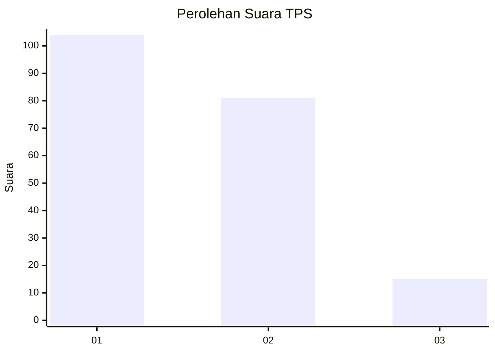
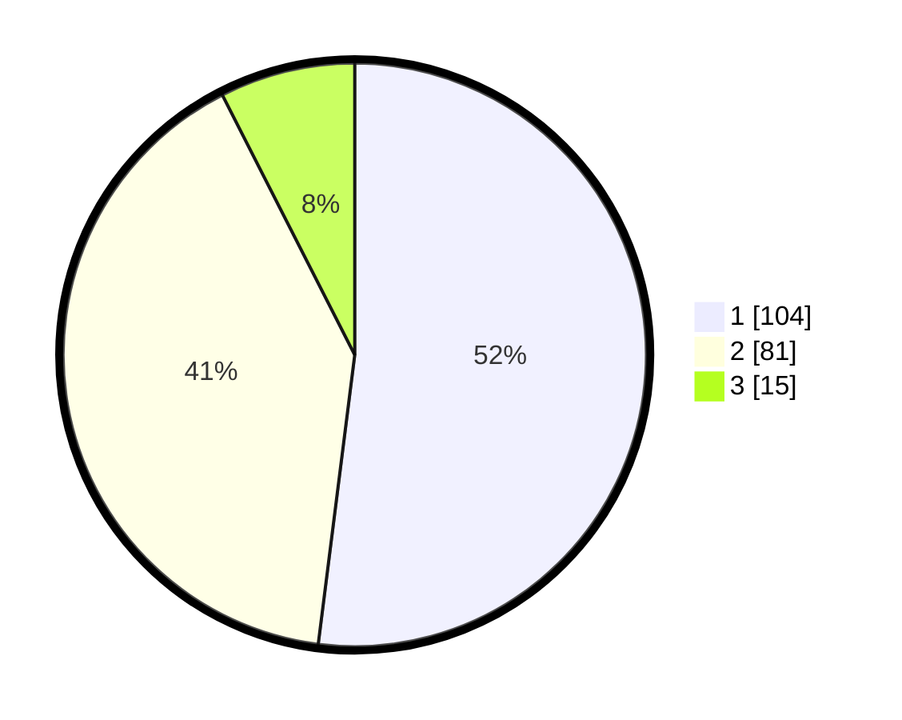

# Hasil

## Grafik

## Tabel

| No. | Nama Paslon    | Suara | Suara (raw) | Persentase |
|:--- |:-------------- | -----:| -----------:| ----------:|
| 1   | ANIES MUHAIMIN | 104   | [104][p-1]  | 52,00      |
| 2   | PRABOWO GIBRAN | 81    | [81][p-2]   | 40,50      |
| 3   | GANJAR MAHFUD  | 15    | [15][p-3]   | 7,50       |

[p-1]: https://github.com/gigit-pemilu/pemilu-2024-16-sumatera-selatan/blob/main/pilpres/hitung-suara/sub/16-sumatera-selatan/sub/71-kota-palembang/sub/08-sako/sub/1002-sako/sub/036-tps/sub/paslon-1.txt
[p-2]: https://github.com/gigit-pemilu/pemilu-2024-16-sumatera-selatan/blob/main/pilpres/hitung-suara/sub/16-sumatera-selatan/sub/71-kota-palembang/sub/08-sako/sub/1002-sako/sub/036-tps/sub/paslon-2.txt
[p-3]: https://github.com/gigit-pemilu/pemilu-2024-16-sumatera-selatan/blob/main/pilpres/hitung-suara/sub/16-sumatera-selatan/sub/71-kota-palembang/sub/08-sako/sub/1002-sako/sub/036-tps/sub/paslon-3.txt

## Foto C Plano

https://sirekap-obj-formc.kpu.go.id/0771/pemilu/ppwp/16/71/08/10/02/1671081002036-20240214-155306--8f55769a-8fea-4369-a38d-763462d2da82.jpg

https://sirekap-obj-formc.kpu.go.id/0771/pemilu/ppwp/16/71/08/10/02/1671081002036-20240214-155635--9ff42ca8-b012-477e-8821-94bafc24108f.jpg

https://sirekap-obj-formc.kpu.go.id/0771/pemilu/ppwp/16/71/08/10/02/1671081002036-20240214-155908--ca7c9dfd-c826-4e9b-a010-63799a5e9d3c.jpg

## Metadata

| Key        | Value               |
| ---------- | ------------------- |
| Time Stamp | 2024-02-14 21:46:01 |

