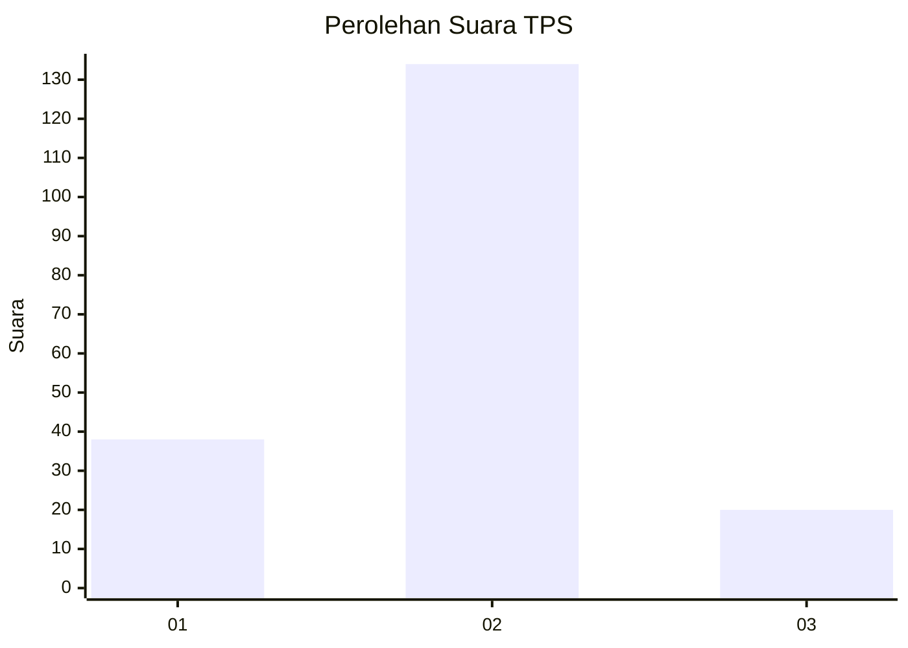
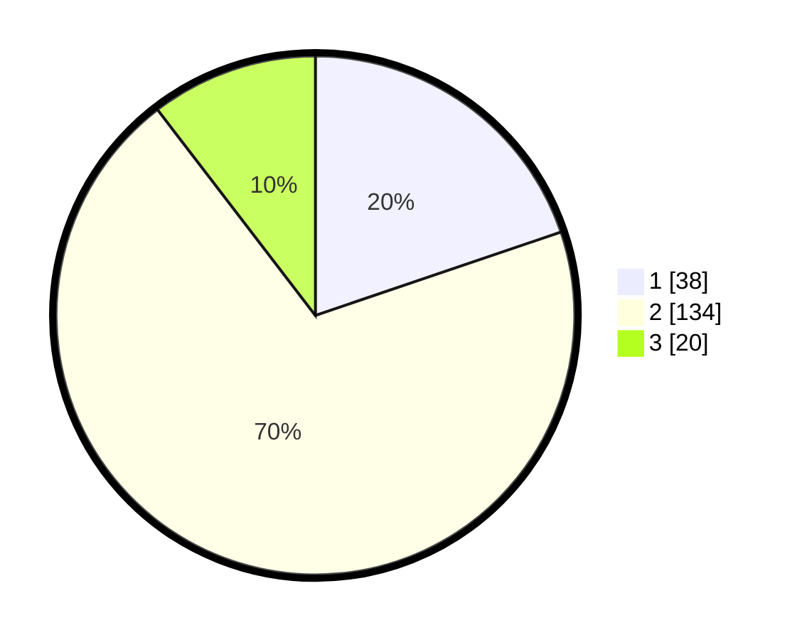

# Hasil

## Grafik

## Tabel

| No. | Nama Paslon    | Suara | Suara (raw) | Persentase |
|:--- |:-------------- | -----:| -----------:| ----------:|
| 1   | ANIES MUHAIMIN | 38    | [38][p-1]   | 19,79      |
| 2   | PRABOWO GIBRAN | 134   | [134][p-2]  | 69,79      |
| 3   | GANJAR MAHFUD  | 20    | [20][p-3]   | 10,42      |

[p-1]: https://github.com/gigit-pemilu/pemilu-2024-16-sumatera-selatan/blob/main/pilpres/hitung-suara/sub/16-sumatera-selatan/sub/71-kota-palembang/sub/08-sako/sub/1002-sako/sub/038-tps/sub/paslon-1.txt
[p-2]: https://github.com/gigit-pemilu/pemilu-2024-16-sumatera-selatan/blob/main/pilpres/hitung-suara/sub/16-sumatera-selatan/sub/71-kota-palembang/sub/08-sako/sub/1002-sako/sub/038-tps/sub/paslon-2.txt
[p-3]: https://github.com/gigit-pemilu/pemilu-2024-16-sumatera-selatan/blob/main/pilpres/hitung-suara/sub/16-sumatera-selatan/sub/71-kota-palembang/sub/08-sako/sub/1002-sako/sub/038-tps/sub/paslon-3.txt

## Foto C Plano

https://sirekap-obj-formc.kpu.go.id/3961/pemilu/ppwp/16/71/08/10/02/1671081002038-20240220-103130--2c6906f8-be95-4cbe-853c-b7864a91bdc4.jpg

https://sirekap-obj-formc.kpu.go.id/3961/pemilu/ppwp/16/71/08/10/02/1671081002038-20240220-103206--36df4689-3b0f-4277-bbb6-3ecb09e4cd23.jpg

https://sirekap-obj-formc.kpu.go.id/3961/pemilu/ppwp/16/71/08/10/02/1671081002038-20240220-103250--74915c2f-8968-403c-89f1-72ddccf9dce1.jpg

## Metadata

| Key        | Value               |
| ---------- | ------------------- |
| Time Stamp | 2024-02-20 11:00:00 |

## DATA PEMILIH TETAP

Jumlah pemilih dalam DPT: **245**.
 * L: **869**.
 * P: **426**.

## DATA PENGGUNA HAK PILIH

Jumlah pengguna hak pilih dalam DPT: **466**.
 * L: **893**.
 * P: **894**.

Jumlah pengguna hak pilih dalam DPTb: **888**.
 * L: **806**.
 * P: **888**.

Jumlah pengguna hak pilih dalam DPK: **886**.
 * L: **848**.
 * P: **803**.

Jumlah pengguna hak pilih: **688**.
 * L: **893**.
 * P: **95**.

## JUMLAH SUARA SAH DAN TIDAK SAH

JUMLAH SELURUH SUARA SAH: **485**.

JUMLAH SUARA TIDAK SAH: **803**.

JUMLAH SELURUH SUARA SAH DAN SUARA TIDAK SAH: **588**.

