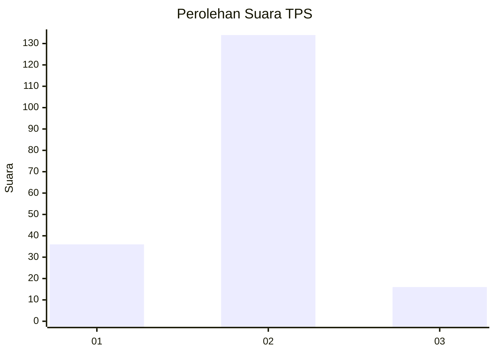
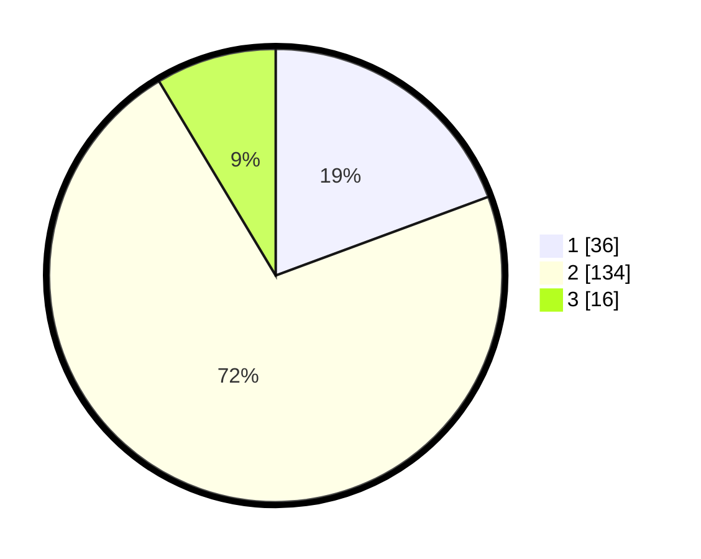

# Hasil

## Grafik

## Tabel

| No. | Nama Paslon    | Suara | Suara (raw) | Persentase |
|:--- |:-------------- | -----:| -----------:| ----------:|
| 1   | ANIES MUHAIMIN | 36    | [36][p-1]   | 19,35      |
| 2   | PRABOWO GIBRAN | 134   | [134][p-2]  | 72,04      |
| 3   | GANJAR MAHFUD  | 16    | [16][p-3]   | 8,60       |

[p-1]: https://github.com/gigit-pemilu/pemilu-2024-16-sumatera-selatan/blob/main/pilpres/hitung-suara/sub/16-sumatera-selatan/sub/71-kota-palembang/sub/08-sako/sub/1002-sako/sub/039-tps/sub/paslon-1.txt
[p-2]: https://github.com/gigit-pemilu/pemilu-2024-16-sumatera-selatan/blob/main/pilpres/hitung-suara/sub/16-sumatera-selatan/sub/71-kota-palembang/sub/08-sako/sub/1002-sako/sub/039-tps/sub/paslon-2.txt
[p-3]: https://github.com/gigit-pemilu/pemilu-2024-16-sumatera-selatan/blob/main/pilpres/hitung-suara/sub/16-sumatera-selatan/sub/71-kota-palembang/sub/08-sako/sub/1002-sako/sub/039-tps/sub/paslon-3.txt

## Foto C Plano

https://sirekap-obj-formc.kpu.go.id/f36d/pemilu/ppwp/16/71/08/10/02/1671081002039-20240220-103543--b8580448-ba3f-4fa8-9092-4a0faa53a1aa.jpg

https://sirekap-obj-formc.kpu.go.id/f36d/pemilu/ppwp/16/71/08/10/02/1671081002039-20240220-103613--508d4529-4b22-4ba1-a033-3ebac56ec612.jpg

https://sirekap-obj-formc.kpu.go.id/f36d/pemilu/ppwp/16/71/08/10/02/1671081002039-20240220-103642--a41643e2-ea87-4c38-80b4-5b0bf6dd25ef.jpg

## Metadata

| Key        | Value               |
| ---------- | ------------------- |
| Time Stamp | 2024-02-20 11:00:00 |

## DATA PEMILIH TETAP

Jumlah pemilih dalam DPT: **682**.
 * L: **826**.
 * P: **627**.

## DATA PENGGUNA HAK PILIH

Jumlah pengguna hak pilih dalam DPT: **692**.
 * L: **90**.
 * P: **800**.

Jumlah pengguna hak pilih dalam DPTb: **805**.
 * L: **800**.
 * P: **0**.

Jumlah pengguna hak pilih dalam DPK: **2**.
 * L: **88**.
 * P: **2**.

Jumlah pengguna hak pilih: **694**.
 * L: **92**.
 * P: **602**.

## JUMLAH SUARA SAH DAN TIDAK SAH

JUMLAH SELURUH SUARA SAH: **686**.

JUMLAH SUARA TIDAK SAH: **8**.

JUMLAH SELURUH SUARA SAH DAN SUARA TIDAK SAH: **594**.

