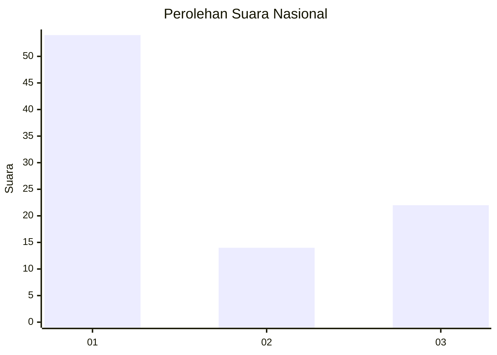
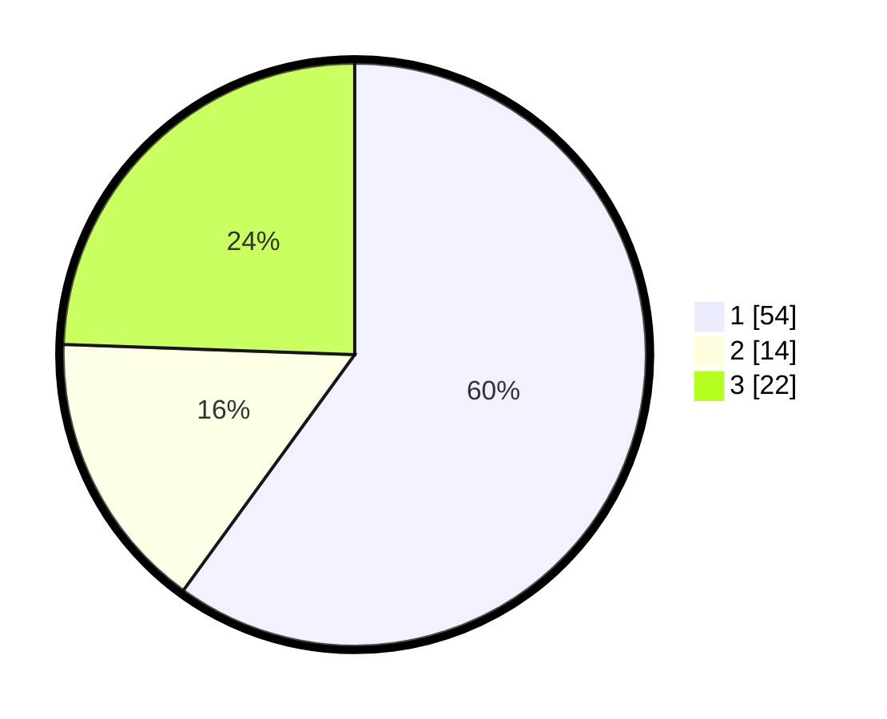

# Hasil

## Grafik

## Tabel

| No. | Nama Paslon    | Suara | Suara (raw) | Persentase |
|:--- |:-------------- | -----:| -----------:| ----------:|
| 1   | ANIES MUHAIMIN | 54    | [54][p-1]   | 60,00      |
| 2   | PRABOWO GIBRAN | 14    | [14][p-2]   | 15,56      |
| 3   | GANJAR MAHFUD  | 22    | [22][p-3]   | 24,44      |

[p-1]: https://github.com/gigit-pemilu/pemilu-2024/blob/main/pilpres/hitung-suara/sub/16-sumatera-selatan/sub/71-kota-palembang/sub/08-sako/sub/1002-sako/sub/040-tps/sub/paslon-1.txt
[p-2]: https://github.com/gigit-pemilu/pemilu-2024/blob/main/pilpres/hitung-suara/sub/16-sumatera-selatan/sub/71-kota-palembang/sub/08-sako/sub/1002-sako/sub/040-tps/sub/paslon-2.txt
[p-3]: https://github.com/gigit-pemilu/pemilu-2024/blob/main/pilpres/hitung-suara/sub/16-sumatera-selatan/sub/71-kota-palembang/sub/08-sako/sub/1002-sako/sub/040-tps/sub/paslon-3.txt

## Foto C Plano

https://sirekap-obj-formc.kpu.go.id/a424/pemilu/ppwp/16/71/08/10/02/1671081002040-20240220-103901--b7f55c78-55e0-43eb-9dfa-3bdb212dadbd.jpg

https://sirekap-obj-formc.kpu.go.id/a424/pemilu/ppwp/16/71/08/10/02/1671081002040-20240220-103929--e44e345b-3241-4254-a70d-b055d7d8501a.jpg

https://sirekap-obj-formc.kpu.go.id/a424/pemilu/ppwp/16/71/08/10/02/1671081002040-20240220-104001--8a0fe5b8-b636-4154-8a23-6044f579763d.jpg

## Metadata

| Key        | Value               |
| ---------- | ------------------- |
| Time Stamp | 2024-02-20 11:00:00 |

## DATA PEMILIH TETAP

Jumlah pemilih dalam DPT: **234**.
 * L: **486**.
 * P: **165**.

## DATA PENGGUNA HAK PILIH

Jumlah pengguna hak pilih dalam DPT: **875**.
 * L: **826**.
 * P: **99**.

Jumlah pengguna hak pilih dalam DPTb: **85**.
 * L: **808**.
 * P: **800**.

Jumlah pengguna hak pilih dalam DPK: **5**.
 * L: **84**.
 * P: **5**.

Jumlah pengguna hak pilih: **480**.
 * L: **80**.
 * P: **500**.

## JUMLAH SUARA SAH DAN TIDAK SAH

JUMLAH SELURUH SUARA SAH: **428**.

JUMLAH SUARA TIDAK SAH: **3**.

JUMLAH SELURUH SUARA SAH DAN SUARA TIDAK SAH: **480**.

