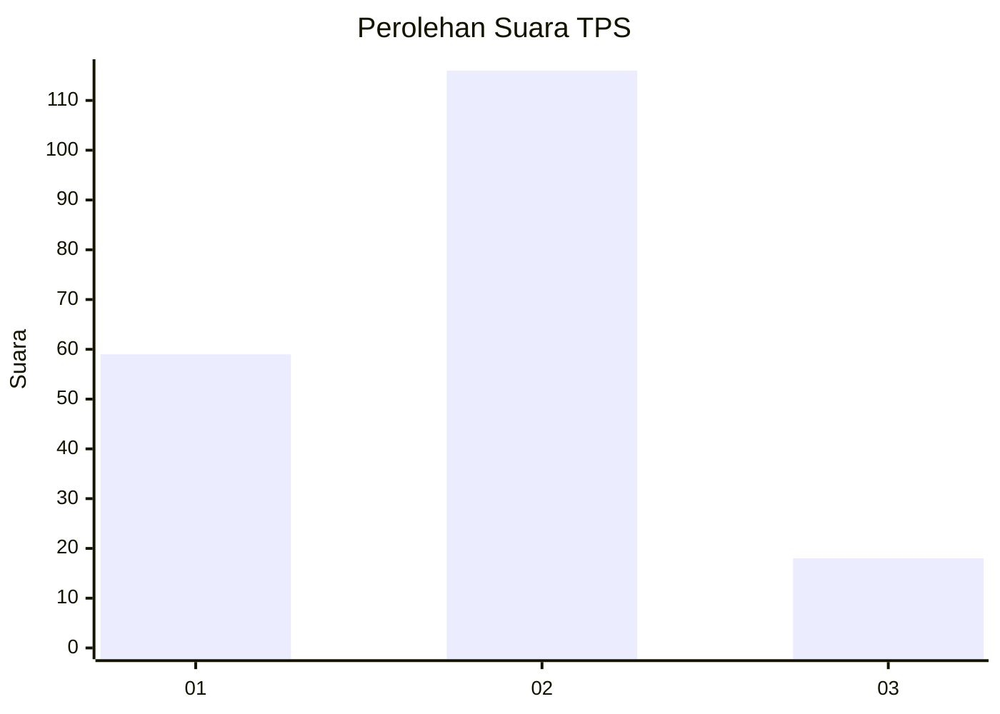
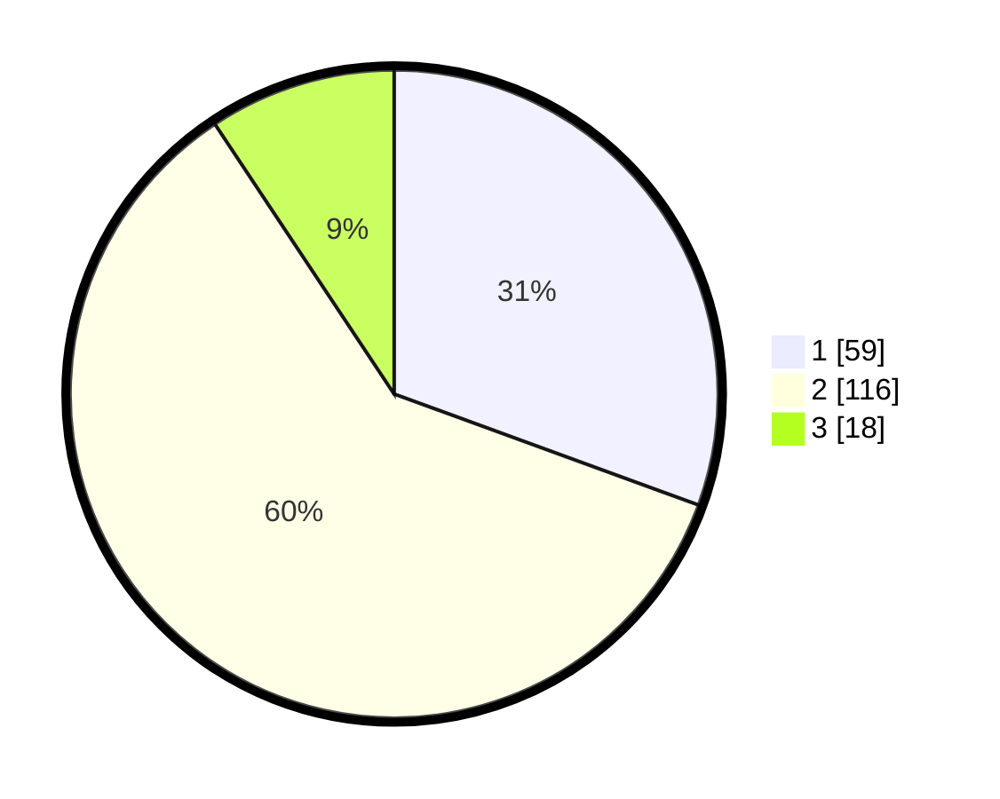

# Hasil

## Grafik

## Tabel

| No. | Nama Paslon    | Suara | Suara (raw) | Persentase |
|:--- |:-------------- | -----:| -----------:| ----------:|
| 1   | ANIES MUHAIMIN | 59    | [59][p-1]   | 30,57      |
| 2   | PRABOWO GIBRAN | 116   | [116][p-2]  | 60,10      |
| 3   | GANJAR MAHFUD  | 18    | [18][p-3]   | 9,33       |

[p-1]: https://github.com/gigit-pemilu/pemilu-2024-16-sumatera-selatan/blob/main/pilpres/hitung-suara/sub/16-sumatera-selatan/sub/71-kota-palembang/sub/08-sako/sub/1002-sako/sub/041-tps/sub/paslon-1.txt
[p-2]: https://github.com/gigit-pemilu/pemilu-2024-16-sumatera-selatan/blob/main/pilpres/hitung-suara/sub/16-sumatera-selatan/sub/71-kota-palembang/sub/08-sako/sub/1002-sako/sub/041-tps/sub/paslon-2.txt
[p-3]: https://github.com/gigit-pemilu/pemilu-2024-16-sumatera-selatan/blob/main/pilpres/hitung-suara/sub/16-sumatera-selatan/sub/71-kota-palembang/sub/08-sako/sub/1002-sako/sub/041-tps/sub/paslon-3.txt

## Foto C Plano

https://sirekap-obj-formc.kpu.go.id/e12e/pemilu/ppwp/16/71/08/10/02/1671081002041-20240220-104215--4084eabd-4e46-40bc-bb07-95c52f560f99.jpg

https://sirekap-obj-formc.kpu.go.id/e12e/pemilu/ppwp/16/71/08/10/02/1671081002041-20240220-104244--2ebdd78f-75df-4db1-9ae5-13b3667d537f.jpg

https://sirekap-obj-formc.kpu.go.id/e12e/pemilu/ppwp/16/71/08/10/02/1671081002041-20240220-104312--d9ec1f7b-b5ed-4e7e-9cb1-964ff4791eef.jpg

## Metadata

| Key        | Value               |
| ---------- | ------------------- |
| Time Stamp | 2024-02-20 11:00:00 |

## DATA PEMILIH TETAP

Jumlah pemilih dalam DPT: **246**.
 * L: **487**.
 * P: **829**.

## DATA PENGGUNA HAK PILIH

Jumlah pengguna hak pilih dalam DPT: **685**.
 * L: **83**.
 * P: **842**.

Jumlah pengguna hak pilih dalam DPTb: **875**.
 * L: **882**.
 * P: **885**.

Jumlah pengguna hak pilih dalam DPK: **3**.
 * L: **84**.
 * P: **82**.

Jumlah pengguna hak pilih: **695**.
 * L: **86**.
 * P: **509**.

## JUMLAH SUARA SAH DAN TIDAK SAH

JUMLAH SELURUH SUARA SAH: **894**.

JUMLAH SUARA TIDAK SAH: **88**.

JUMLAH SELURUH SUARA SAH DAN SUARA TIDAK SAH: **595**.

