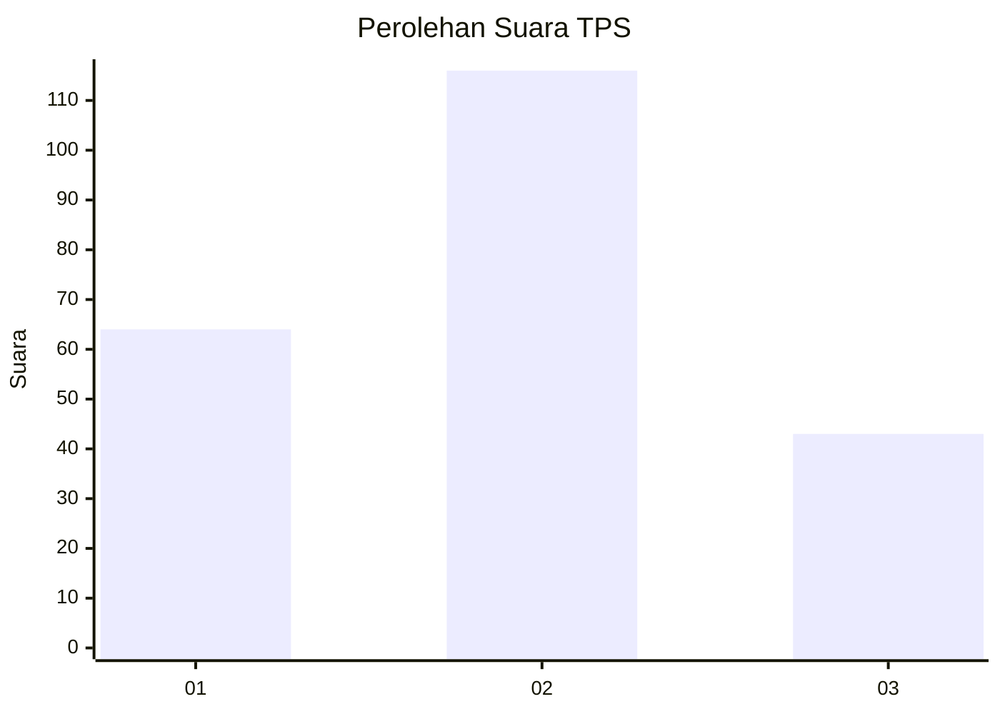
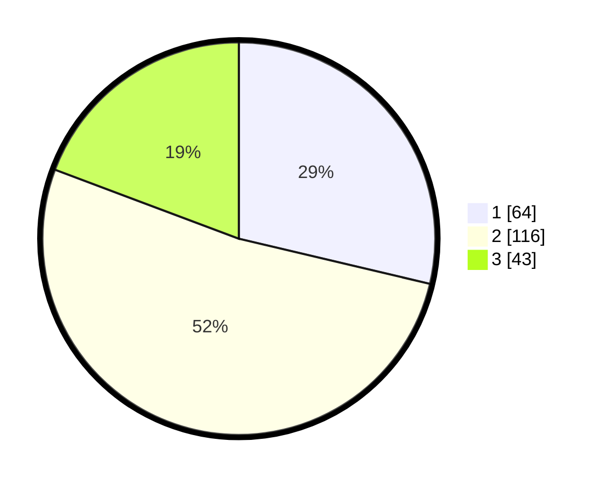

# Hasil

## Grafik

## Tabel

| No. | Nama Paslon    | Suara | Suara (raw) | Persentase |
|:--- |:-------------- | -----:| -----------:| ----------:|
| 1   | ANIES MUHAIMIN | 64    | [64][p-1]   | 28,70      |
| 2   | PRABOWO GIBRAN | 116   | [116][p-2]  | 52,02      |
| 3   | GANJAR MAHFUD  | 43    | [43][p-3]   | 19,28      |

[p-1]: https://github.com/gigit-pemilu/pemilu-2024-16-sumatera-selatan/blob/main/pilpres/hitung-suara/sub/16-sumatera-selatan/sub/71-kota-palembang/sub/08-sako/sub/1002-sako/sub/042-tps/sub/paslon-1.txt
[p-2]: https://github.com/gigit-pemilu/pemilu-2024-16-sumatera-selatan/blob/main/pilpres/hitung-suara/sub/16-sumatera-selatan/sub/71-kota-palembang/sub/08-sako/sub/1002-sako/sub/042-tps/sub/paslon-2.txt
[p-3]: https://github.com/gigit-pemilu/pemilu-2024-16-sumatera-selatan/blob/main/pilpres/hitung-suara/sub/16-sumatera-selatan/sub/71-kota-palembang/sub/08-sako/sub/1002-sako/sub/042-tps/sub/paslon-3.txt

## Foto C Plano

https://sirekap-obj-formc.kpu.go.id/25a7/pemilu/ppwp/16/71/08/10/02/1671081002042-20240220-104501--c6538813-34e1-4201-aac4-3fd89fda9c15.jpg

https://sirekap-obj-formc.kpu.go.id/25a7/pemilu/ppwp/16/71/08/10/02/1671081002042-20240220-104530--8aa12953-d2b9-4a63-977e-3cf6ead2d5b6.jpg

https://sirekap-obj-formc.kpu.go.id/25a7/pemilu/ppwp/16/71/08/10/02/1671081002042-20240220-104602--124a246d-234d-4aa6-b5bf-82e611076d94.jpg

## Metadata

| Key        | Value               |
| ---------- | ------------------- |
| Time Stamp | 2024-02-20 11:00:00 |

## DATA PEMILIH TETAP

Jumlah pemilih dalam DPT: **240**.
 * L: **841**.
 * P: **699**.

## DATA PENGGUNA HAK PILIH

Jumlah pengguna hak pilih dalam DPT: **498**.
 * L: **93**.
 * P: **98**.

Jumlah pengguna hak pilih dalam DPTb: **82**.
 * L: **40**.
 * P: **996**.

Jumlah pengguna hak pilih dalam DPK: **93**.
 * L: **996**.
 * P: **902**.

Jumlah pengguna hak pilih: **896**.
 * L: **45**.
 * P: **594**.

## JUMLAH SUARA SAH DAN TIDAK SAH

JUMLAH SELURUH SUARA SAH: **333**.

JUMLAH SUARA TIDAK SAH: **84**.

JUMLAH SELURUH SUARA SAH DAN SUARA TIDAK SAH: **696**.

