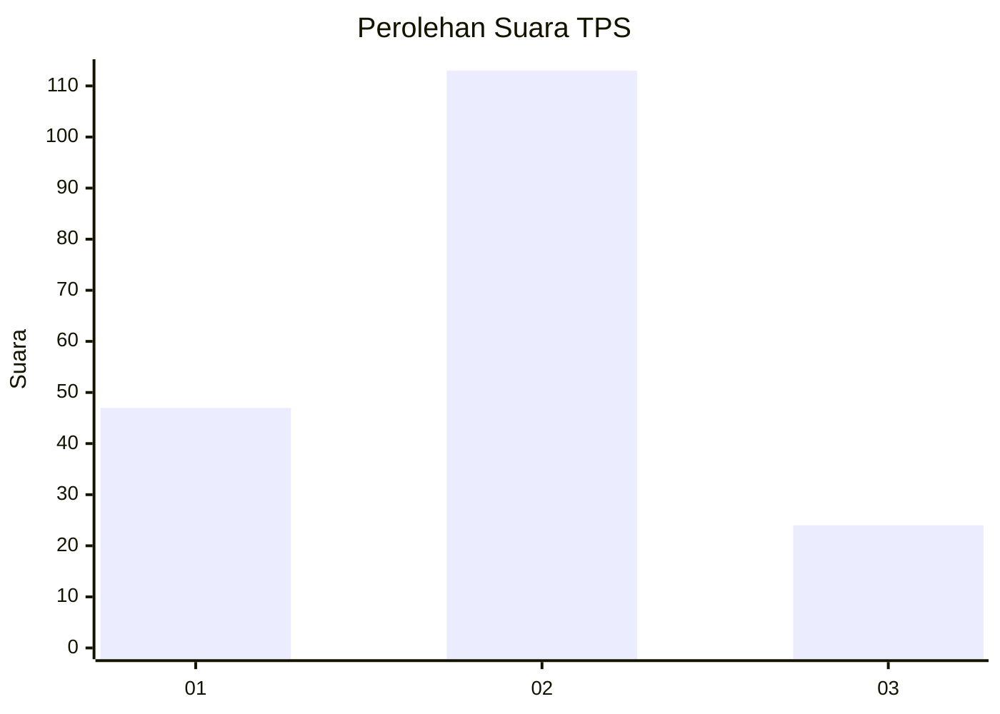
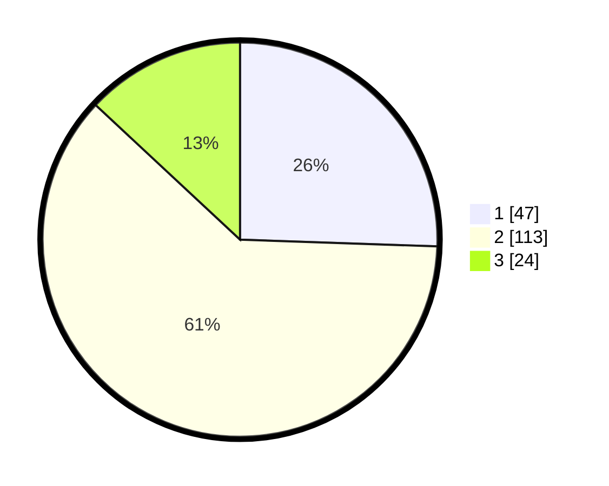

# Hasil

## Grafik

## Tabel

| No. | Nama Paslon    | Suara | Suara (raw) | Persentase |
|:--- |:-------------- | -----:| -----------:| ----------:|
| 1   | ANIES MUHAIMIN | 47    | [47][p-1]   | 25,54      |
| 2   | PRABOWO GIBRAN | 113   | [113][p-2]  | 61,41      |
| 3   | GANJAR MAHFUD  | 24    | [24][p-3]   | 13,04      |

[p-1]: https://github.com/gigit-pemilu/pemilu-2024-16-sumatera-selatan/blob/main/pilpres/hitung-suara/sub/16-sumatera-selatan/sub/71-kota-palembang/sub/08-sako/sub/1002-sako/sub/043-tps/sub/paslon-1.txt
[p-2]: https://github.com/gigit-pemilu/pemilu-2024-16-sumatera-selatan/blob/main/pilpres/hitung-suara/sub/16-sumatera-selatan/sub/71-kota-palembang/sub/08-sako/sub/1002-sako/sub/043-tps/sub/paslon-2.txt
[p-3]: https://github.com/gigit-pemilu/pemilu-2024-16-sumatera-selatan/blob/main/pilpres/hitung-suara/sub/16-sumatera-selatan/sub/71-kota-palembang/sub/08-sako/sub/1002-sako/sub/043-tps/sub/paslon-3.txt

## Foto C Plano

https://sirekap-obj-formc.kpu.go.id/7065/pemilu/ppwp/16/71/08/10/02/1671081002043-20240220-104742--220ec117-d9f6-44a5-9364-20cadbcc1140.jpg

https://sirekap-obj-formc.kpu.go.id/7065/pemilu/ppwp/16/71/08/10/02/1671081002043-20240220-104823--702a719b-73fc-498d-b788-a207993820ff.jpg

https://sirekap-obj-formc.kpu.go.id/7065/pemilu/ppwp/16/71/08/10/02/1671081002043-20240220-104853--4c09a58b-23cf-48cb-a3e5-ce1244c70e0a.jpg

## Metadata

| Key        | Value               |
| ---------- | ------------------- |
| Time Stamp | 2024-02-20 11:00:00 |

## DATA PEMILIH TETAP

Jumlah pemilih dalam DPT: **245**.
 * L: **432**.
 * P: **448**.

## DATA PENGGUNA HAK PILIH

Jumlah pengguna hak pilih dalam DPT: **896**.
 * L: **400**.
 * P: **894**.

Jumlah pengguna hak pilih dalam DPTb: **80**.
 * L: **485**.
 * P: **880**.

Jumlah pengguna hak pilih dalam DPK: **800**.
 * L: **800**.
 * P: **888**.

Jumlah pengguna hak pilih: **594**.
 * L: **200**.
 * P: **94**.

## JUMLAH SUARA SAH DAN TIDAK SAH

JUMLAH SELURUH SUARA SAH: **884**.

JUMLAH SUARA TIDAK SAH: **882**.

JUMLAH SELURUH SUARA SAH DAN SUARA TIDAK SAH: **495**.

