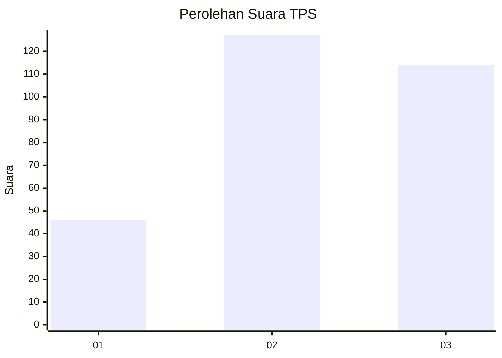
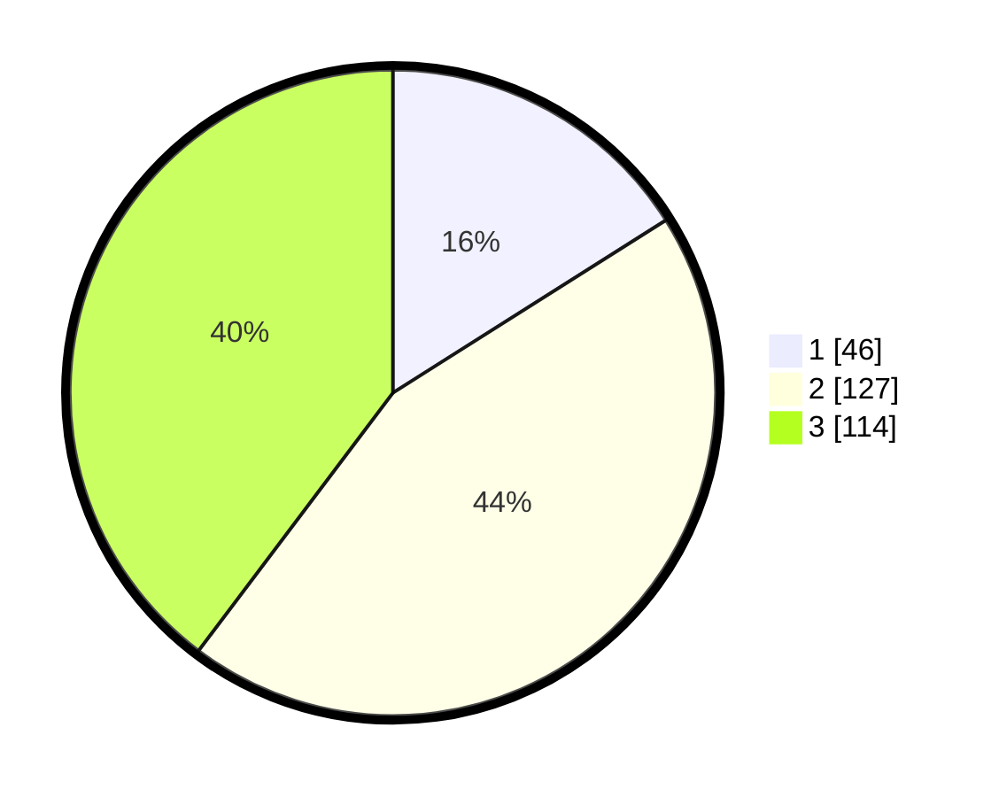

# Hasil

## Grafik

## Tabel

| No. | Nama Paslon    | Suara | Suara (raw) | Persentase |
|:--- |:-------------- | -----:| -----------:| ----------:|
| 1   | ANIES MUHAIMIN | 46    | [46][p-1]   | 16,03      |
| 2   | PRABOWO GIBRAN | 127   | [127][p-2]  | 44,25      |
| 3   | GANJAR MAHFUD  | 114   | [114][p-3]  | 39,72      |

[p-1]: https://github.com/gigit-pemilu/pemilu-2024-16-sumatera-selatan/blob/main/pilpres/hitung-suara/sub/16-sumatera-selatan/sub/71-kota-palembang/sub/08-sako/sub/1002-sako/sub/044-tps/sub/paslon-1.txt
[p-2]: https://github.com/gigit-pemilu/pemilu-2024-16-sumatera-selatan/blob/main/pilpres/hitung-suara/sub/16-sumatera-selatan/sub/71-kota-palembang/sub/08-sako/sub/1002-sako/sub/044-tps/sub/paslon-2.txt
[p-3]: https://github.com/gigit-pemilu/pemilu-2024-16-sumatera-selatan/blob/main/pilpres/hitung-suara/sub/16-sumatera-selatan/sub/71-kota-palembang/sub/08-sako/sub/1002-sako/sub/044-tps/sub/paslon-3.txt

## Foto C Plano

https://sirekap-obj-formc.kpu.go.id/e76a/pemilu/ppwp/16/71/08/10/02/1671081002044-20240220-105033--e648368f-ae15-45ea-8fb1-33c0580f9c2e.jpg

https://sirekap-obj-formc.kpu.go.id/e76a/pemilu/ppwp/16/71/08/10/02/1671081002044-20240220-105142--35255b0a-2b53-40c8-9d79-068c02a596b0.jpg

https://sirekap-obj-formc.kpu.go.id/e76a/pemilu/ppwp/16/71/08/10/02/1671081002044-20240220-105209--4fc139d2-78bb-4738-8193-646d29af521f.jpg

## Metadata

| Key        | Value               |
| ---------- | ------------------- |
| Time Stamp | 2024-02-20 11:00:00 |

## DATA PEMILIH TETAP

Jumlah pemilih dalam DPT: **393**.
 * L: **889**.
 * P: **404**.

## DATA PENGGUNA HAK PILIH

Jumlah pengguna hak pilih dalam DPT: **696**.
 * L: **882**.
 * P: **804**.

Jumlah pengguna hak pilih dalam DPTb: **888**.
 * L: **888**.
 * P: **888**.

Jumlah pengguna hak pilih dalam DPK: **820**.
 * L: **223**.
 * P: **828**.

Jumlah pengguna hak pilih: **893**.
 * L: **889**.
 * P: **204**.

## JUMLAH SUARA SAH DAN TIDAK SAH

JUMLAH SELURUH SUARA SAH: **682**.

JUMLAH SUARA TIDAK SAH: **5**.

JUMLAH SELURUH SUARA SAH DAN SUARA TIDAK SAH: **693**.

