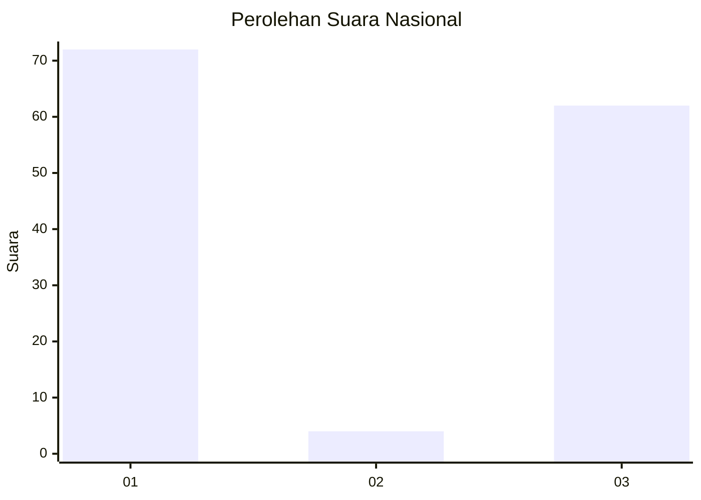
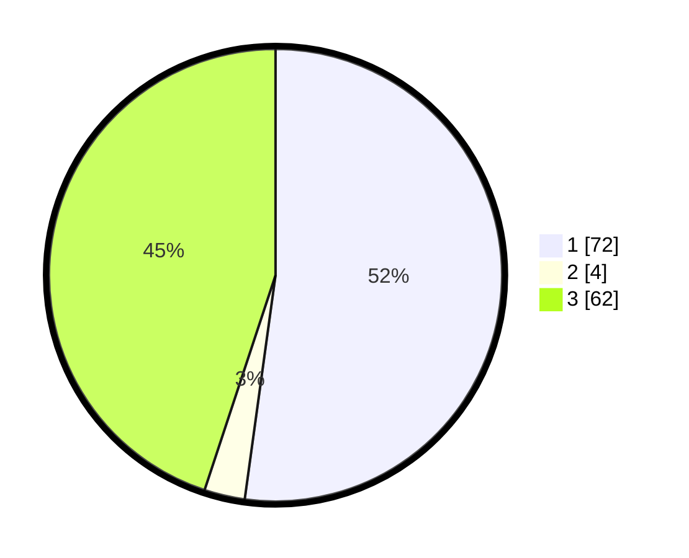

# Hasil

## Grafik

## Tabel

| No. | Nama Paslon    | Suara | Suara (raw) | Persentase |
|:--- |:-------------- | -----:| -----------:| ----------:|
| 1   | ANIES MUHAIMIN | 72    | [72][p-1]   | 52,17      |
| 2   | PRABOWO GIBRAN | 4     | [4][p-2]    | 2,90       |
| 3   | GANJAR MAHFUD  | 62    | [62][p-3]   | 44,93      |

[p-1]: https://github.com/gigit-pemilu/pemilu-2024/blob/main/pilpres/hitung-suara/sub/16-sumatera-selatan/sub/71-kota-palembang/sub/08-sako/sub/1002-sako/sub/045-tps/sub/paslon-1.txt
[p-2]: https://github.com/gigit-pemilu/pemilu-2024/blob/main/pilpres/hitung-suara/sub/16-sumatera-selatan/sub/71-kota-palembang/sub/08-sako/sub/1002-sako/sub/045-tps/sub/paslon-2.txt
[p-3]: https://github.com/gigit-pemilu/pemilu-2024/blob/main/pilpres/hitung-suara/sub/16-sumatera-selatan/sub/71-kota-palembang/sub/08-sako/sub/1002-sako/sub/045-tps/sub/paslon-3.txt

## Foto C Plano

https://sirekap-obj-formc.kpu.go.id/72b7/pemilu/ppwp/16/71/08/10/02/1671081002045-20240220-105441--0ec9bd18-9739-4e35-bfa3-67d2b0eff124.jpg

https://sirekap-obj-formc.kpu.go.id/72b7/pemilu/ppwp/16/71/08/10/02/1671081002045-20240220-105512--6f9df138-7af7-47b7-bc8b-18798c56f66e.jpg

https://sirekap-obj-formc.kpu.go.id/72b7/pemilu/ppwp/16/71/08/10/02/1671081002045-20240220-105540--5a95b67c-b071-49b7-941d-9502df2b4a67.jpg

## Metadata

| Key        | Value               |
| ---------- | ------------------- |
| Time Stamp | 2024-02-20 11:00:00 |

## DATA PEMILIH TETAP

Jumlah pemilih dalam DPT: **254**.
 * L: **328**.
 * P: **826**.

## DATA PENGGUNA HAK PILIH

Jumlah pengguna hak pilih dalam DPT: **698**.
 * L: **94**.
 * P: **993**.

Jumlah pengguna hak pilih dalam DPTb: **53**.
 * L: **0**.
 * P: **80**.

Jumlah pengguna hak pilih dalam DPK: **6**.
 * L: **4**.
 * P: **2**.

Jumlah pengguna hak pilih: **698**.
 * L: **98**.
 * P: **600**.

## JUMLAH SUARA SAH DAN TIDAK SAH

JUMLAH SELURUH SUARA SAH: **598**.

JUMLAH SUARA TIDAK SAH: **900**.

JUMLAH SELURUH SUARA SAH DAN SUARA TIDAK SAH: **698**.

