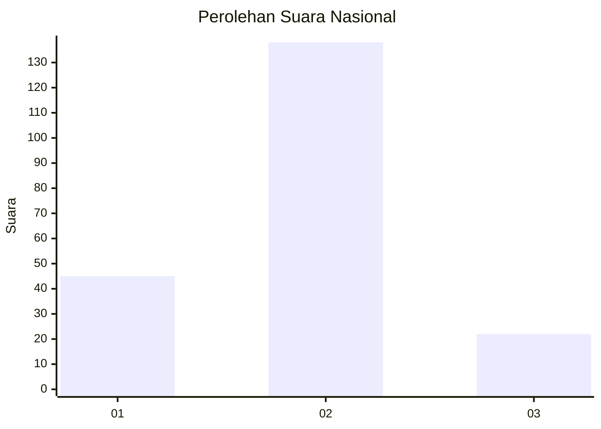
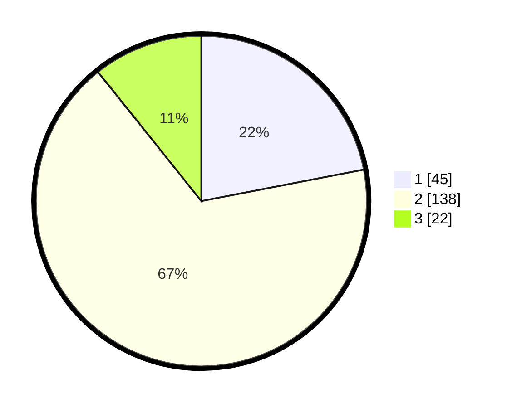

# Hasil

## Grafik

## Tabel

| No. | Nama Paslon    | Suara | Suara (raw) | Persentase |
|:--- |:-------------- | -----:| -----------:| ----------:|
| 1   | ANIES MUHAIMIN | 45    | [45][p-1]   | 21,95      |
| 2   | PRABOWO GIBRAN | 138   | [138][p-2]  | 67,32      |
| 3   | GANJAR MAHFUD  | 22    | [22][p-3]   | 10,73      |

[p-1]: https://github.com/gigit-pemilu/pemilu-2024/blob/main/pilpres/hitung-suara/sub/16-sumatera-selatan/sub/71-kota-palembang/sub/08-sako/sub/1002-sako/sub/046-tps/sub/paslon-1.txt
[p-2]: https://github.com/gigit-pemilu/pemilu-2024/blob/main/pilpres/hitung-suara/sub/16-sumatera-selatan/sub/71-kota-palembang/sub/08-sako/sub/1002-sako/sub/046-tps/sub/paslon-2.txt
[p-3]: https://github.com/gigit-pemilu/pemilu-2024/blob/main/pilpres/hitung-suara/sub/16-sumatera-selatan/sub/71-kota-palembang/sub/08-sako/sub/1002-sako/sub/046-tps/sub/paslon-3.txt

## Foto C Plano

https://sirekap-obj-formc.kpu.go.id/f6cd/pemilu/ppwp/16/71/08/10/02/1671081002046-20240220-105718--5a7691ca-bf8a-4feb-ab2b-4a4512ff3f2f.jpg

https://sirekap-obj-formc.kpu.go.id/f6cd/pemilu/ppwp/16/71/08/10/02/1671081002046-20240220-105748--1b9533b5-b4ba-4f25-8134-83cbd74c68a8.jpg

https://sirekap-obj-formc.kpu.go.id/f6cd/pemilu/ppwp/16/71/08/10/02/1671081002046-20240220-105817--4e1d6c4b-ea10-4363-8fce-dbec11c03bcb.jpg

## Metadata

| Key        | Value               |
| ---------- | ------------------- |
| Time Stamp | 2024-02-20 11:00:00 |

## DATA PEMILIH TETAP

Jumlah pemilih dalam DPT: **253**.
 * L: **824**.
 * P: **429**.

## DATA PENGGUNA HAK PILIH

Jumlah pengguna hak pilih dalam DPT: **222**.
 * L: **32**.
 * P: **593**.

Jumlah pengguna hak pilih dalam DPTb: **3**.
 * L: **502**.
 * P: **2**.

Jumlah pengguna hak pilih dalam DPK: **880**.
 * L: **0**.
 * P: **50**.

Jumlah pengguna hak pilih: **295**.
 * L: **92**.
 * P: **608**.

## JUMLAH SUARA SAH DAN TIDAK SAH

JUMLAH SELURUH SUARA SAH: **205**.

JUMLAH SUARA TIDAK SAH: **42**.

JUMLAH SELURUH SUARA SAH DAN SUARA TIDAK SAH: **247**.

