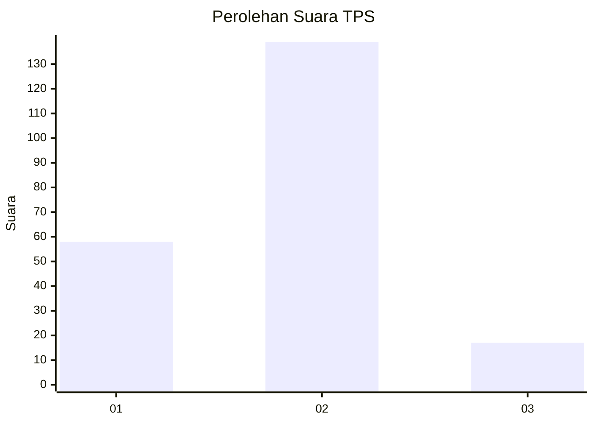
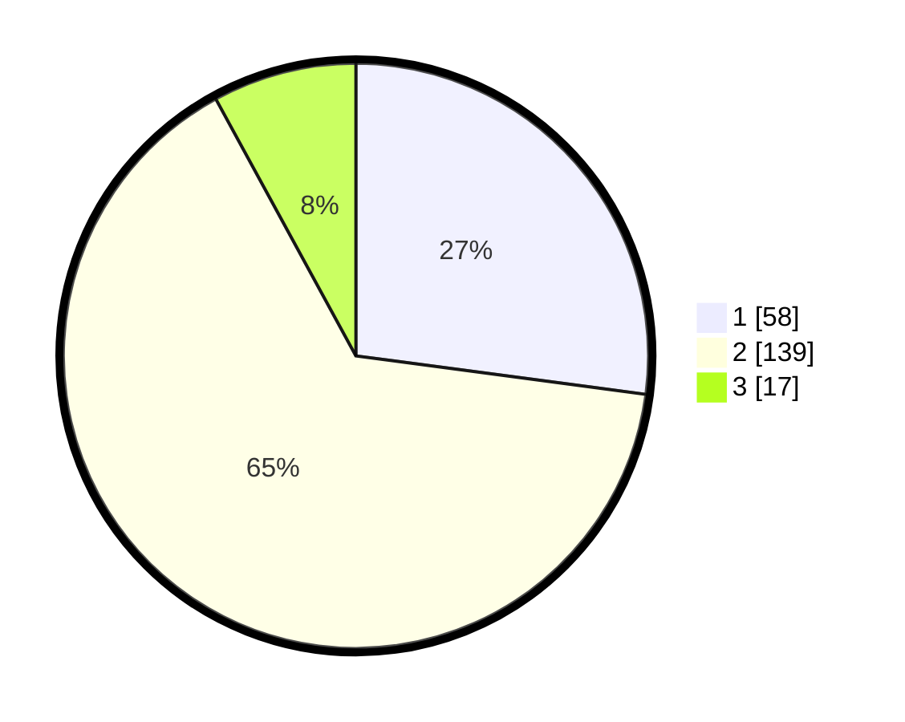

# Hasil

## Grafik

## Tabel

| No. | Nama Paslon    | Suara | Suara (raw) | Persentase |
|:--- |:-------------- | -----:| -----------:| ----------:|
| 1   | ANIES MUHAIMIN | 58    | [58][p-1]   | 27,10      |
| 2   | PRABOWO GIBRAN | 139   | [139][p-2]  | 64,95      |
| 3   | GANJAR MAHFUD  | 17    | [17][p-3]   | 7,94       |

[p-1]: https://github.com/gigit-pemilu/pemilu-2024-16-sumatera-selatan/blob/main/pilpres/hitung-suara/sub/16-sumatera-selatan/sub/71-kota-palembang/sub/08-sako/sub/1002-sako/sub/047-tps/sub/paslon-1.txt
[p-2]: https://github.com/gigit-pemilu/pemilu-2024-16-sumatera-selatan/blob/main/pilpres/hitung-suara/sub/16-sumatera-selatan/sub/71-kota-palembang/sub/08-sako/sub/1002-sako/sub/047-tps/sub/paslon-2.txt
[p-3]: https://github.com/gigit-pemilu/pemilu-2024-16-sumatera-selatan/blob/main/pilpres/hitung-suara/sub/16-sumatera-selatan/sub/71-kota-palembang/sub/08-sako/sub/1002-sako/sub/047-tps/sub/paslon-3.txt

## Foto C Plano

https://sirekap-obj-formc.kpu.go.id/5efd/pemilu/ppwp/16/71/08/10/02/1671081002047-20240220-110018--af5b701d-6a9b-4d96-9cbd-6b136e8c4183.jpg

https://sirekap-obj-formc.kpu.go.id/5efd/pemilu/ppwp/16/71/08/10/02/1671081002047-20240220-110047--7fb00a9a-7caf-4848-869b-ac86b73652b7.jpg

https://sirekap-obj-formc.kpu.go.id/5efd/pemilu/ppwp/16/71/08/10/02/1671081002047-20240220-110115--ad75a77e-8e62-41b6-960d-a819d6be4685.jpg

## Metadata

| Key        | Value               |
| ---------- | ------------------- |
| Time Stamp | 2024-02-20 12:00:00 |

## DATA PEMILIH TETAP

Jumlah pemilih dalam DPT: **259**.
 * L: **834**.
 * P: **625**.

## DATA PENGGUNA HAK PILIH

Jumlah pengguna hak pilih dalam DPT: **269**.
 * L: **284**.
 * P: **505**.

Jumlah pengguna hak pilih dalam DPTb: **88**.
 * L: **888**.
 * P: **888**.

Jumlah pengguna hak pilih dalam DPK: **888**.
 * L: **8**.
 * P: **888**.

Jumlah pengguna hak pilih: **359**.
 * L: **44**.
 * P: **895**.

## JUMLAH SUARA SAH DAN TIDAK SAH

JUMLAH SELURUH SUARA SAH: **264**.

JUMLAH SUARA TIDAK SAH: **5**.

JUMLAH SELURUH SUARA SAH DAN SUARA TIDAK SAH: **239**.

