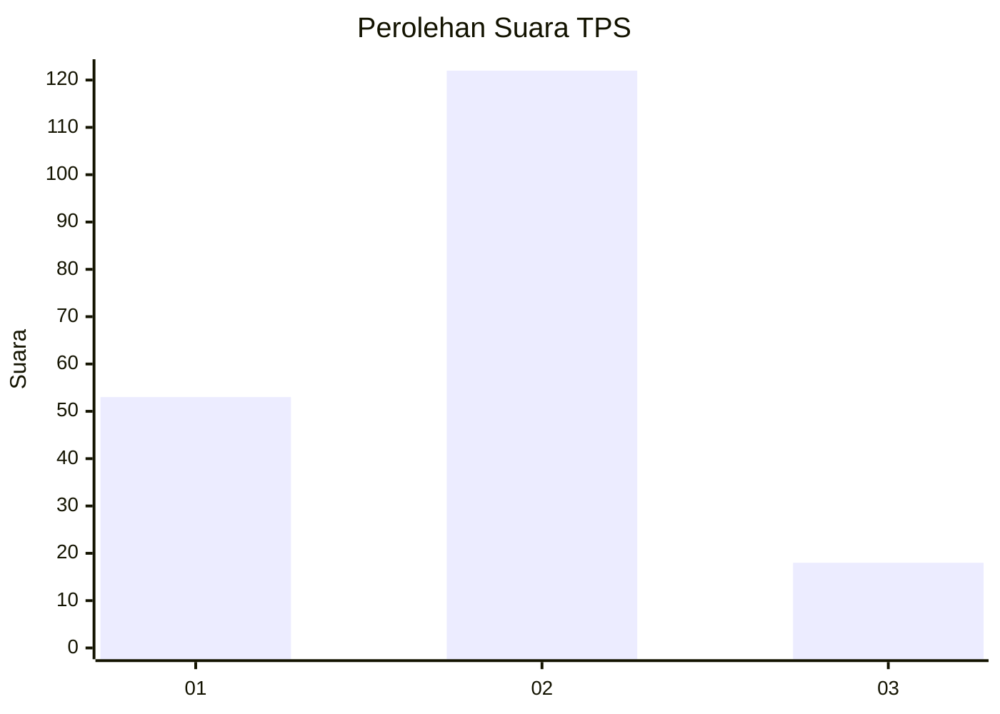
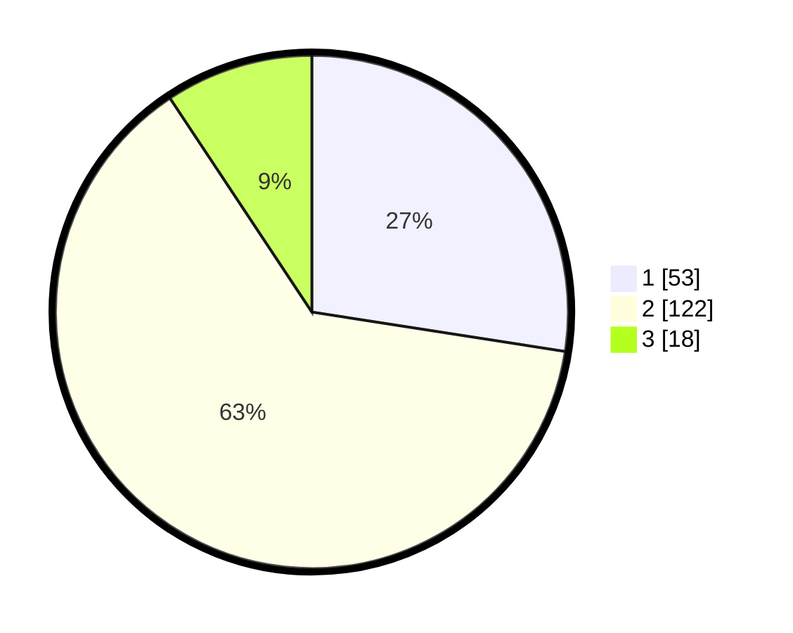

# Hasil

## Grafik

## Tabel

| No. | Nama Paslon    | Suara | Suara (raw) | Persentase |
|:--- |:-------------- | -----:| -----------:| ----------:|
| 1   | ANIES MUHAIMIN | 53    | [53][p-1]   | 27,46      |
| 2   | PRABOWO GIBRAN | 122   | [122][p-2]  | 63,21      |
| 3   | GANJAR MAHFUD  | 18    | [18][p-3]   | 9,33       |

[p-1]: https://github.com/gigit-pemilu/pemilu-2024-16-sumatera-selatan/blob/main/pilpres/hitung-suara/sub/16-sumatera-selatan/sub/71-kota-palembang/sub/08-sako/sub/1002-sako/sub/048-tps/sub/paslon-1.txt
[p-2]: https://github.com/gigit-pemilu/pemilu-2024-16-sumatera-selatan/blob/main/pilpres/hitung-suara/sub/16-sumatera-selatan/sub/71-kota-palembang/sub/08-sako/sub/1002-sako/sub/048-tps/sub/paslon-2.txt
[p-3]: https://github.com/gigit-pemilu/pemilu-2024-16-sumatera-selatan/blob/main/pilpres/hitung-suara/sub/16-sumatera-selatan/sub/71-kota-palembang/sub/08-sako/sub/1002-sako/sub/048-tps/sub/paslon-3.txt

## Foto C Plano

https://sirekap-obj-formc.kpu.go.id/4260/pemilu/ppwp/16/71/08/10/02/1671081002048-20240220-110311--42bacf66-0313-4ebd-a947-571a543948b0.jpg

https://sirekap-obj-formc.kpu.go.id/4260/pemilu/ppwp/16/71/08/10/02/1671081002048-20240220-110342--b71eae3b-83f7-41e5-a64f-ca5d43c33a61.jpg

https://sirekap-obj-formc.kpu.go.id/4260/pemilu/ppwp/16/71/08/10/02/1671081002048-20240220-110411--91990147-cc46-4bd6-9752-b58d8029df98.jpg

## Metadata

| Key        | Value               |
| ---------- | ------------------- |
| Time Stamp | 2024-02-20 12:00:00 |

## DATA PEMILIH TETAP

Jumlah pemilih dalam DPT: **254**.
 * L: **529**.
 * P: **825**.

## DATA PENGGUNA HAK PILIH

Jumlah pengguna hak pilih dalam DPT: **294**.
 * L: **94**.
 * P: **803**.

Jumlah pengguna hak pilih dalam DPTb: **264**.
 * L: **0**.
 * P: **0**.

Jumlah pengguna hak pilih dalam DPK: **0**.
 * L: **80**.
 * P: **0**.

Jumlah pengguna hak pilih: **694**.
 * L: **96**.
 * P: **203**.

## JUMLAH SUARA SAH DAN TIDAK SAH

JUMLAH SELURUH SUARA SAH: **593**.

JUMLAH SUARA TIDAK SAH: **804**.

JUMLAH SELURUH SUARA SAH DAN SUARA TIDAK SAH: **594**.

