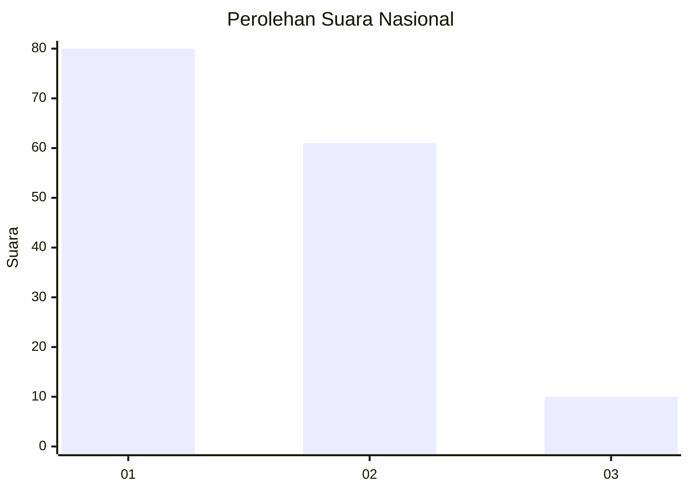
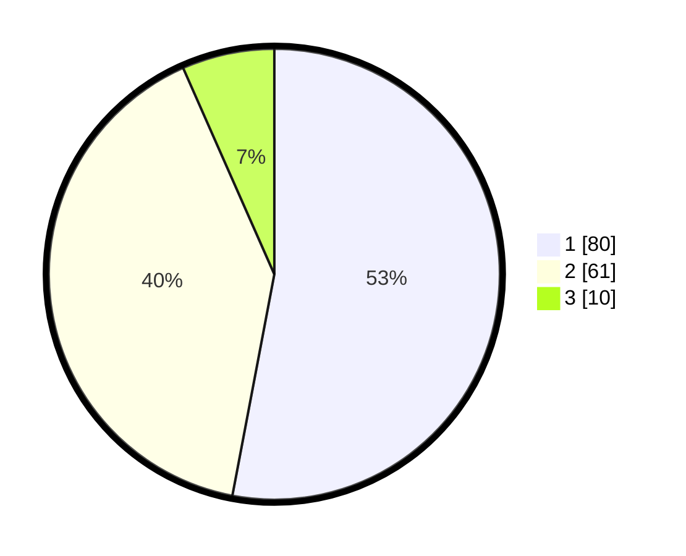

# Hasil

## Grafik

## Tabel

| No. | Nama Paslon    | Suara | Suara (raw) | Persentase |
|:--- |:-------------- | -----:| -----------:| ----------:|
| 1   | ANIES MUHAIMIN | 80    | [80][p-1]   | 52,98      |
| 2   | PRABOWO GIBRAN | 61    | [61][p-2]   | 40,40      |
| 3   | GANJAR MAHFUD  | 10    | [10][p-3]   | 6,62       |

[p-1]: https://github.com/gigit-pemilu/pemilu-2024/blob/main/pilpres/hitung-suara/sub/16-sumatera-selatan/sub/71-kota-palembang/sub/08-sako/sub/1002-sako/sub/061-tps/sub/paslon-1.txt
[p-2]: https://github.com/gigit-pemilu/pemilu-2024/blob/main/pilpres/hitung-suara/sub/16-sumatera-selatan/sub/71-kota-palembang/sub/08-sako/sub/1002-sako/sub/061-tps/sub/paslon-2.txt
[p-3]: https://github.com/gigit-pemilu/pemilu-2024/blob/main/pilpres/hitung-suara/sub/16-sumatera-selatan/sub/71-kota-palembang/sub/08-sako/sub/1002-sako/sub/061-tps/sub/paslon-3.txt

## Foto C Plano

https://sirekap-obj-formc.kpu.go.id/f5eb/pemilu/ppwp/16/71/08/10/02/1671081002061-20240220-111634--bdc59ddd-3fce-48d9-80a8-b8b6d8c33922.jpg

https://sirekap-obj-formc.kpu.go.id/f5eb/pemilu/ppwp/16/71/08/10/02/1671081002061-20240220-111702--2032eda8-ba35-4873-8dad-b8d68ac1d0a6.jpg

https://sirekap-obj-formc.kpu.go.id/f5eb/pemilu/ppwp/16/71/08/10/02/1671081002061-20240220-111731--f04f9d59-af45-4c69-a746-b529649eab41.jpg

## Metadata

| Key        | Value               |
| ---------- | ------------------- |
| Time Stamp | 2024-02-20 21:00:00 |

## DATA PEMILIH TETAP

Jumlah pemilih dalam DPT: **252**.
 * L: **98**.
 * P: **554**.

## DATA PENGGUNA HAK PILIH

Jumlah pengguna hak pilih dalam DPT: **656**.
 * L: **878**.
 * P: **880**.

Jumlah pengguna hak pilih dalam DPTb: **86**.
 * L: **4**.
 * P: **0**.

Jumlah pengguna hak pilih dalam DPK: **0**.
 * L: **80**.
 * P: **80**.

Jumlah pengguna hak pilih: **652**.
 * L: **72**.
 * P: **880**.

## JUMLAH SUARA SAH DAN TIDAK SAH

JUMLAH SELURUH SUARA SAH: **151**.

JUMLAH SUARA TIDAK SAH: **1**.

JUMLAH SELURUH SUARA SAH DAN SUARA TIDAK SAH: **152**.

