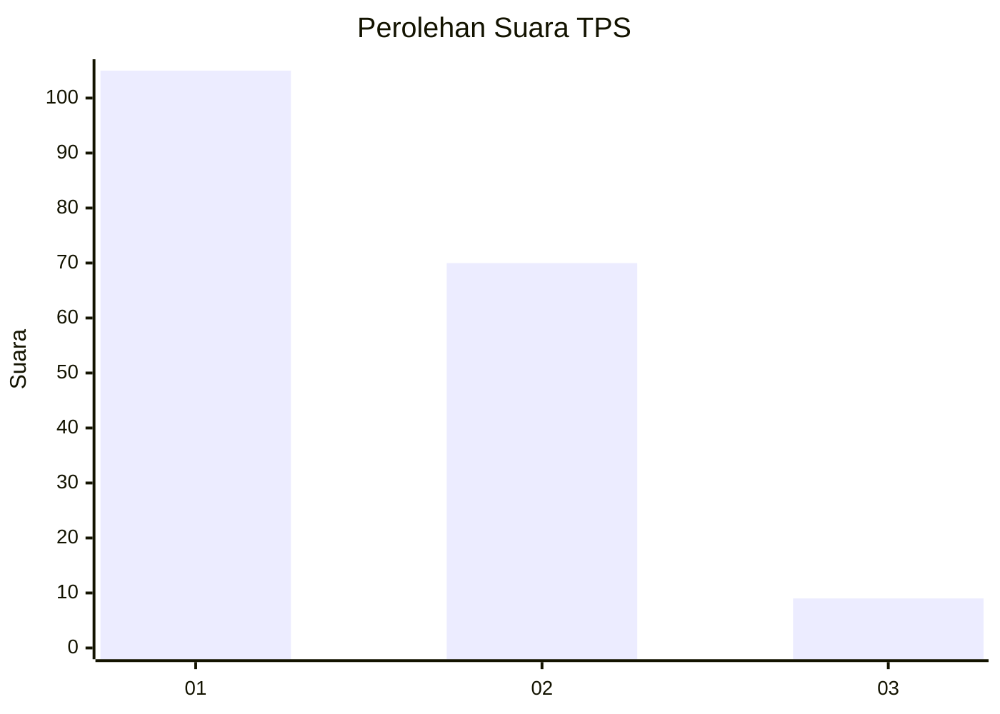
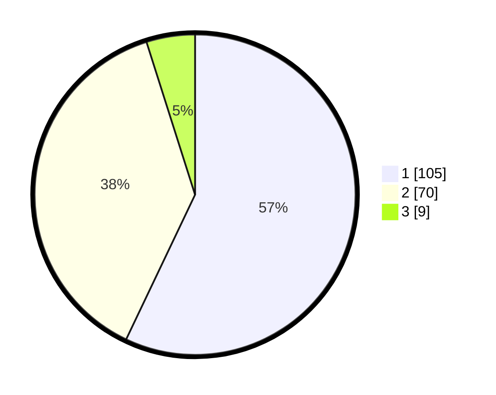

# Hasil

## Grafik

## Tabel

| No. | Nama Paslon    | Suara | Suara (raw) | Persentase |
|:--- |:-------------- | -----:| -----------:| ----------:|
| 1   | ANIES MUHAIMIN | 105   | [105][p-1]  | 57,07      |
| 2   | PRABOWO GIBRAN | 70    | [70][p-2]   | 38,04      |
| 3   | GANJAR MAHFUD  | 9     | [9][p-3]    | 4,89       |

[p-1]: https://github.com/gigit-pemilu/pemilu-2024-16-sumatera-selatan/blob/main/pilpres/hitung-suara/sub/16-sumatera-selatan/sub/71-kota-palembang/sub/08-sako/sub/1002-sako/sub/062-tps/sub/paslon-1.txt
[p-2]: https://github.com/gigit-pemilu/pemilu-2024-16-sumatera-selatan/blob/main/pilpres/hitung-suara/sub/16-sumatera-selatan/sub/71-kota-palembang/sub/08-sako/sub/1002-sako/sub/062-tps/sub/paslon-2.txt
[p-3]: https://github.com/gigit-pemilu/pemilu-2024-16-sumatera-selatan/blob/main/pilpres/hitung-suara/sub/16-sumatera-selatan/sub/71-kota-palembang/sub/08-sako/sub/1002-sako/sub/062-tps/sub/paslon-3.txt

## Foto C Plano

https://sirekap-obj-formc.kpu.go.id/6a73/pemilu/ppwp/16/71/08/10/02/1671081002062-20240215-113314--364ecf7e-4f2c-4731-b35d-262927245d37.jpg

https://sirekap-obj-formc.kpu.go.id/6a73/pemilu/ppwp/16/71/08/10/02/1671081002062-20240215-113320--fd66a88d-84f2-4505-a225-5d84e5628e04.jpg

https://sirekap-obj-formc.kpu.go.id/6a73/pemilu/ppwp/16/71/08/10/02/1671081002062-20240215-113328--4540a4a7-8ff5-43fe-a09a-16a8e81ef121.jpg

## Metadata

| Key        | Value               |
| ---------- | ------------------- |
| Time Stamp | 2024-02-24 22:31:28 |

