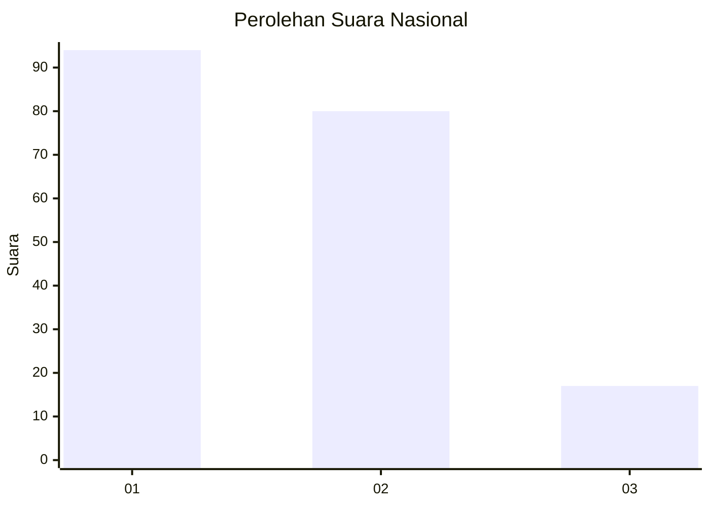
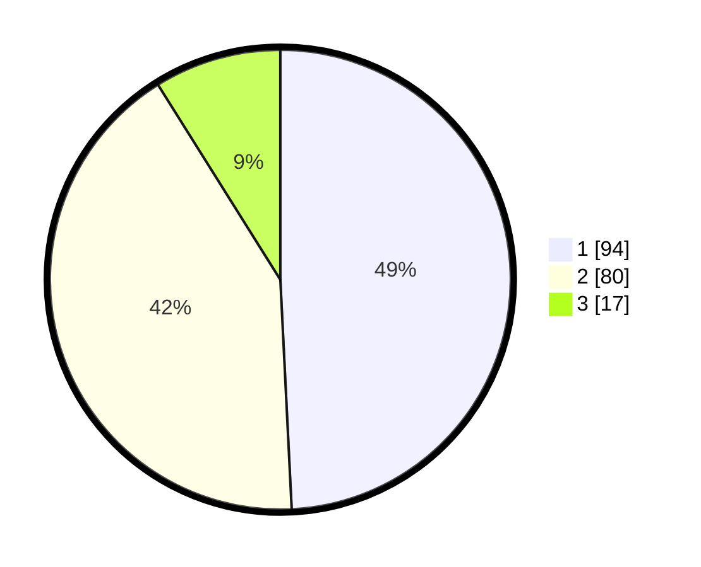

# Hasil

## Grafik

## Tabel

| No. | Nama Paslon    | Suara | Suara (raw) | Persentase |
|:--- |:-------------- | -----:| -----------:| ----------:|
| 1   | ANIES MUHAIMIN | 94    | [94][p-1]   | 49,21      |
| 2   | PRABOWO GIBRAN | 80    | [80][p-2]   | 41,88      |
| 3   | GANJAR MAHFUD  | 17    | [17][p-3]   | 8,90       |

[p-1]: https://github.com/gigit-pemilu/pemilu-2024/blob/main/pilpres/hitung-suara/sub/16-sumatera-selatan/sub/71-kota-palembang/sub/08-sako/sub/1002-sako/sub/063-tps/sub/paslon-1.txt
[p-2]: https://github.com/gigit-pemilu/pemilu-2024/blob/main/pilpres/hitung-suara/sub/16-sumatera-selatan/sub/71-kota-palembang/sub/08-sako/sub/1002-sako/sub/063-tps/sub/paslon-2.txt
[p-3]: https://github.com/gigit-pemilu/pemilu-2024/blob/main/pilpres/hitung-suara/sub/16-sumatera-selatan/sub/71-kota-palembang/sub/08-sako/sub/1002-sako/sub/063-tps/sub/paslon-3.txt

## Foto C Plano

https://sirekap-obj-formc.kpu.go.id/8da5/pemilu/ppwp/16/71/08/10/02/1671081002063-20240220-111151--e242f087-394a-44bb-a447-10468496df1d.jpg

https://sirekap-obj-formc.kpu.go.id/8da5/pemilu/ppwp/16/71/08/10/02/1671081002063-20240220-111322--4b957a05-1f01-49c9-8493-1295cf1c9e36.jpg

https://sirekap-obj-formc.kpu.go.id/8da5/pemilu/ppwp/16/71/08/10/02/1671081002063-20240220-111423--17a69a35-4f90-4c09-9160-90705426c9ec.jpg

## Metadata

| Key        | Value               |
| ---------- | ------------------- |
| Time Stamp | 2024-02-20 12:00:00 |

## DATA PEMILIH TETAP

Jumlah pemilih dalam DPT: **236**.
 * L: **805**.
 * P: **633**.

## DATA PENGGUNA HAK PILIH

Jumlah pengguna hak pilih dalam DPT: **694**.
 * L: **83**.
 * P: **408**.

Jumlah pengguna hak pilih dalam DPTb: **888**.
 * L: **0**.
 * P: **0**.

Jumlah pengguna hak pilih dalam DPK: **0**.
 * L: **0**.
 * P: **0**.

Jumlah pengguna hak pilih: **844**.
 * L: **83**.
 * P: **638**.

## JUMLAH SUARA SAH DAN TIDAK SAH

JUMLAH SELURUH SUARA SAH: **297**.

JUMLAH SUARA TIDAK SAH: **880**.

JUMLAH SELURUH SUARA SAH DAN SUARA TIDAK SAH: **493**.

