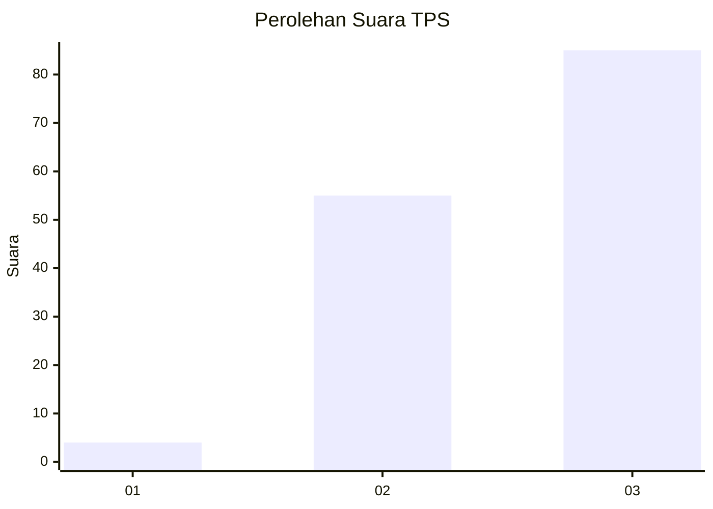
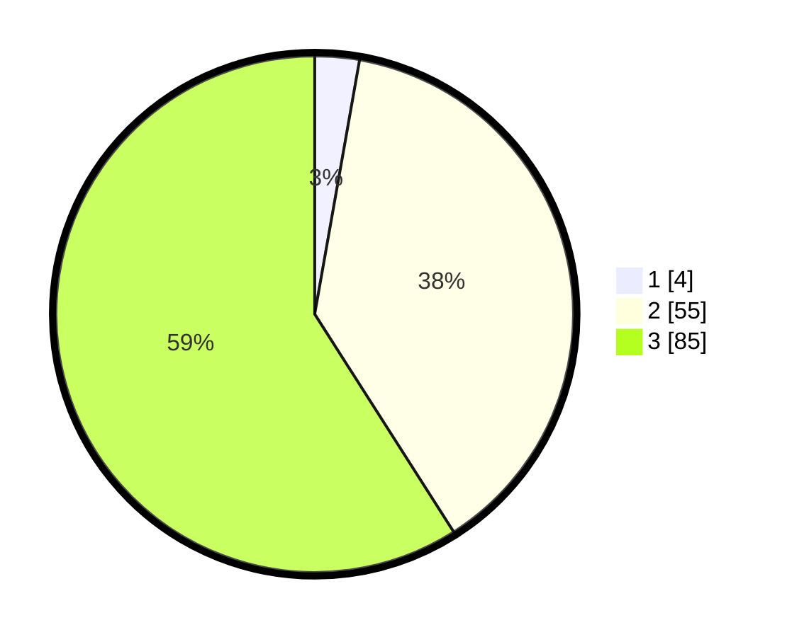

# Hasil

## Grafik

## Tabel

| No. | Nama Paslon    | Suara | Suara (raw) | Persentase |
|:--- |:-------------- | -----:| -----------:| ----------:|
| 1   | ANIES MUHAIMIN | 4     | [4][p-1]    | 2,78       |
| 2   | PRABOWO GIBRAN | 55    | [55][p-2]   | 38,19      |
| 3   | GANJAR MAHFUD  | 85    | [85][p-3]   | 59,03      |

[p-1]: https://github.com/gigit-pemilu/pemilu-2024-16-sumatera-selatan/blob/main/pilpres/hitung-suara/sub/16-sumatera-selatan/sub/71-kota-palembang/sub/08-sako/sub/1002-sako/sub/066-tps/sub/paslon-1.txt
[p-2]: https://github.com/gigit-pemilu/pemilu-2024-16-sumatera-selatan/blob/main/pilpres/hitung-suara/sub/16-sumatera-selatan/sub/71-kota-palembang/sub/08-sako/sub/1002-sako/sub/066-tps/sub/paslon-2.txt
[p-3]: https://github.com/gigit-pemilu/pemilu-2024-16-sumatera-selatan/blob/main/pilpres/hitung-suara/sub/16-sumatera-selatan/sub/71-kota-palembang/sub/08-sako/sub/1002-sako/sub/066-tps/sub/paslon-3.txt

## Foto C Plano

https://sirekap-obj-formc.kpu.go.id/663e/pemilu/ppwp/16/71/08/10/02/1671081002066-20240220-112631--2160a7f6-b540-4d21-a71d-95ef63a6bda6.jpg

https://sirekap-obj-formc.kpu.go.id/663e/pemilu/ppwp/16/71/08/10/02/1671081002066-20240220-112711--032d68f1-0600-4b92-b205-1f45514cede7.jpg

https://sirekap-obj-formc.kpu.go.id/663e/pemilu/ppwp/16/71/08/10/02/1671081002066-20240220-112739--08e154ae-1154-44ce-94c0-100b990e25a1.jpg

## Metadata

| Key        | Value               |
| ---------- | ------------------- |
| Time Stamp | 2024-02-20 12:00:00 |

## DATA PEMILIH TETAP

Jumlah pemilih dalam DPT: **234**.
 * L: **562**.
 * P: **634**.

## DATA PENGGUNA HAK PILIH

Jumlah pengguna hak pilih dalam DPT: **574**.
 * L: **882**.
 * P: **893**.

Jumlah pengguna hak pilih dalam DPTb: **888**.
 * L: **808**.
 * P: **888**.

Jumlah pengguna hak pilih dalam DPK: **884**.
 * L: **885**.
 * P: **883**.

Jumlah pengguna hak pilih: **378**.
 * L: **83**.
 * P: **805**.

## JUMLAH SUARA SAH DAN TIDAK SAH

JUMLAH SELURUH SUARA SAH: **684**.

JUMLAH SUARA TIDAK SAH: **4**.

JUMLAH SELURUH SUARA SAH DAN SUARA TIDAK SAH: **528**.

