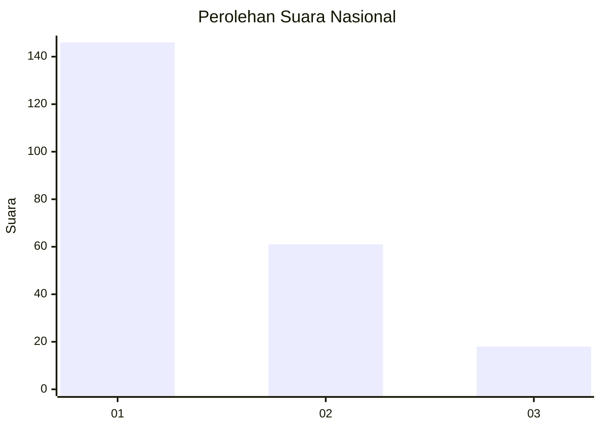
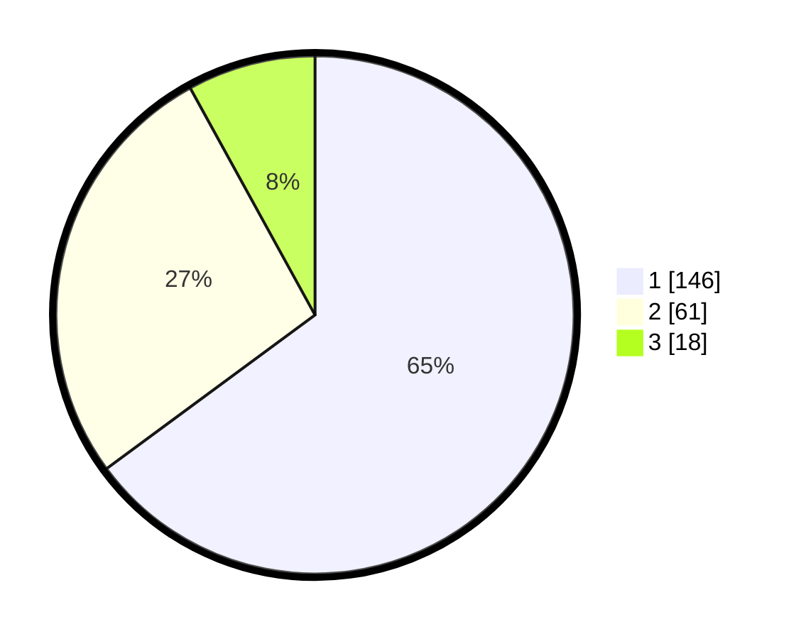

# Hasil

## Grafik

## Tabel

| No. | Nama Paslon    | Suara | Suara (raw) | Persentase |
|:--- |:-------------- | -----:| -----------:| ----------:|
| 1   | ANIES MUHAIMIN | 146   | [146][p-1]  | 64,89      |
| 2   | PRABOWO GIBRAN | 61    | [61][p-2]   | 27,11      |
| 3   | GANJAR MAHFUD  | 18    | [18][p-3]   | 8,00       |

[p-1]: https://github.com/gigit-pemilu/pemilu-2024/blob/main/pilpres/hitung-suara/sub/16-sumatera-selatan/sub/71-kota-palembang/sub/08-sako/sub/1002-sako/sub/068-tps/sub/paslon-1.txt
[p-2]: https://github.com/gigit-pemilu/pemilu-2024/blob/main/pilpres/hitung-suara/sub/16-sumatera-selatan/sub/71-kota-palembang/sub/08-sako/sub/1002-sako/sub/068-tps/sub/paslon-2.txt
[p-3]: https://github.com/gigit-pemilu/pemilu-2024/blob/main/pilpres/hitung-suara/sub/16-sumatera-selatan/sub/71-kota-palembang/sub/08-sako/sub/1002-sako/sub/068-tps/sub/paslon-3.txt

## Foto C Plano

https://sirekap-obj-formc.kpu.go.id/64db/pemilu/ppwp/16/71/08/10/02/1671081002068-20240220-112039--044a723c-72ea-4b6f-9153-72400b82d74d.jpg

https://sirekap-obj-formc.kpu.go.id/64db/pemilu/ppwp/16/71/08/10/02/1671081002068-20240220-112112--0e8a5af5-ac65-42bf-8d47-0c79efb3a470.jpg

https://sirekap-obj-formc.kpu.go.id/64db/pemilu/ppwp/16/71/08/10/02/1671081002068-20240220-112140--d1d84b5a-b9c5-4438-a75e-f3c9bd358ee1.jpg

## Metadata

| Key        | Value               |
| ---------- | ------------------- |
| Time Stamp | 2024-02-20 12:00:00 |

## DATA PEMILIH TETAP

Jumlah pemilih dalam DPT: **356**.
 * L: **736**.
 * P: **735**.

## DATA PENGGUNA HAK PILIH

Jumlah pengguna hak pilih dalam DPT: **292**.
 * L: **887**.
 * P: **405**.

Jumlah pengguna hak pilih dalam DPTb: **880**.
 * L: **888**.
 * P: **388**.

Jumlah pengguna hak pilih dalam DPK: **883**.
 * L: **808**.
 * P: **883**.

Jumlah pengguna hak pilih: **595**.
 * L: **887**.
 * P: **508**.

## JUMLAH SUARA SAH DAN TIDAK SAH

JUMLAH SELURUH SUARA SAH: **595**.

JUMLAH SUARA TIDAK SAH: **88**.

JUMLAH SELURUH SUARA SAH DAN SUARA TIDAK SAH: **695**.

