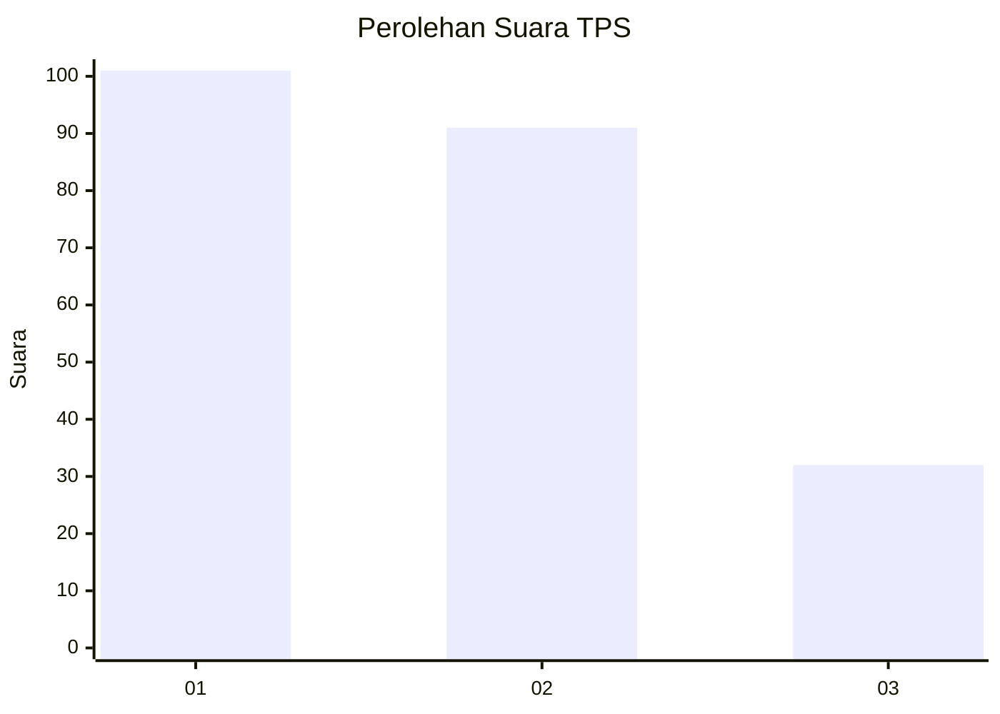
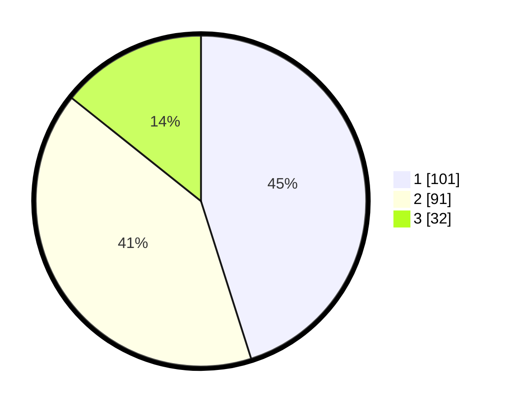

# Hasil

## Grafik

## Tabel

| No. | Nama Paslon    | Suara | Suara (raw) | Persentase |
|:--- |:-------------- | -----:| -----------:| ----------:|
| 1   | ANIES MUHAIMIN | 101   | [101][p-1]  | 45,09      |
| 2   | PRABOWO GIBRAN | 91    | [91][p-2]   | 40,63      |
| 3   | GANJAR MAHFUD  | 32    | [32][p-3]   | 14,29      |

[p-1]: https://github.com/gigit-pemilu/pemilu-2024-16-sumatera-selatan/blob/main/pilpres/hitung-suara/sub/16-sumatera-selatan/sub/71-kota-palembang/sub/08-sako/sub/1002-sako/sub/070-tps/sub/paslon-1.txt
[p-2]: https://github.com/gigit-pemilu/pemilu-2024-16-sumatera-selatan/blob/main/pilpres/hitung-suara/sub/16-sumatera-selatan/sub/71-kota-palembang/sub/08-sako/sub/1002-sako/sub/070-tps/sub/paslon-2.txt
[p-3]: https://github.com/gigit-pemilu/pemilu-2024-16-sumatera-selatan/blob/main/pilpres/hitung-suara/sub/16-sumatera-selatan/sub/71-kota-palembang/sub/08-sako/sub/1002-sako/sub/070-tps/sub/paslon-3.txt

## Foto C Plano

https://sirekap-obj-formc.kpu.go.id/4898/pemilu/ppwp/16/71/08/10/02/1671081002070-20240220-112912--275e3226-f0ac-409c-ad17-ac952def24d0.jpg

https://sirekap-obj-formc.kpu.go.id/4898/pemilu/ppwp/16/71/08/10/02/1671081002070-20240220-112946--4de181aa-006a-4249-a778-b94e1616ac5b.jpg

https://sirekap-obj-formc.kpu.go.id/4898/pemilu/ppwp/16/71/08/10/02/1671081002070-20240220-113014--8342973a-9116-4914-9ce4-f4c7034a5a21.jpg

## Metadata

| Key        | Value               |
| ---------- | ------------------- |
| Time Stamp | 2024-02-20 12:00:00 |

## DATA PEMILIH TETAP

Jumlah pemilih dalam DPT: **368**.
 * L: **538**.
 * P: **348**.

## DATA PENGGUNA HAK PILIH

Jumlah pengguna hak pilih dalam DPT: **223**.
 * L: **94**.
 * P: **328**.

Jumlah pengguna hak pilih dalam DPTb: **903**.
 * L: **404**.
 * P: **993**.

Jumlah pengguna hak pilih dalam DPK: **603**.
 * L: **2**.
 * P: **5**.

Jumlah pengguna hak pilih: **226**.
 * L: **93**.
 * P: **629**.

## JUMLAH SUARA SAH DAN TIDAK SAH

JUMLAH SELURUH SUARA SAH: **224**.

JUMLAH SUARA TIDAK SAH: **922**.

JUMLAH SELURUH SUARA SAH DAN SUARA TIDAK SAH: **226**.

