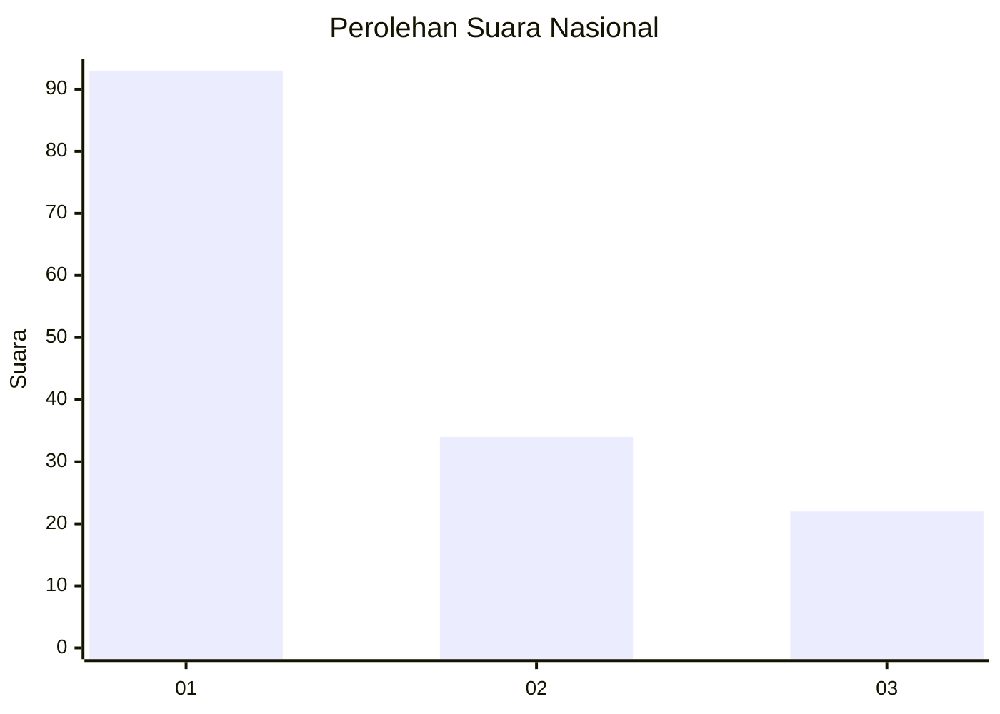
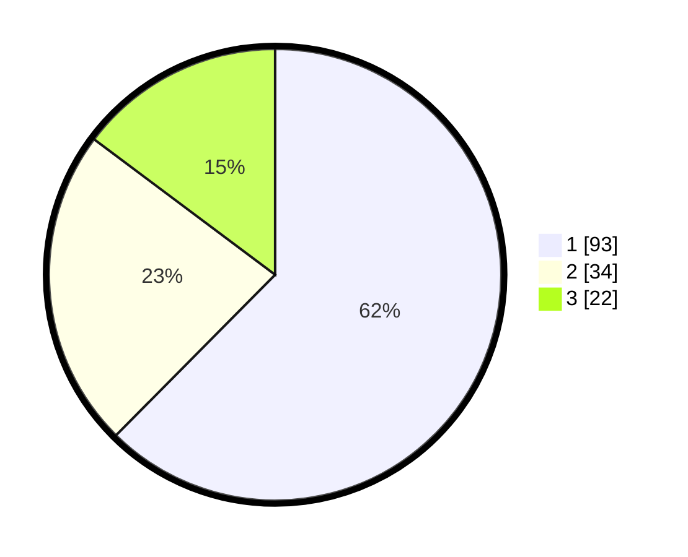

# Hasil

## Grafik

## Tabel

| No. | Nama Paslon    | Suara | Suara (raw) | Persentase |
|:--- |:-------------- | -----:| -----------:| ----------:|
| 1   | ANIES MUHAIMIN | 93    | [93][p-1]   | 62,42      |
| 2   | PRABOWO GIBRAN | 34    | [34][p-2]   | 22,82      |
| 3   | GANJAR MAHFUD  | 22    | [22][p-3]   | 14,77      |

[p-1]: https://github.com/gigit-pemilu/pemilu-2024/blob/main/pilpres/hitung-suara/sub/16-sumatera-selatan/sub/71-kota-palembang/sub/08-sako/sub/1002-sako/sub/081-tps/sub/paslon-1.txt
[p-2]: https://github.com/gigit-pemilu/pemilu-2024/blob/main/pilpres/hitung-suara/sub/16-sumatera-selatan/sub/71-kota-palembang/sub/08-sako/sub/1002-sako/sub/081-tps/sub/paslon-2.txt
[p-3]: https://github.com/gigit-pemilu/pemilu-2024/blob/main/pilpres/hitung-suara/sub/16-sumatera-selatan/sub/71-kota-palembang/sub/08-sako/sub/1002-sako/sub/081-tps/sub/paslon-3.txt

## Foto C Plano

https://sirekap-obj-formc.kpu.go.id/63d9/pemilu/ppwp/16/71/08/10/02/1671081002081-20240220-123758--d7be0a07-dea9-4a99-8573-4c260cb992ff.jpg

https://sirekap-obj-formc.kpu.go.id/63d9/pemilu/ppwp/16/71/08/10/02/1671081002081-20240220-123834--002044ed-18a6-4b8b-a494-eea0e1ea2a05.jpg

https://sirekap-obj-formc.kpu.go.id/63d9/pemilu/ppwp/16/71/08/10/02/1671081002081-20240220-123915--9189dab9-711b-44e6-a790-f235667299c5.jpg

## Metadata

| Key        | Value               |
| ---------- | ------------------- |
| Time Stamp | 2024-02-20 13:00:00 |

## DATA PEMILIH TETAP

Jumlah pemilih dalam DPT: **247**.
 * L: **727**.
 * P: **726**.

## DATA PENGGUNA HAK PILIH

Jumlah pengguna hak pilih dalam DPT: **798**.
 * L: **92**.
 * P: **706**.

Jumlah pengguna hak pilih dalam DPTb: **0**.
 * L: **0**.
 * P: **0**.

Jumlah pengguna hak pilih dalam DPK: **7**.
 * L: **0**.
 * P: **7**.

Jumlah pengguna hak pilih: **799**.
 * L: **42**.
 * P: **707**.

## JUMLAH SUARA SAH DAN TIDAK SAH

JUMLAH SELURUH SUARA SAH: **799**.

JUMLAH SUARA TIDAK SAH: **0**.

JUMLAH SELURUH SUARA SAH DAN SUARA TIDAK SAH: **799**.

